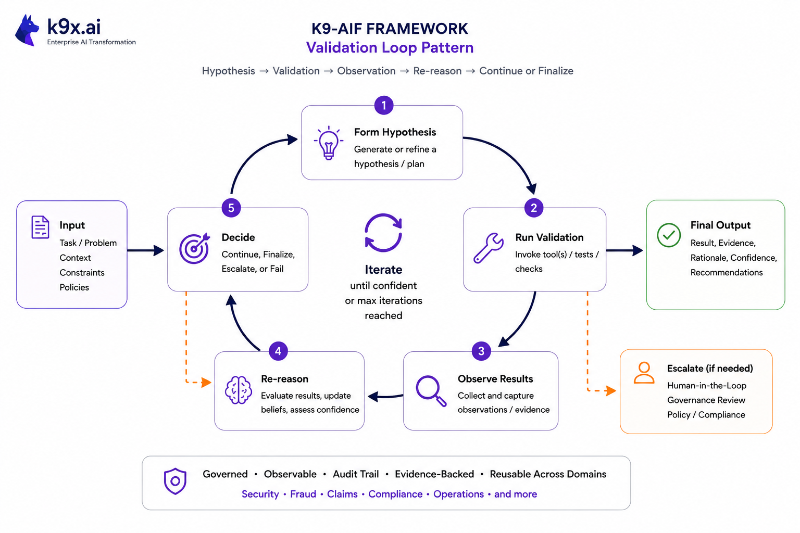

# K9-AIF — K9 Agentic Integration Framework

K9-AIF is an architecture-first framework for designing governed, enterprise-scale multi-agent AI systems.

Unlike agent runtimes that focus mainly on execution, K9-AIF defines the architectural structure,
interaction boundaries, governance model, and runtime execution control needed to build scalable agentic AI systems.

The framework separates Architecture Building Blocks (ABB) from
Solution Building Blocks (SBB), enabling extensible and composable
agentic applications.

[](docs/diagrams/k9-aif-architecture.png)

*K9-AIF layered architecture — click the image to view full resolution.*

K9-AIF provides architectural patterns for constructing agentic
workflows where multiple AI agents collaborate to perform reasoning,
analysis, and decision-support tasks while maintaining clear
governance, orchestration, and integration boundaries.

The framework draws inspiration from established architectural
disciplines, including:

- Object-Oriented Analysis & Design (OOA/OOD)
- Enterprise Architecture (TOGAF)
- Service-Oriented Architecture (SOA)
- Modern multi-agent AI systems

The goal is to enable **composable, scalable, and governed agentic AI applications**.

---

## Table of Contents

- [A Simple Way to Think About It](#a-simple-way-to-think-about-it)
- [Understanding K9-AIF](#understanding-k9-aif)
- [Core Architectural Concepts](#core-architectural-concepts)
  - [Architecture Building Blocks (ABB)](#architecture-building-blocks-abb)
  - [Solution Building Blocks (SBB)](#solution-building-blocks-sbb)
  - [Architectural Layers](#architectural-layers)
  - [Agent Squads](#agent-squads)
  - [Zero Trust Execution Layer](#zero-trust-execution-layer)
- [Prototype Implementations](#prototype-implementations)
- [Design Goals](#design-goals)
- [Framework Comparison](#framework-comparison)
- [Architectural Patterns](#architectural-patterns)
- [Intelligent Model Routing](#intelligent-model-routing)
- [Multi-Provider LLM Support](#multi-provider-llm-support)
- [Using Claude Code with K9-AIF](#using-claude-code-with-k9-aif)
- [Scaffold Generation](#scaffold-generation)
- [K9-AIF Developer Journey](#k9-aif-developer-journey)
- [Framework Implementation](#framework-implementation)
- [Developer Guide](#developer-guide)
- [Quick Start](#quick-start-linux--ubuntu)
- [Project Status](#project-status)
- [License](#license)
- [Contributions](#contributions)
- [Architectural Foundations](#architectural-foundations)
- [Architecture Notes &amp; Blog](#architecture-notes--blog)
- [Author&#39;s Recommendation](#authors-recommendation)
- [Author](#author)

---

## A Simple Way to Think About It

- Frameworks like CrewAI define how agents collaborate.
- Cloud platforms like Azure or AWS provide infrastructure.
- Runtimes execute workflows.
- **K9-AIF defines how the full AI system should be architected.**

---

## Understanding K9-AIF

Start here for a structured explanation of K9-AIF:

- [The Path of K9-AIF](docs/understanding-k9-aif/01-the-path-of-k9-aif.md)
- [What K9-AIF Is](docs/understanding-k9-aif/02-what-k9-aif-is.md)
- [K9-AIF for Stakeholders](docs/understanding-k9-aif/03-k9-aif-for-stakeholders.md)
- [K9-AIF vs Agent Frameworks](docs/understanding-k9-aif/04-k9-aif-vs-agent-frameworks.md)
- [Where Agent Systems Fail](docs/understanding-k9-aif/05-where-agent-systems-fail.md)
- [FAQ](docs/understanding-k9-aif/06-faq.md)

---

# Core Architectural Concepts

K9-AIF introduces two primary architectural abstractions.

## Architecture Building Blocks (ABB)

Architecture Building Blocks define abstract architectural capabilities and contracts within the K9-AIF framework. ABBs specify responsibilities, interfaces, and interaction patterns without prescribing concrete implementations or technologies.

An ABB typically defines:

- Interfaces and interaction contracts
- Responsibilities and functional boundaries
- Lifecycle expectations
- Governance and observability hooks

Examples include:

- Agent interface contracts
- Orchestrator contracts
- Tool connector interfaces
- Inference adapters
- Storage or persistence adapters

---

## Solution Building Blocks (SBB)

Solution Building Blocks provide concrete implementations of ABB contracts. SBBs introduce domain-specific behavior, technology choices, and runtime integrations while conforming to the architectural constraints defined by the ABB layer.

This separation allows architectural stability while enabling domain-specific extensions without modifying the core framework.

Examples:

- Document Analysis Agent
- Retrieval Agent
- CrewAI Agent
- LangChain Tool Adapter
- OpenAI LLM Connector

---

## Architectural Layers

A typical K9-AIF system is organized into a set of architectural layers
that separate interface concerns, orchestration, external integration,
inference, and persistence.

1. **Presentation Layer** Handles incoming user or system interactions through web interfaces,
   conversational channels, or APIs.
2. **Application Layer** Coordinates orchestration flows, routing, and workflow execution
   across agents and services.
3. **Integration Layer** Provides governed access to external systems, APIs, tools,
   messaging platforms, and storage services.
4. **Inference Layer** Supports model invocation, retrieval-augmented generation (RAG),
   and context-aware reasoning.
5. **Data Layer** Provides persistence, object storage, and messaging infrastructure
   used by the framework.
6. **Cross-Cutting Concerns** Security, governance, and observability apply across all layers to enforce policy, auditability, monitoring, and operational control. This includes the **Zero Trust Execution Layer**, which verifies, risk-evaluates, and enforces policy on all actions before execution across routers, orchestrators, agents, and integrations.

---

## Agent Squads

K9-AIF introduces the concept of **Agent Squads**.

A Squad represents a coordinated group of agents working together to perform a specific capability within an orchestration workflow.

Rather than orchestrators invoking individual agents directly, K9-AIF introduces a structured collaboration layer between orchestrators and agents.

Execution hierarchy:

Router --> Orchestrator --> Squads --> Agents

Squads allow enterprise workflows to be modeled as **capability-based teams of agents**.
All squad-level execution remains subject to K9-AIF’s governance and Zero Trust execution controls, ensuring that agent actions are verified and policy-enforced at runtime.

Examples include:

- Claims Processing Squad
- Medical Review Squad
- Architecture Analysis Squad
- Threat Assessment Squad

Squads are defined declaratively using configuration and loaded dynamically at runtime using the **SquadLoader** component.

Core squad framework components include:

- `BaseSquad`
- `SquadLoader`
- `SquadContext`
- `DefaultSquadMonitor`

---

## Zero Trust Execution Layer

Once you understand the execution hierarchy (Router → Orchestrator → Squads → Agents), Zero Trust is the cross-cutting layer that governs every step of it.

Traditional Zero Trust focuses on access — who can reach a system.K9-AIF applies Zero Trust to **execution** — every action is verified before it runs.

- Every action is verified before execution
- Contextual risk is evaluated (identity, data sensitivity, destination)
- Policies are enforced at runtime (allow, conditional, deny)

This is not a checkpoint at the edge — it is enforced at every layer:

- **Router** — pre-routing enforcement
- **Orchestrator** — pre-execution enforcement before the Squad runs

> Zero Trust is not a checkpoint — it is a layer applied across the system.


---

## Prototype Implementations

Prototype systems based on K9-AIF demonstrate how the framework can support
governed multi-agent architectures across multiple domains.

### Featured Example

**K9X Enterprise Insurance Operations Center (EOC)**
→ [examples/K9X_Enterprise_Insurance_OperationsCenter](examples/K9X_Enterprise_Insurance_OperationsCenter)

The EOC is the canonical reference implementation of K9-AIF — the most complete, production-aligned example in the framework. It demonstrates every architectural concept end-to-end:

- Full Kafka-based event pipeline (Router → domain topics → Orchestrator → `eoc-results`)
- Seven domain orchestrators, each owning a Squad and its agents
- Agent pipeline with sequential flow, conditional steps (`when:`), and accumulated context
- Zero Trust enforcement at the Orchestrator layer
- Governance pre/post processing across all agents
- Neo4j graph sync, PostgreSQL persistence, Docling OCR via MCP
- FastAPI backend + Web UI with real-time SSE event streaming
- Containerised deployment (Podman pod, three containers)

**Use the EOC as your reference when building any new K9-AIF solution.**

### Additional Examples

- **ACME Health Insurance Claims Assistant** — Multi-agent insurance workflow demo including eligibility checks, provider lookup, and claims support.
  → [examples/acme_health_insurance](examples/acme_health_insurance)
- **K9Chat** — Minimal chat application demonstrating K9-AIF squads, agents, and model routing.
  → [examples/k9chat](examples/k9chat)
- **WeatherAssist Decision Support System**
- **Department of War (DoW) Systems Engineering Pipeline** — Demonstrates how K9-AIF architectural patterns can automate multi-stage systems engineering workflows aligned with the DoDAF 2.0 architecture framework, exploring agent orchestration across multiple architectural stages using K9-AIF patterns together with the CrewAI orchestration framework.

---

## Design Goals

K9-AIF is designed to support the development of governed, modular
agentic AI systems aligned with enterprise architecture practices.

Key architectural goals include:

- Modular architecture supporting independently deployable AI capabilities
- Reusable architectural building blocks for consistent system composition
- Governed AI workflows with policy, control, and observability integration
- Clear orchestration boundaries between agents, tools, squads, and services
- Scalable integration with enterprise systems and external platforms
- Architecture-driven routing of inference requests across multiple models and providers
- Runtime execution control using a Zero Trust model, ensuring that all agentic actions are verified, risk-evaluated, and policy-enforced before execution

The framework bridges traditional **enterprise architecture principles**
with emerging **agentic AI system design**.

---

## Framework Comparison

K9-AIF focuses on architectural structure and governed orchestration of multi-agent systems.
The table below highlights how the framework differs from several popular agentic AI frameworks.

| Capability                             | K9-AIF                                        | CrewAI       | LangGraph            | AgentStack              |
| -------------------------------------- | --------------------------------------------- | ------------ | -------------------- | ----------------------- |
| Architecture-first framework           | ✅ Yes                                        | ⚠️ Limited | ⚠️ Partial         | ⚠️ Platform-centric   |
| ABB/SBB architectural separation       | ✅ Yes                                        | ❌ No        | ❌ No                | ❌ No                   |
| Explicit orchestration hierarchy       | ✅ Router → Orchestrator → Squads → Agents | ⚠️ Crews   | ⚠️ Graph workflows | ⚠️ Agent services     |
| Team abstraction                       | ✅ Squads                                     | ✅ Crews     | ❌ None              | ⚠️ Agent groups       |
| Declarative configuration              | ✅ YAML-driven                                | ⚠️ Partial | ⚠️ Code-centric    | ⚠️ Platform config    |
| Enterprise architecture alignment      | ✅ Yes                                        | ❌ No        | ❌ No                | ⚠️ Partial            |
| Governance & observability hooks       | ✅ Built into ABBs                            | ⚠️ Limited | ⚠️ Limited         | ⚠️ Platform dependent |
| Runtime execution control (Zero Trust) | ✅ Yes (Router + Orchestrator enforcement)    | ❌ No        | ❌ No                | ❌ No                   |
| Iterative validation loop pattern      | ✅ Built-in (`BaseValidationLoopAgent`)       | ❌ No        | ⚠️ Manual graph    | ❌ No                   |

K9-AIF emphasizes **architectural clarity, composability, and governance**, allowing multi-agent systems to be constructed using well-defined architectural building blocks rather than ad-hoc orchestration logic.

---

## Architectural Patterns

Many of the architectural ideas used within the K9-AIF framework are documented separately as reusable architecture patterns.

These patterns describe the core design principles behind the framework while remaining independent of any specific runtime implementation.

The pattern catalog includes topics such as:

- Factory-based governed component instantiation
- Inference layer abstraction for model providers
- Connector-based integration with external systems
- Configuration-driven runtime loading of agents and orchestration components

The full set of patterns is available in the **K9-AIF Architecture Patterns repository**:

➡️ https://github.com/k9aif/k9aif-patterns

### Validation Loop Pattern

An in-framework pattern for iterative hypothesis-validate-reason workflows — applicable across security, fraud, claims, compliance, and document extraction domains.



Implemented as `BaseValidationLoopAgent` in `k9_aif_abb/k9_agents/validation/`. See [Skill 10 in SKILLS.md](SKILLS.md) for usage.

---

## Intelligent Model Routing

K9-AIF includes an Intelligent Model Router that enables applications to dynamically select the most appropriate AI model at runtime.

Rather than binding agents to specific model providers, the router evaluates inference requests based on task type, metadata, and routing policies to determine the best model and provider.

This enables:

- provider-agnostic application logic
- centralized governance over inference usage
- cost and latency optimization
- future compatibility with new AI models

For detailed implementation documentation see:

See the full documentation for the inference layer in
[`k9_aif_abb/k9_inference`](k9_aif_abb/k9_inference)

---

## Multi-Provider LLM Support

K9-AIF uses a **Provider Adapter** pattern to support multiple LLM backends without coupling any framework component to a specific provider.

`LLMFactory` remains provider-agnostic — it resolves the correct adapter from `ProviderAdapterRegistry` and asks it to construct the `BaseLLM`. Agents, squads, orchestrators, and the model router require no changes when switching providers.

[](docs/diagrams/k9-aif-inteference-llm-provider-class-diagram.png)

*Click to view full resolution.*

### Supported out of the box

| Provider | `backend` config value | API key env var |
|---|---|---|
| Ollama (local) | `ollama` | — |
| OpenAI | `openai` | `OPENAI_API_KEY` |
| Grok / xAI | `openai-compatible` | `GROK_API_KEY` |
| Any OpenAI-compatible endpoint | `openai-compatible` | your choice |

### Switching provider — config only, no code changes

**Ollama (default):**
```yaml
inference:
  llm_factory:
    backend: ollama
    base_url: "http://localhost:11434"
    models:
      general:
        model: "llama3.2:1b"
```

**OpenAI:**
```yaml
inference:
  llm_factory:
    backend: openai
    api_key_env: OPENAI_API_KEY    # resolved from environment — never hardcode
    models:
      general:
        model: "gpt-4o-mini"
```

**Grok / xAI:**
```yaml
inference:
  llm_factory:
    backend: openai-compatible
    base_url: "https://api.x.ai/v1"
    api_key_env: GROK_API_KEY
    models:
      general:
        model: "grok-3-mini"
```

### Adding a new provider — no framework changes required

Extend `BaseProviderAdapter`, implement two methods, register once:

```python
from k9_aif_abb.k9_core.inference.base_provider_adapter import BaseProviderAdapter
from k9_aif_abb.k9_core.inference.provider_registry import ProviderAdapterRegistry

class WatsonxProviderAdapter(BaseProviderAdapter):

    @property
    def provider_name(self) -> str:
        return "watsonx"

    def create_llm(self, model_name, factory_cfg, extra_kwargs):
        return WatsonxLLM(api_key=..., model=model_name, **extra_kwargs)

ProviderAdapterRegistry.register("watsonx", WatsonxProviderAdapter)
```

Then set `backend: watsonx` in `config.yaml`. Nothing else changes.

API keys are always resolved from environment variables (`api_key_env: MY_KEY`) — never stored in config files.

---

## Example Use Cases

K9-AIF can be applied to enterprise AI systems that require governed orchestration of multiple AI capabilities.

Examples include:

- Enterprise architecture and technology landscape analysis
- Document intelligence and large-scale document processing
- Insurance claims analysis and decision support
- Automated systems engineering workflows
- Knowledge synthesis and research assistance

---

# Scaffold Generation

K9-AIF provides two ways to generate a production-ready project scaffold.

## K9X Studio — Visual Builder (Recommended)

**[K9X Studio](https://github.com/k9aif/k9x-ecosystem)** is a browser-based drag-and-drop architecture builder for K9-AIF systems.

Design your architecture visually → generate a production-ready scaffold → implement in VS Code + Claude Code.

```bash
podman run -d \
  --name k9x_studio \
  -p 8080:8080 \
  -e K9X_PROJECTS_ROOT="/k9x/projects" \
  -v ~/k9x-studio-working:/k9x/projects:Z \
  ghcr.io/k9aif/k9x-studio:latest
```

Open **http://localhost:8080** — no setup required.

- Drag Router → Orchestrator → Squad → Agents onto the canvas
- Configure each node in the inspector
- Click **Generate Scaffold** — a ready-to-run project lands in `~/k9x-studio-working/k9_projects/<your-project>/`
- Supports Ollama, OpenAI, and Grok backends out of the box

➡️ **[k9aif/k9x-ecosystem](https://github.com/k9aif/k9x-ecosystem)**

---

## K9-AIF Generator — CLI

For terminal-based workflows, K9-AIF includes a lightweight CLI generator:

```bash
./k9_generator.sh preview <AppName>   # preview what will be generated
./k9_generator.sh run <AppName>       # generate the scaffold
./k9_generator.sh recycle <AppName>   # regenerate from scratch
```

Refer to: [K9-AIF Generator](generator/README.md)

---

## K9-AIF Developer Journey


The diagram illustrates how applications are built using K9-AIF:

• **Architects** design the system visually in **K9X Studio** or define ABBs directly in code.
• **Application developers** extend ABBs into Solution Building Blocks (SBB) and implement agent logic in VS Code + Claude Code.
• **Business analysts** configure workflows and governance policies using YAML without modifying code.

Two paths to a running scaffold:

| Path | Tool | How |
|---|---|---|
| Visual | K9X Studio | Drag-and-drop canvas → Generate Scaffold |
| CLI | k9_generator.sh | `./k9_generator.sh run <AppName>` |

Both paths produce the same scaffold structure — runnable out of the box with Ollama.

---

## Framework Implementation

The core implementation of the K9-AIF architecture is provided in the
`k9_aif_abb` package, where **ABB** refers to *Architecture Building Blocks*.

This package contains the **Architecture Building Blocks (ABB)** and
supporting framework components used to construct K9-AIF applications.

**Location:** `k9_aif_abb`

---

## Developer Guide

A comprehensive developer guide for contributors and solution developers building on K9-AIF is available in the `docs/developers/` folder.

| Format | Location |
|---|---|
| Markdown | [docs/developers/Developer-guide.md](docs/developers/Developer-guide.md) |
| PDF | [docs/developers/Developer-guide.pdf](docs/developers/Developer-guide.pdf) |

The guide covers all 21 chapters — from core architecture and ABB/SBB development model through agent, orchestrator, and router development; the Validation Loop and Critic-Actor iterative reasoning patterns; model routing, governance, testing standards, and developer workflow. It includes accurate class signatures, config examples, and code drawn directly from the `k9_aif_abb` source.

---

## Using Claude Code with K9-AIF

K9-AIF is designed to work with **Claude Code** — Anthropic's AI coding assistant. The repository includes context files that give Claude Code an immediate, accurate understanding of the framework so you can build new applications without re-explaining the architecture every session.

### Context files included

| File                                                                       | How it helps Claude Code                                                                                                                                                                                                                                                                                                                 |
| -------------------------------------------------------------------------- | ---------------------------------------------------------------------------------------------------------------------------------------------------------------------------------------------------------------------------------------------------------------------------------------------------------------------------------------- |
| [`CLAUDE.md`](CLAUDE.md)                                                    | Loaded automatically on repo open. Gives Claude Code the full framework picture — execution hierarchy, ABB/SBB contracts, inference pipeline, governance rules, config structure, and infrastructure endpoints — so it never has to re-derive them by reading source files                                                             |
| [`SKILLS.md`](SKILLS.md)                                                    | Tells Claude Code exactly how to build things: the precise pattern for adding an agent, the full `llm_invoke` → `ModelRouterFactory` → `K9ModelRouter` → `LLMFactory` → `OllamaLLM` chain, how to wire squads, enforce governance, and write tests — so generated code follows framework conventions correctly every time |
| [`AGENTS.md`](examples/K9X_Enterprise_Insurance_OperationsCenter/AGENTS.md) | When extending the EOC, Claude Code knows every agent's model assignment, squad membership, governance coverage, and event contract without reading 8 YAML files — enabling accurate, consistent additions to the existing pipeline                                                                                                     |

### Generating a new example with Claude Code

Open the repository in VS Code with Claude Code and run this prompt:

```
You are building a new application example on top of the K9-AIF framework located at k9_aif_abb/.

Project details:
- Application name: [e.g., K9X_Healthcare_ClaimsProcessor]
- Create all files under: examples/K9X_Healthcare_ClaimsProcessor/
- Spec doc location: examples/K9X_Healthcare_ClaimsProcessor/docs/your-spec.docx

Before writing any code, read CLAUDE.md and SKILLS.md, then read the canonical reference example:
  examples/K9X_Enterprise_Insurance_OperationsCenter/

Then implement the new example following the same structure and conventions. Rules:
- Every agent must extend BaseAgent and implement execute()
- Every squad must be defined in a squad YAML with a flow
- The router must route by event_type
- Governance must be explicit — do not use NoopGovernance in production code
- Folder structure, naming, and config patterns must match the reference example
```

The combination of `CLAUDE.md`, `SKILLS.md`, and the reference example gives Claude Code enough context to generate architecturally consistent, governed, runnable K9-AIF applications from a spec document alone.

> Read more: [Build a K9-AIF Example App in Minutes Using Claude Code](https://blog.k9x.ai/build-k9-aif-example-with-claude-code/)

---

## Quick Start (Linux / Ubuntu)

Clone the framework and create a Python virtual environment:

```bash
git clone https://github.com/k9aif/k9-aif-framework.git
cd k9-aif-framework

python3.11 --version
python3.11 -m venv .venv
source .venv/bin/activate

python --version
python -m pip install --upgrade pip
python -m pip install -r requirements.txt

```

once this is done: you can directly test out the demos:
from the k9-aif-framework folder, run the commands:

```bash
./run_k9chat.sh
./run_acme_support_center.sh

```

test programs from the tests folder can be run like below:

```bash
python -m k9_aif_abb.tests.<test program name>

```

---

## Project Status

K9-AIF is an actively evolving framework. The repository contains reference
architecture material, prototype implementations, and example applications
used to explore practical approaches to building governed agentic AI systems.

---

## License

This repository is released under the MIT License.

The framework concepts may be used, adapted, and extended for research and
development of agentic AI systems.

---

## Contributions

Contributions, discussions, and architectural ideas related to agentic AI
systems and multi-agent orchestration are welcome.

---

## Architectural Foundations

K9-AIF draws inspiration from established software architecture and enterprise architecture practices, including:

- Booch, G. *Object-Oriented Analysis and Design with Applications*
- Gamma, E., Helm, R., Johnson, R., Vlissides, J. *Design Patterns: Elements of Reusable Object-Oriented Software*
- The Open Group. *TOGAF Standard*

---

## Architecture Notes & Blog

The K9-AIF blog contains architecture discussions, design evaluations, and evolving ideas related to building governed agentic AI systems.

Recent posts:

• Build a K9-AIF Example App in Minutes Using Claude Code
https://blog.k9x.ai/build-k9-aif-example-with-claude-code/

• EOC — K9X Enterprise Insurance Operations Center
https://blog.k9x.ai/eoc-enterprise-insurance-operations-center/

• From Agents to Architecture: Integrating CrewAI into K9-AIF
https://blog.k9x.ai/crewai-application-and-k9-aif/

• Architectural Evaluation of K9-AIF
https://blog.k9x.ai/k9-aif-architectural-evaluation-claude/

More posts can be found at:
https://blog.k9x.ai

---

## Author's Recommendation

### 1. Know the Framework

Before building, understand the architecture. K9-AIF is built on a strict **ABB/SBB separation** —
Architecture Building Blocks define the contracts, Solution Building Blocks implement the domain.
Read `CLAUDE.md` for architecture and `SKILLS.md` for step-by-step recipes. These are the two
documents that will make you productive fast.

### 2. Use Claude Code with VS Code — the Recommended Path

The most effective way to build with K9-AIF is **Claude Code** inside **VS Code**.

K9-AIF ships with `CLAUDE.md` and `SKILLS.md` — these are loaded automatically by Claude Code,
giving it a deep understanding of the framework's architecture, conventions, and code generation
rules. Claude Code will generate agents, squads, orchestrators, and config that comply with the
framework out of the box, without you having to explain the patterns each time.

Download and install Claude Code from:
**https://claude.ai/code**

It is available as a VS Code extension, a desktop app, and a CLI.
Once installed, open your solution folder in VS Code and Claude Code is ready to use.

Claude Code understands:

- ABB contracts and how to extend them correctly
- Squad YAML format, agent registration, flow structure
- Kafka ownership (Router publishes, Orchestrator consumes)
- Governance enforcement patterns
- The full inference pipeline through `llm_invoke`

### 3. No Claude Code? Use the Generator

If you are not using Claude Code, use the scaffold generator to create a compliant solution stub:

```bash
./k9_generator.sh preview <AppName>   # preview what will be generated
./k9_generator.sh run <AppName>       # generate the solution scaffold
```

Then validate your solution at any time with:

```bash
python -m k9_aif_abb.k9_utils.k9_aif_inspector /path/to/your/solution
```

---

**Happy Coding!**

Building Architecture-First Agentic Applications — done right, that really works.

---

## Author

**Ravi Natarajan**
AI Systems Architect
Agentic AI • Multi-Agent Systems • LLM Applications

Email: ravinatarajan@k9x.ai
Website: https://k9x.ai

---
