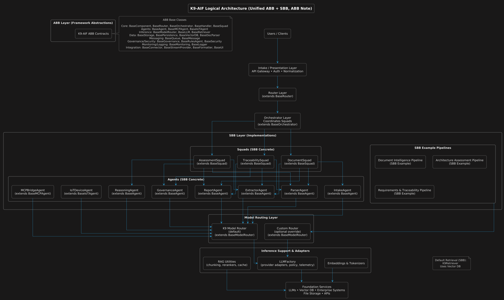

# K9-AIF — K9 Agentic Integration Framework

K9-AIF is a modular architecture framework for building governed
enterprise-scale multi-agent AI systems.

The framework separates Architecture Building Blocks (ABB) from
Solution Building Blocks (SBB), enabling extensible and composable
agentic applications.

[](docs/diagrams/k9-aif-architecture.png)

*K9-AIF layered architecture — click the image to view full resolution.*

K9-AIF provides architectural patterns for constructing agentic
workflows where multiple AI agents collaborate to perform reasoning,
analysis, and decision-support tasks while maintaining clear
governance, orchestration, and integration boundaries.

The framework draws inspiration from established architectural
disciplines, including:

- Object-Oriented Analysis & Design (OOA/OOD)
- Enterprise Architecture (TOGAF)
- Service-Oriented Architecture (SOA)
- Modern multi-agent AI systems

The goal is to enable **composable, scalable, and governed agentic AI applications**.

---

# Core Architectural Concepts

K9-AIF introduces two primary architectural abstractions.

## Architecture Building Blocks (ABB)

Architecture Building Blocks define abstract architectural capabilities and contracts within the K9-AIF framework. ABBs specify responsibilities, interfaces, and interaction patterns without prescribing concrete implementations or technologies.

An ABB typically defines:

- Interfaces and interaction contracts
- Responsibilities and functional boundaries
- Lifecycle expectations
- Governance and observability hooks

Examples include:

- Agent interface contracts
- Orchestrator contracts
- Tool connector interfaces
- Inference adapters
- Storage or persistence adapters

---

## Solution Building Blocks (SBB)

Solution Building Blocks provide concrete implementations of ABB contracts. SBBs introduce domain-specific behavior, technology choices, and runtime integrations while conforming to the architectural constraints defined by the ABB layer.

This separation allows architectural stability while enabling domain-specific extensions without modifying the core framework.

Examples:

- Document Analysis Agent
- Retrieval Agent
- CrewAI Agent
- LangChain Tool Adapter
- OpenAI LLM Connector

---

## Architectural Layers

A typical K9-AIF system is organized into a set of architectural layers
that separate interface concerns, orchestration, external integration,
inference, and persistence.

1. **Presentation Layer**Handles incoming user or system interactions through web interfaces,
   conversational channels, or APIs.
2. **Application Layer**Coordinates orchestration flows, routing, and workflow execution
   across agents and services.
3. **Integration Layer**Provides governed access to external systems, APIs, tools,
   messaging platforms, and storage services.
4. **Inference Layer**Supports model invocation, retrieval-augmented generation (RAG),
   and context-aware reasoning.
5. **Data Layer**Provides persistence, object storage, and messaging infrastructure
   used by the framework.
6. **Cross-Cutting Concerns**Security, governance, and observability apply across all layers to
   enforce policy, auditability, monitoring, and operational control.


---
## Agent Squads

K9-AIF introduces the concept of **Agent Squads**.

A Squad represents a coordinated group of agents working together to perform a specific capability within an orchestration workflow.

Rather than orchestrators invoking individual agents directly, K9-AIF introduces a structured collaboration layer between orchestrators and agents.

Execution hierarchy:

Router --> Orchestrator --> Squads --> Agents  

Squads allow enterprise workflows to be modeled as **capability-based teams of agents**.

Examples include:

- Claims Processing Squad
- Medical Review Squad
- Architecture Analysis Squad
- Threat Assessment Squad

Squads are defined declaratively using configuration and loaded dynamically at runtime using the **SquadLoader** component.

Core squad framework components include:

- `BaseSquad`
- `SquadLoader`
- `SquadContext`
- `DefaultSquadMonitor`
---
## Prototype Implementations

Prototype systems based on K9-AIF demonstrate how the framework can support
governed multi-agent architectures across multiple domains.

Example demonstration systems include:

- **ACME Health Insurance Claims Assistant**Multi-agent insurance workflow demo including eligibility checks,
  provider lookup, and claims support.→ [examples/acme-health-insurance](examples/acme-health-insurance)
- **K9Chat** – Minimal chat application demonstrating K9-AIF squads, agents, and model routing.
  [examples/k9chat](examples/k9chat)
- **WeatherAssist Decision Support System**
- **Sports Car Experience Center**
- **Department of War (DoW) Systems Engineering Pipeline**
  Demonstrates how K9-AIF architectural patterns can automate multi-stage
  systems engineering workflows aligned with the **DoDAF 2.0 architecture
  framework**, exploring agent orchestration across multiple architectural
  stages using K9-AIF patterns together with the CrewAI orchestration framework.

---

## Design Goals

K9-AIF is designed to support the development of governed, composable agentic AI systems aligned with enterprise architecture practices.

Key architectural goals include:

- Modular architecture supporting independently deployable AI capabilities
- Composable intelligence through reusable architectural building blocks
- Governed AI workflows with policy and control integration
- Clear orchestration boundaries between agents, tools, and services
- Scalable integration with enterprise systems and external platforms
- Support architecture-driven routing of inference requests across multiple models and providers.

The framework bridges traditional **enterprise architecture principles** with emerging **agentic AI system design**.

---

## Framework Comparison

K9-AIF focuses on architectural structure and governed orchestration of multi-agent systems.  
The table below highlights how the framework differs from several popular agentic AI frameworks.


| Capability | K9-AIF | CrewAI | LangGraph | AgentStack |
|------------|--------|--------|-----------|------------|
| Architecture-first framework | ✅ Yes | ⚠️ Limited | ⚠️ Partial | ⚠️ Platform-centric |
| ABB/SBB architectural separation | ✅ Yes | ❌ No | ❌ No | ❌ No |
| Explicit orchestration hierarchy | ✅ Router → Orchestrator → Squads → Agents | ⚠️ Crews | ⚠️ Graph workflows | ⚠️ Agent services |
| Team abstraction | ✅ Squads | ✅ Crews | ❌ None | ⚠️ Agent groups |
| Declarative configuration | ✅ YAML-driven | ⚠️ Partial | ⚠️ Code-centric | ⚠️ Platform config |
| Enterprise architecture alignment | ✅ Yes | ❌ No | ❌ No | ⚠️ Partial |
| Governance & observability hooks | ✅ Built into ABBs | ⚠️ Limited | ⚠️ Limited | ⚠️ Platform dependent |

K9-AIF emphasizes **architectural clarity, composability, and governance**, allowing multi-agent systems to be constructed using well-defined architectural building blocks rather than ad-hoc orchestration logic.


---

## Architectural Patterns

Many of the architectural ideas used within the K9-AIF framework are documented separately as reusable architecture patterns.

These patterns describe the core design principles behind the framework while remaining independent of any specific runtime implementation.

The pattern catalog includes topics such as:

- Factory-based governed component instantiation
- Inference layer abstraction for model providers
- Connector-based integration with external systems
- Configuration-driven runtime loading of agents and orchestration components

The full set of patterns is available in the **K9-AIF Architecture Patterns repository**:

➡️ https://github.com/k9aif/k9aif-patterns

---

## Intelligent Model Routing

K9-AIF includes an Intelligent Model Router that enables applications to dynamically select the most appropriate AI model at runtime.

Rather than binding agents to specific model providers, the router evaluates inference requests based on task type, metadata, and routing policies to determine the best model and provider.

This enables:

- provider-agnostic application logic
- centralized governance over inference usage
- cost and latency optimization
- future compatibility with new AI models

For detailed implementation documentation see:

See the full documentation for the inference layer in  
[`k9_aif_abb/k9_inference`](k9_aif_abb/k9_inference)

---


## Example Use Cases

K9-AIF can be applied to enterprise AI systems that require governed orchestration of multiple AI capabilities.

Examples include:

- Enterprise architecture and technology landscape analysis
- Document intelligence and large-scale document processing
- Insurance claims analysis and decision support
- Automated systems engineering workflows
- Knowledge synthesis and research assistance

---

# Stub Generator

K9-AIF includes a lightweight **project stub generator** that bootstraps new agentic applications following the framework architecture.

The generator creates a ready-to-run project structure including:

- squads
- agents
- orchestrators
- configuration files (`agents.yaml`. `squads.yaml`)
- application entry point (`main.py`)
- test scaffolding

Example usage:

```bash

=== K9-AIF Generator v0.1.0 ===

K9-AIF Generator CLI

Usage:
  ./k9_generator.sh preview <AppName>
  ./k9_generator.sh run <AppName>
  ./k9_generator.sh recycle <AppName>

Examples:
  ./k9_generator.sh preview WeatherAssist
  ./k9_generator.sh run ACMEInsurance
  ./k9_generator.sh recycle PetStore
```
Refer to: [K9-AIF Generator](generator/README.md)

---

## K9-AIF Developer Journey


The diagram illustrates how applications are built using K9-AIF:

• **Architects** define reusable Architectural Building Blocks (ABB).
• **Application developers** extend these ABBs into Solution Building Blocks (SBB).
• **Business analysts** configure workflows and governance policies using YAML configuration without modifying code.

This layered approach separates architecture, implementation, and configuration,
allowing applications to evolve with minimal code changes.

---

## Framework Implementation

The core implementation of the K9-AIF architecture is provided in the
`k9_aif_abb` package, where **ABB** refers to *Architecture Building Blocks*.

This package contains the **Architecture Building Blocks (ABB)** and
supporting framework components used to construct K9-AIF applications.

Location: k9_aif_abb

---

## Project Status

K9-AIF is an actively evolving framework. The repository contains reference
architecture material, prototype implementations, and example applications
used to explore practical approaches to building governed agentic AI systems.

---

## License

This repository is released under the MIT License.

The framework concepts may be used, adapted, and extended for research and
development of agentic AI systems.

---

## Contributions

Contributions, discussions, and architectural ideas related to agentic AI
systems and multi-agent orchestration are welcome.

---

## Author

**Ravi Natarajan**
AI Systems Architect
Agentic AI • Multi-Agent Systems • LLM Applications

Email: ravinatarajan@k9aif.com
Website: https://k9aif.com

---

## Architectural Foundations

K9-AIF draws inspiration from established software architecture and enterprise architecture practices, including:

- Booch, G. *Object-Oriented Analysis and Design with Applications*
- Gamma, E., Helm, R., Johnson, R., Vlissides, J. *Design Patterns: Elements of Reusable Object-Oriented Software*
- The Open Group. *TOGAF Standard*

---

## Architecture Notes & Blog

The K9-AIF blog contains architecture discussions, design evaluations, and evolving ideas related to building governed agentic AI systems.

Recent posts:

• Agent Squads in K9-AIF  
https://github.com/k9aif/k9-aif-framework/blob/main/blog/2026-03-14-agent-squads-in-k9-aif.md

• Architectural Evaluation of K9-AIF  
https://github.com/k9aif/k9-aif-framework/blob/main/blog/2026-03-14-k9-aif-architectural-evaluation-claude.md

More posts can be found in the `/blog` directory.
