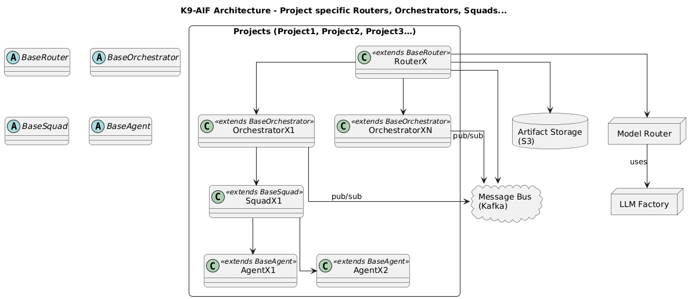

# K9-AIF Documentation

This directory contains supporting documentation and reference material for the K9-AIF architecture framework.

## Contents

- **blogs/**  
  Blogs
  
- **diagrams/**  
  Architecture diagrams and visual assets used throughout the project.

- **paper/**  
  Research papers and related material describing the K9-AIF framework.

Additional documentation may be added over time as the framework evolves.

## K9-AIF diagram showing multiple projects, routers, orchestrators, squads and agent pattern

