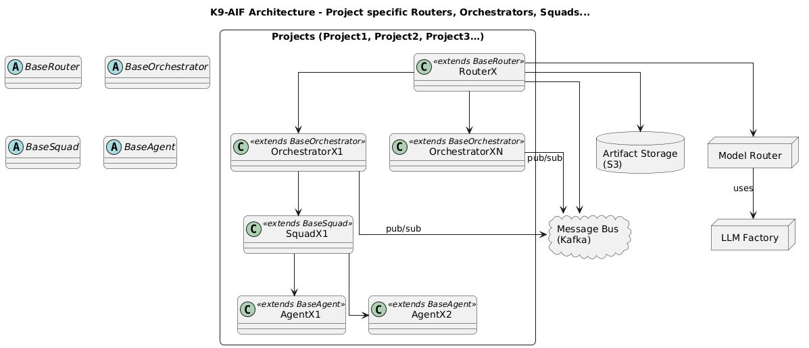

# K9-AIF Documentation

Supporting documentation and reference material for the K9-AIF framework. The published site
is built from this folder (`index.html`).

## Contents

- **[getting-started.md](getting-started.md)**: first steps with the framework.
- **[starthere/](starthere/)**, **[understanding-k9-aif/](understanding-k9-aif/README.md)**,
  **[about/](about/README.md)**: what K9-AIF is and the ideas behind it.
- **[developers/](developers/README.md)**: developer guide (Markdown and PDF).
- **[examples/](examples/README.md)**: the example applications.
- **[continuum/](continuum/README.md)**: the Enterprise Continuum.
- **[k9-aif-methodology/](k9-aif-methodology/README.md)**: the intake methodology.
- **[diagrams/](diagrams/README.md)**: architecture diagrams used across the project.
- **graph/**, **landscape/**, **roadmap/**, **architecture-bus/**: pages of the published site.
- **pydocs/**: API documentation generated by `./generate_pdoc.sh`.

## K9-AIF diagram showing multiple projects, routers, orchestrators, squads and agent pattern

