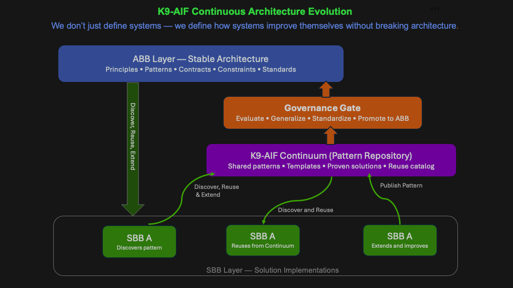

# K9-AIF Continuum

## Overview

The K9-AIF Continuum defines how architectural knowledge is captured, shared, and evolved across implementations.

It is inspired by the TOGAF Enterprise Continuum and extends it for agentic systems.

---

## TOGAF Enterprise Continuum (Reference)

The TOGAF Enterprise Continuum is a structured classification method — often described as a “virtual repository” — that organizes architectural assets such as:

- models  
- patterns  
- reference architectures  
- solution descriptions  

These assets range from:

- generic, foundational building blocks  
→ to  
- industry-specific solutions  
→ to  
- organization-specific implementations  

The continuum acts as a **map for reuse**, helping architects understand:

- where an asset fits  
- how it can be reused  
- how it evolves from generic to specific  

It combines:
- Architecture Continuum  
- Solutions Continuum  

---

## Implementation in Practice

The Enterprise Continuum is not a specific product.

Organizations typically implement it using tools such as:

- SharePoint  
- Confluence  
- GitHub  
- internal architecture portals  

These platforms act as repositories to:
- store architectural assets  
- classify patterns  
- enable discovery and reuse  

---

## K9-AIF Continuum

K9-AIF extends this concept to agentic systems and solution implementations.

It introduces a structured layer between:

- **SBB (Solution Building Blocks)** — where patterns are discovered  
- **ABB (Architectural Building Blocks)** — where patterns are standardized  

---

## Core Function

The K9-AIF Continuum enables:

1. **Pattern Capture**  
   - SBB implementations publish reusable patterns  

2. **Pattern Sharing**  
   - Other teams discover and reuse these patterns  

3. **Pattern Evaluation**  
   - Governance evaluates patterns for reuse and alignment  

4. **Pattern Promotion**  
   - High-value patterns are promoted to ABB  

---

## Lifecycle

Patterns in the Continuum typically follow:

- Draft  
- Shared  
- Reused  
- Validated  
- Promoted (to ABB)

---

## Key Principle

SBBs do not directly reuse each other.

Instead:

> SBBs publish → Continuum shares → Governance standardizes

---

## Design Principles

- Tool-agnostic  
- Structured and classifiable  
- Governed, not ad-hoc  
- Reuse-driven  
- Aligned with architectural principles  

---

## Summary

The K9-AIF Continuum provides a **controlled bridge between innovation and standardization**.

It ensures that:

- useful patterns are not lost  
- solutions are reusable across teams  
- architecture evolves in a governed manner  

> Systems improve continuously — without breaking architecture.

## Diagram

