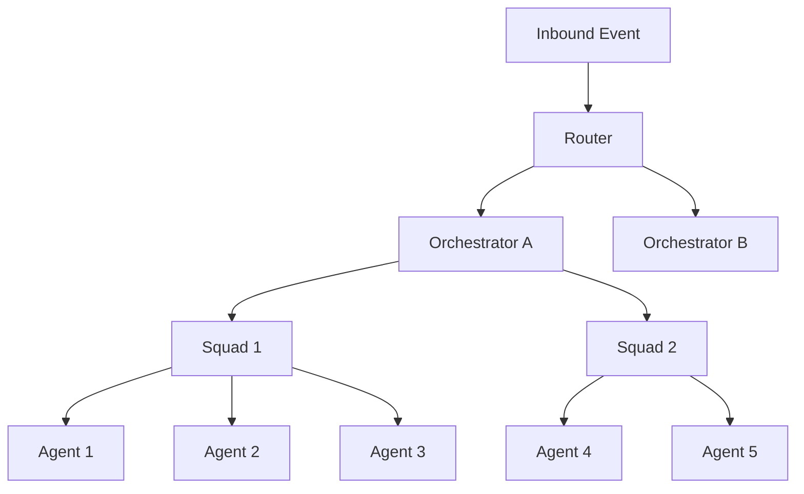
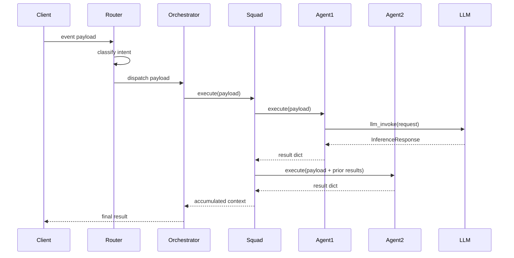
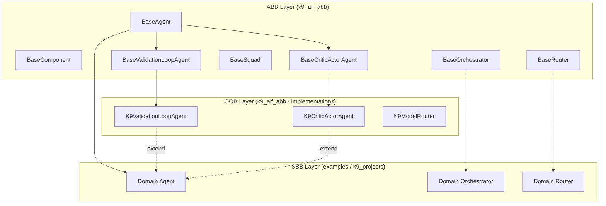
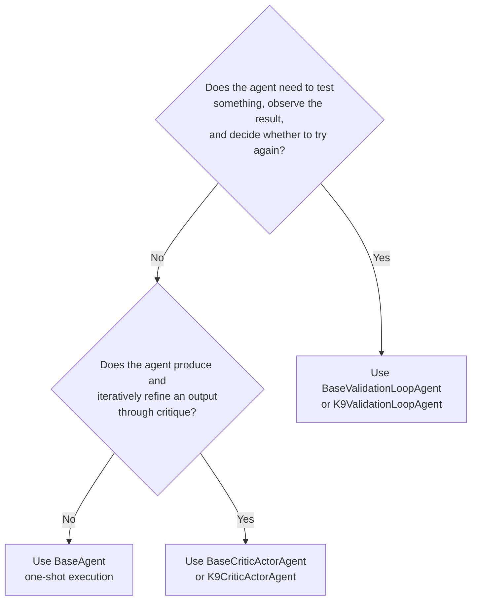
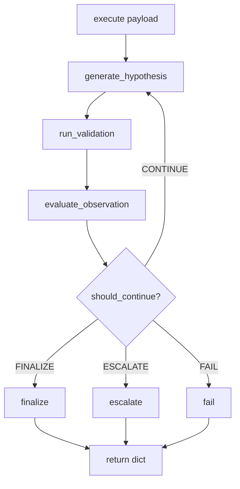
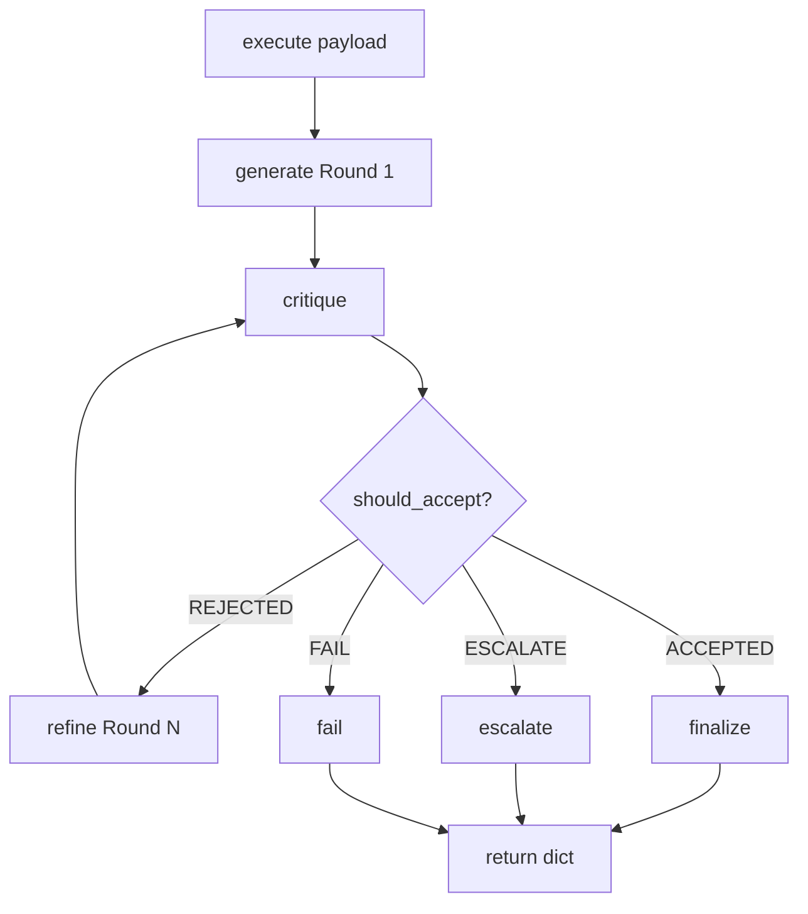
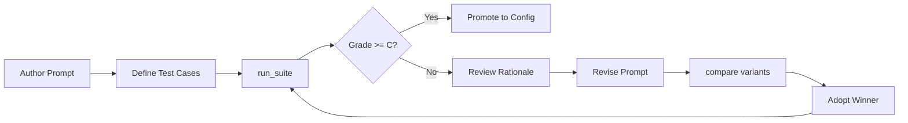

# K9-AIF Developer Guide
## Architecture-First Development for Governed Agentic AI Systems

---

**Author:** Ravi Natarajan  
**Project:** K9-AIF Framework  
**Last Updated:** 2026-07-21  
**Website:** [https://k9x.ai](https://k9x.ai)  
**Architecture Graph:** [https://graph.k9x.ai](https://graph.k9x.ai)  
**Blog:** [https://blog.k9x.ai](https://blog.k9x.ai)  
**Patterns Repository:** [https://github.com/k9aif/k9aif-patterns](https://github.com/k9aif/k9aif-patterns)  
**Main Repository:** [https://github.com/k9aif/k9-aif-framework](https://github.com/k9aif/k9-aif-framework)

---

## Table of Contents

1. [Introduction](#1-introduction)
   - [1.8 Developer Quick Start](#18-developer-quick-start)
2. [Repository Orientation](#2-repository-orientation)
3. [Core Architecture](#3-core-architecture)
4. [ABB vs SBB Development Model](#4-abb-vs-sbb-development-model)
5. [Agent Development Guide](#5-agent-development-guide)
6. [Orchestrator Development Guide](#6-orchestrator-development-guide)
7. [Router Development Guide](#7-router-development-guide)
8. [Validation Loop Pattern](#8-validation-loop-pattern)
9. [Critic-Actor Pattern](#9-critic-actor-pattern)
10. [Planning Loop Pattern](#10-planning-loop-pattern)
11. [Prompt Evaluation Pattern](#11-prompt-evaluation-pattern)
12. [Model Routing and Inference](#12-model-routing-and-inference)
13. [Governance and Zero Trust](#13-governance-and-zero-trust)
14. [K9X Security and Vulnerability Checks](#14-k9x-security-and-vulnerability-checks)
15. [Messaging, Events, and Telemetry](#15-messaging-events-and-telemetry)
16. [Persistence and Graph Integration](#16-persistence-and-graph-integration)
17. [Configuration Standards](#17-configuration-standards)
18. [Testing Standards](#18-testing-standards)
19. [Developer Workflow](#19-developer-workflow)
20. [K9X Studio Integration](#20-k9x-studio-integration)
21. [K9X Enterprise Continuum](#21-k9x-enterprise-continuum)
22. [Human-in-the-Loop Integration](#22-human-in-the-loop-integration)
23. [Provider Adapter Pattern](#23-provider-adapter-pattern)
24. [Using Claude Code with VSCode for K9-AIF Development](#24-using-claude-code-with-vscode-for-k9-aif-development)
25. [Common Architectural Mistakes](#25-common-architectural-mistakes)
26. [Author's Recommendations](#26-authors-recommendations)
27. [Patterns Reference](#27-patterns-reference)
28. [K9X Ecosystem](#28-k9x-ecosystem)
29. [Architect's Mindset](#29-architects-mindset)
30. [Acknowledgements](#30-acknowledgements)
31. [References](#31-references)

---

## 1. Introduction

### 1.1 What K9-AIF Is

K9-AIF (K9 Agent Integration Framework) is an architecture-first Python framework for building governed, observable, multi-agent AI systems at enterprise scale. It provides a layered set of abstract contracts (Architecture Building Blocks) and ready-to-use implementations (Solution Building Blocks) that teams can extend to build domain-specific AI solutions without starting from scratch and without sacrificing governance or observability.

The framework does not attempt to be a general-purpose AI toolkit. It is deliberately opinionated about structure: agents are small and focused, orchestrators coordinate squads of agents, routers decide which orchestrator handles an event, and governance runs at every layer boundary.

### 1.2 Why Architecture-First Agentic AI Matters

Most agentic AI systems begin as demos: a single agent connected to an LLM, returning answers. This works until the system needs to run in production, handle failures, respect data governance policies, produce audit trails, or be extended by a team. At that point, the absence of architectural structure becomes the primary source of risk.

K9-AIF applies a principle borrowed from enterprise architecture: define stable abstract contracts first, implement domain behavior second. This makes the system predictable, governable, and extensible without requiring rewrites.

### 1.3 Goals of the Framework

- Provide reusable ABBs that teams can extend without modifying the framework core
- Make governance, telemetry, and observability structural requirements, not afterthoughts
- Support iterative reasoning patterns (validation loops, actor-critic refinement) as first-class primitives
- Decouple model selection from agent logic through a routing layer
- Enable configuration-driven assembly of agents, squads, and orchestrators
- Support multiple inference backends, persistence stores, monitoring systems, and messaging backends through the factory pattern

### 1.4 ABB / OOB / SBB — Three Architectural Layers

K9-AIF uses TOGAF-inspired terminology to organize components into three distinct layers:

**Architecture Building Blocks (ABBs)** define the architectural abstractions. They are abstract classes that specify contracts — method signatures, lifecycle hooks, governance wiring — without any domain behavior. ABBs establish the vocabulary of the framework: what it means to be an agent, a router, a governance pipeline. They live in `k9_aif_abb/k9_core/` and change infrequently.

**Out-of-the-Box (OOB) implementations** are framework-provided realizations of ABB contracts. `K9ValidationLoopAgent`, `K9ModelRouter`, `K9PromptEvaluator`, and the provider adapters are OOB implementations. They are ready to use without modification and are the natural extension base for most domain SBBs — extend them and override only what differs.

**Solution Building Blocks (SBBs)** realize ABB contracts for a specific solution. They extend ABBs or OOB implementations with domain-specific logic, prompts, business rules, and tool integrations. SBBs live in `examples/` or `k9_projects/` and evolve as domain requirements evolve.

This three-layer separation means the architectural vocabulary (ABBs) stays stable, reusable defaults (OOB) reduce implementation effort, and domain behavior (SBBs) can evolve independently without affecting either layer above it.

### 1.5 Router → Orchestrator → Squads → Agents Hierarchy



Each layer has a single responsibility:

| Layer | Responsibility | Key Contract |
|---|---|---|
| **Router** | Classify intent; select orchestrator | `route(payload)` |
| **Orchestrator** | Coordinate a domain workflow via squads | `execute_flow(payload)` |
| **Squad** | Execute agents in a defined sequence | `execute(payload)` |
| **Agent** | Perform one unit of work | `execute(payload)` |

Each layer knows only what is below it. An agent does not know which squad it belongs to. A squad does not know which orchestrator called it. This decoupling is enforced by convention and by the YAML schema — agent YAML has no squad reference; squad YAML has no orchestrator reference.

### 1.6 Enterprise AI Systems vs Isolated Agents

Isolated agents solve demos. Enterprise AI systems solve production problems. The difference lies in governance (who authorized this action?), observability (what happened and why?), failure handling (what do we do when the LLM is unavailable?), and extensibility (how do we add a new domain without rewriting existing code?).

K9-AIF is designed for enterprise AI systems. Every architectural decision in the framework reflects these concerns.

### 1.7 K9-AIF Architecture Principles

These principles govern how K9-AIF is designed and how solutions built on it should be structured. Understanding them helps developers make better decisions at every stage of development.

**Architecture before implementation.** Design the component structure — agents, squads, orchestrators, routing — before writing Python. YAML first, code second. The YAML captures architectural intent; the Python fills it in.

**ABB first, SBB second.** Define the abstract contract before implementing domain behavior. If you cannot state what the ABB is, you are not ready to write the SBB.

**Realize contracts; do not bypass them.** Every SBB must extend an ABB or OOB implementation. Bypassing the contract — direct LLM calls, skipping governance, inventing a parallel orchestration path — produces ungovernable systems that cannot be tested, extended, or governed in production.

**Composition over coupling.** Agents, squads, orchestrators, and routers are composed via configuration and factories. Direct class references across layers are forbidden. An agent does not reference its squad. A squad does not reference its orchestrator.

**Configuration over hardcoding.** Model names, connection strings, provider choices, threshold values, and environment flags belong in YAML configuration, not Python code. The system should be promotable from development to production by changing configuration, not by changing code.

**Governance by construction.** Governance is wired at component initialization via `require_governance()`, not added later as an afterthought. A component without a governance pipeline is architecturally incomplete regardless of how much domain logic it contains.

**Observability by default.** Every framework component inherits logging, monitoring, and event publishing from `BaseComponent`. Telemetry is not optional and does not require separate wiring — it is part of the contract.

**Provider independence.** LLM backends, persistence stores, monitoring systems, messaging platforms, and secret managers are abstracted behind factory-provisioned ABBs. No concrete provider class should appear in domain code.

**Pattern-based development.** New domain behaviors emerge from extending established patterns — validation loop, actor-critic, squad orchestration, prompt evaluation — rather than from ad-hoc agent logic. When a new pattern is genuinely needed, formalize it as an ABB before building solutions with it.

**Framework stability over feature growth.** The ABB layer changes infrequently by design. The cost of every addition to `k9_aif_abb/` is paid by every current and future SBB. Domain-specific behavior belongs in SBBs, not in the framework core.

### 1.8 Developer Quick Start

**Do you need CrewAI? LangChain? Any other framework?**

No. K9-AIF is end-to-end. It provides the router, orchestrators, squads, agents, model routing, governance, messaging, persistence, and observability — out of the box, in one framework. You do not need to assemble these from separate libraries or integrate third-party orchestration tools to build a production-grade multi-agent AI system.

CrewAI and LangChain are supported as optional execution backends for teams that already use them. They are not required.

**The fastest path to a working system:**

**Step 1 — Start with K9X Studio (online)**

Go to [studio.k9x.ai](https://studio.k9x.ai). Upload a spec document or describe your system. Studio generates a governed K9-AIF architecture on the canvas — Router, Orchestrators, Squads, and Agents — wired together with governance from the start. Export the scaffold and start building.

**Step 2 — Run Studio locally**

```bash
pip install k9x
k9x studio
```

Studio runs at `http://localhost:5173`. Same canvas, same code generation, fully offline.

**Step 3 — Install the framework**

```bash
pip install k9-aif
```

For a complete local stack with all optional dependencies:

```bash
pip install "k9-aif[all]"
```

**Step 4 — Explore the examples**

The `examples/` directory contains working reference implementations. Start with the EOC (Enterprise Operations Center) — it demonstrates the full stack: Router → Orchestrators → Squads → Agents → Kafka → PostgreSQL → governance → telemetry, with a working web UI.

```bash
git clone https://github.com/k9aif/k9-aif-framework
cd k9-aif-framework/examples/K9X_Enterprise_Insurance_OperationsCenter
```

See Chapter 2 for repository orientation and Chapter 5 onward for the development guides.

---

## 2. Repository Orientation

### 2.1 Top-Level Repository Structure

```
k9-aif-framework/
├── k9_aif_abb/          # The framework package — ABBs and OOB implementations
├── examples/            # Reference SBB implementations (EOC is canonical)
├── k9_projects/         # Generated SBB stubs (from k9_generator.sh)
├── docs/                # Documentation
├── tests/               # Integration and smoke tests
├── k9_generator.sh      # Scaffold generator for new solutions
├── CLAUDE.md            # Claude Code integration guide
├── SKILLS.md            # Step-by-step development recipes
└── requirements.txt     # Python dependencies
```

### 2.2 k9_aif_abb Package Structure

```
k9_aif_abb/
├── k9_core/             # Foundation ABBs (abstract contracts)
│   ├── agent/           # BaseAgent, BaseMCPAgent
│   ├── router/          # BaseRouter
│   ├── orchestration/   # BaseOrchestrator, Handler (CoR)
│   ├── inference/       # BaseLLM, OllamaLLM, MockLLM
│   ├── governance/      # BaseGovernance, pipeline, require_governance()
│   ├── security/        # BaseSecurity, MockAuth
│   ├── persistence/     # BasePersistence
│   ├── messaging/       # BaseMessageAgent, K9EventBus
│   ├── monitoring/      # BaseMonitor, LoggerMonitor
│   ├── storage/         # BaseStorage
│   ├── retrieval/       # BaseRetriever, BaseDocParser, RetrieverRegistry
│   ├── integration/     # BaseConnector, MCPClientConnector, MCPHttpConnector
│   ├── streaming/       # BaseStreamProvider, RedpandaStreamProvider
│   ├── logging/         # BaseLogger
│   ├── formatter/       # BaseFormatter
│   ├── presentation/    # BaseUI
│   ├── iot/             # BaseIoTAgent
│   └── base_component.py # BaseComponent (root foundation)
│
├── k9_agents/           # Agent ABBs and OOB implementations
│   ├── validation/      # BaseValidationLoopAgent, K9ValidationLoopAgent
│   ├── critic_actor/    # BaseCriticActorAgent, K9CriticActorAgent
│   ├── chat/            # ChatAgentABB
│   ├── router/          # RouterAgent (intent classification)
│   ├── enrichment/      # EnrichmentAgent
│   ├── governance/      # GovernanceAgent
│   ├── security/        # AuthAgent, EncryptionAgent, SecretManagerAgent
│   ├── storage/         # FileStorageAgent, ObjectStorageAgent
│   ├── messaging/       # KafkaAgent, SQSAgent, TopicMessageAgent
│   ├── integration/     # MCPClientAgent, WebSearchAgent
│   ├── retrieval/       # DoclingParser
│   ├── async_agent/     # AsyncAgent
│   └── registry/        # AgentRegistry
│
├── k9_squad/            # Squad orchestration
│   ├── base_squad.py    # BaseSquad
│   ├── squad_context.py # SquadContext
│   ├── squad_loader.py  # SquadLoader
│   └── squad_monitor.py # Squad monitoring
│
├── k9_orchestrators/    # OOB orchestrator implementations
│   ├── framework_orchestrator.py
│   ├── governance_orchestrator.py
│   ├── diagnostic_orchestrator.py
│   ├── liveagent_orchestrator.py
│   └── orchestrator_loader.py
│
├── k9_inference/        # Model routing and inference
│   ├── models/          # InferenceRequest, InferenceResponse, RouteDecision
│   ├── routers/         # BaseModelRouter, K9ModelRouter, DefaultModelRouter
│   └── catalog/         # ModelCatalog
│
├── k9_factories/        # Component factories (LLM, Router, Monitor, etc.)
├── k9_storage/          # Storage implementations (SQLite, PostgreSQL, File)
├── k9_persistence/      # Persistence implementations
├── k9_monitoring/       # Monitoring implementations (Prometheus, OTEL, etc.)
├── k9_security/         # Zero-trust security layer
├── k9_governance/       # Governance implementations (ProfanityGovernance)
├── k9_data/             # Vector database and retrieval
├── k9_mcp/              # MCP server implementations
├── k9_adapters/         # Framework adapters (CrewAI)
├── k9_utils/            # Utilities (config_loader, llm_invoke, timer)
├── config/              # Framework default configuration YAML
├── policies/            # Default governance policy YAML
└── tests/               # Framework test suite
```

### 2.3 Major Folders and Responsibilities

| Folder | What Belongs Here |
|---|---|
| `k9_core/` | Abstract contracts only. No domain logic, no concrete implementations except minimal utility classes like `OllamaLLM` and `MockLLM` |
| `k9_agents/` | Agent patterns (ABBs) and OOB agent implementations ready for domain extension |
| `k9_squad/` | Squad assembly, execution flow, and YAML loading |
| `k9_orchestrators/` | Concrete orchestrator implementations for framework-level concerns |
| `k9_inference/` | Model catalog, routing contracts, and the OOB `K9ModelRouter` |
| `k9_factories/` | All component construction; application code never instantiates framework components directly |
| `k9_storage/` and `k9_persistence/` | Storage backends; agents and orchestrators depend on `BasePersistence` / `BaseStorage`, never on a concrete class |
| `k9_security/` | Zero-trust execution context model; wired optionally into routers and orchestrators |
| `k9_utils/` | Cross-cutting utilities; `llm_invoke` is the canonical LLM call path |
| `config/` | Framework-level default YAML. **Do not treat this as production config.** Each solution defines its own `config/config.yaml` |

### 2.4 How Developers Should Navigate the Codebase

**Start with the ABBs:** Understand the contracts before reading implementations. The abstract classes in `k9_core/` are concise and well-documented. Reading them takes less than an hour and reveals the full structure.

**Read CLAUDE.md:** This file contains the authoritative architecture notes, decoupling rules, and infrastructure defaults. It is more accurate than any documentation that lags the code.

**Read SKILLS.md:** This file contains step-by-step recipes for the most common tasks. Use it before writing any new agent, squad, orchestrator, or router.

**Use the EOC example:** `examples/K9X_Enterprise_Insurance_OperationsCenter/` is the canonical reference implementation. When in doubt, read how EOC does it.

---

## 3. Core Architecture

### 3.1 BaseComponent

`k9_core/base_component.py` — the root foundation for all framework components.

```python
class BaseComponent:
    def __init__(
        self,
        monitor=None,
        message_bus=None,
        config: Optional[Dict[str, Any]] = None,
    ):
        self.monitor = monitor
        self.logger = logging.getLogger(self.__class__.__name__)
        self.config = config or {}
        self.message_bus = message_bus

    async def log(self, message: str, level: str = "INFO", **kwargs) -> None:
        """Log to logger, emit to monitor, publish to message bus."""
```

`BaseComponent` wires together the three observability channels that every framework component uses: Python logger, monitor (for metrics), and message bus (for events). Most components inherit from it indirectly through `BaseAgent`, `BaseOrchestrator`, or `BaseRouter`.

### 3.2 BaseAgent

`k9_core/agent/base_agent.py` — the execution contract for every agent.

```python
class BaseAgent(ABC):
    layer: str = "Agent Base"

    def __init__(
        self,
        config: Optional[Dict[str, Any]] = None,
        monitor=None,
        message_bus=None,
        governance=None,
    ):
        self.config = config or {}
        self.monitor = monitor
        self.message_bus = message_bus
        self.governance = require_governance(governance, self.config.get("k9_env"))
        self.logger = logging.getLogger(self.__class__.__name__)

    @abstractmethod
    def execute(self, payload: Dict[str, Any]) -> Dict[str, Any]:
        raise NotImplementedError("Subclasses must implement execute()")

    def publish_event(self, event: Dict[str, Any]) -> None:
        """Publish event to message bus and monitor."""

    async def apply_pre_governance(self, payload, ctx=None) -> Dict[str, Any]:
        """Apply governance pre-process hook before payload is sent outward."""

    async def apply_post_governance(self, payload, ctx=None) -> Dict[str, Any]:
        """Apply governance post-process hook after payload is received."""

    def enforce_governance(self) -> None:
        """
        Assert real governance is configured.
        - development/test: logs WARNING, continues
        - production/staging: raises PermissionError if NoopGovernance active
        """
```

The `layer` class attribute identifies the component in logs and events. Every subclass should override it with a meaningful name.

### 3.3 BaseRouter

`k9_core/router/base_router.py` — the intent routing contract.

```python
class BaseRouter(ABC):
    layer: str = "Router Base"

    def __init__(
        self,
        config=None, monitor=None, message_bus=None, governance=None,
        zero_trust_guard=None, policy_enforcer=None,
        enable_zero_trust: Optional[bool] = None,
    ):
        # governance, zero-trust, registry wired at construction

    def register_orchestrator(self, intent: str, orchestrator: Any) -> None:
        """Register an orchestrator for a given intent."""

    @abstractmethod
    def route(self, payload: Dict[str, Any]) -> Dict[str, Any]:
        """Route the payload to the correct orchestrator."""

    def normalize(self, payload: Dict[str, Any]) -> Dict[str, Any]:
        """Normalize inbound payload before routing (optional hook)."""

    def apply_zero_trust(self, payload, ctx=None) -> Dict[str, Any]:
        """Apply zero-trust execution layer (if enabled)."""
```

The router is the entry point for all inbound events. It performs intent classification, optional zero-trust evaluation, and dispatches to the registered orchestrator. Routers own the first Kafka publish in a standard K9-AIF pipeline.

### 3.4 BaseOrchestrator

`k9_core/orchestration/base_orchestrator.py` — the workflow coordination contract.

```python
class BaseOrchestrator(ABC):
    layer: str = "Orchestrator Base"

    def __init__(
        self,
        config=None, monitor=None, message_bus=None, governance=None,
        zero_trust_guard=None, policy_enforcer=None,
        enable_zero_trust: Optional[bool] = None,
    ):
        # governance, zero-trust wired at construction

    @abstractmethod
    def execute_flow(self, payload: Dict[str, Any]) -> Dict[str, Any]:
        """Execute the orchestration flow."""

    def publish_status(self, status: str, context: Dict[str, Any]) -> None:
        """Publish lifecycle status event."""

    def apply_zero_trust(self, payload, ctx=None) -> Dict[str, Any]:
        """Apply zero-trust evaluation if enabled."""
```

The orchestrator is responsible for the entire domain workflow. It loads and executes squads, applies governance, publishes status events, and returns the final result. It does not know about the router that dispatched to it.

### 3.5 BaseSquad

`k9_squad/base_squad.py` — sequential agent execution.

```python
class BaseSquad:
    def __init__(self, squad_id, agents, orchestrator=None, monitor=None):
        self.squad_id = squad_id
        self.agents = agents or []
        self.flow = []

    def execute(self, payload: dict) -> dict:
        """
        Execute agents in flow order.
        Each step receives the accumulated context from all prior steps.
        Conditional steps (when:) are skipped if condition is false.
        Returns {"status": "completed", "squad_id": ..., **step_results}
        """

    def run(self, payload) -> dict:
        """Alias for execute()."""
```

`BaseSquad` is not abstract — it is a concrete implementation. Domain solutions rarely need to subclass it. The flow behavior is fully driven by the YAML definition loaded by `SquadLoader`.

### 3.6 Configuration-Driven Loading

K9-AIF uses YAML-driven assembly for agents, squads, and orchestrators. This means the structure of the system — which agents form a squad, what prompts they use, which model they invoke — is expressed in configuration rather than hardcoded.

The primary loaders are:

| Loader | Input | Output |
|---|---|---|
| `AgentRegistry` | Name → class mapping | Agent instances |
| `SquadLoader` | YAML file + squad ID | `BaseSquad` with wired agents |
| `OrchestratorLoader` | Config dict | `BaseOrchestrator` instance |
| `LLMFactory` | Config block | Cached LLM instances |
| `ModelRouterFactory` | Config block | Cached router instance |

### 3.7 Runtime Execution Model



Context accumulation is the key concept: each agent in a squad enriches the shared context progressively. Agent 2 receives both the original payload and Agent 1's output. By the final agent, the context contains the full enriched state of the workflow.

### 3.8 Layering Strategy



ABBs define contracts. OOB implementations provide ready-to-use defaults. Domain SBBs extend either the ABB directly (for full control) or the OOB implementation (to inherit defaults and override what differs).

---

## 4. ABB vs SBB Development Model

### 4.1 What Belongs in ABB

ABBs define stable, reusable contracts that are domain-agnostic. They belong in `k9_aif_abb/` and should:

- Contain only abstract methods or minimal lifecycle implementations
- Express architectural intent, not business rules
- Remain stable across releases
- Contain no references to specific domains (claims, fraud, medical)
- Contain no hardcoded prompts, business logic, or connection strings

**Good ABB:** `BaseValidationLoopAgent` — defines a hypothesis-validate-reason loop skeleton. No domain logic.

**Bad ABB:** An agent that knows about insurance claims, contains specific prompts, or references a particular database schema.

### 4.2 What Belongs in SBB

SBBs realize ABB contracts for a specific solution. They belong in `examples/<App>/` or `k9_projects/<App>/` and should:

- Extend exactly one ABB (or OOB implementation)
- Contain all domain-specific prompts, business rules, and tool integrations
- Override only the methods required for their domain
- Not modify the parent ABB

**Good SBB:** `FraudDetectionAgent(K9ValidationLoopAgent)` — overrides `run_validation()` to call a fraud rule engine, overrides `should_continue()` for fraud-specific confidence thresholds.

### 4.3 What Belongs in Examples

The `examples/` directory contains complete, runnable reference implementations. The canonical example is `examples/K9X_Enterprise_Insurance_OperationsCenter/` (EOC). Examples demonstrate:

- How to wire agents into squads
- How to wire squads into orchestrators
- How to configure Kafka, PostgreSQL, governance policies
- How iterative patterns are used in practice

Examples are not templates. They are reference implementations to learn from, not copy.

### 4.4 Stable Contracts vs Domain Realizations

| Aspect | ABB (Stable Contract) | SBB (Domain Realization) |
|---|---|---|
| Location | `k9_aif_abb/` | `examples/` or `k9_projects/` |
| Change rate | Infrequent | Frequent |
| Abstraction | Abstract class | Concrete class |
| Domain knowledge | None | Full |
| Prompt content | None | Yes |
| Business rules | None | Yes |
| Tests | Framework stability tests | Domain behavior tests |

### 4.5 Anti-Patterns to Avoid

**Anti-pattern: Putting domain logic in ABBs**
```python
# Wrong — domain knowledge in ABB
class BaseClaimsAgent(BaseAgent):
    COVERAGE_LIMIT = 50000  # domain constant has no place here
```

**Anti-pattern: Bypassing the agent contract**
```python
# Wrong — calling Ollama directly from agent code
import requests
resp = requests.post("http://localhost:11434/api/generate", json={...})
```

**Anti-pattern: Agents referencing squads**
```python
# Wrong — agent should never know its squad context
class MyAgent(BaseAgent):
    def execute(self, payload):
        next_agent = self.squad.agents[1]  # forbidden coupling
```

**Anti-pattern: Squad referencing its orchestrator**
```yaml
# Wrong — squad YAML must not reference its orchestrator
squads:
  MySquad:
    orchestrator: MyOrchestrator  # this field must not exist
```

### 4.6 Why Not Everything Belongs in the Framework Core

The framework core is stable because it is small and focused. Every addition to the ABB layer increases the surface area that all solutions must track. Domain logic, prompt engineering, and business rules evolve at a much higher rate than architectural contracts. Keeping them in SBBs means the framework stays stable while solutions evolve freely.

### 4.7 The Three-Layer Model: ABB, OOB, and SBB

| Layer | Purpose | Location | Change Rate |
|---|---|---|---|
| **ABB** (Architecture Building Block) | Abstract contracts — defines the architectural interface | `k9_aif_abb/k9_core/` | Infrequent — changes only when the architectural contract itself must evolve |
| **OOB** (Out-of-the-Box) | Framework-provided reusable implementations — ready to use or extend | `k9_aif_abb/k9_agents/`, `k9_aif_abb/k9_inference/` | Moderate — new capabilities and improved defaults |
| **SBB** (Solution Building Block) | Domain realizations — extends ABB or OOB for a specific solution | `examples/` or `k9_projects/` | Frequent — evolves with domain requirements |

**ABBs define what.** They establish the architectural vocabulary: what it means to be an agent, a router, a governance pipeline.

**OOBs demonstrate how.** `K9ValidationLoopAgent`, `K9ModelRouter`, `K9PromptEvaluator` — these are reusable defaults that work without modification, and are the natural extension base for most SBBs. Extend an OOB when the default behavior is mostly correct and you need to override only 1–2 methods. Extend the ABB directly only when you need full control over the entire realization.

**SBBs realize the domain.** A fraud detection agent, a claims processing squad, a compliance router — all domain knowledge lives here, behind ABB contracts.

The three-layer model ensures that architectural stability (ABBs never change due to domain requirements) and solution velocity (SBBs change freely) can coexist without coordination.

### 4.8 Why ABBs Exist

ABBs exist to stabilize architecture, not to enable code reuse. Code reuse is a side effect. The primary goal is this: once an ABB is established, every solution built on it can evolve independently without coordination. Adding a new inference provider, a new persistence backend, or a new agent pattern does not require any change to existing SBBs — because they depend on the ABB contract, not on any concrete implementation.

Without stable ABBs, enterprise multi-agent systems devolve into point-to-point integrations: every new model, every new backend, every new feature requires changes in multiple places. The ABB layer prevents this by giving every solution a fixed, governance-bearing surface area to depend on.

**ABBs are commitments.** Every abstract method in an ABB is a commitment to every current and future SBB that realizes it. Add abstract methods carefully — each addition becomes a requirement for all implementations.

**ABBs are not domain code.** The moment an ABB contains a domain constant, a specific prompt, a named model, or a business rule, the architectural boundary has been violated. Domain knowledge belongs exclusively in SBBs.

### 4.9 SBB Lifecycle

Every SBB follows a lifecycle from initial design to reusable architectural knowledge:

```
1. Design     → Identify the ABB or OOB base; clarify what the SBB realizes
2. Scaffold   → Use k9_generator.sh or Studio to create the file structure
3. Realize    → Override required abstract methods; add domain logic
4. Test       → Write domain behavior tests; verify governance and LLM mocking
5. Inspect    → Run k9aif inspect to verify ABB compliance and decoupling
6. Deploy     → Run in production; observe telemetry and governance output
7. Publish    → Publish to the K9X Enterprise Continuum with metadata
8. Reuse      → Other solutions discover and extend the published SBB
9. Promote    → If the pattern recurs across 3+ solutions, consider promoting to OOB or ABB
```

Steps 1–6 are required for every SBB. Steps 7–9 enable organizational learning: validated domain realizations become reusable building blocks that future solutions can discover and build on. The K9X Enterprise Continuum (Chapter 21) provides the infrastructure for steps 7–9.

### 4.10 Architectural Decision Guide

Use this matrix when making design decisions in K9-AIF.

**When should I create a new ABB?**
- There is a genuine gap in the architectural vocabulary that no existing ABB covers
- The need will recur across multiple solutions (not domain-specific)
- The interface has been proven stable by at least two independent SBB realizations
- The contract can be specified without any domain knowledge

**When should I extend an OOB implementation (rather than the ABB directly)?**
- The OOB default behavior is mostly correct and you need to override only 1–2 methods
- You want to inherit the event taxonomy, telemetry hooks, and configuration defaults
- The OOB provides a proven loop skeleton, routing algorithm, or evaluation pipeline

**When should I create a new SBB (by extending the ABB directly)?**
- You need domain-specific behavior from the ground up
- No OOB implementation exists or fits the domain structure
- You need full control over the entire realization

**When should I NOT create a new ABB?**
- The need is specific to one domain or one solution
- The contract would require domain knowledge to specify
- Fewer than two independent implementations exist yet

**When should I introduce a new pattern?**
- Three or more solutions have independently arrived at similar iterative logic
- The pattern can be described as a lifecycle with clear abstract steps
- The pattern complements (does not duplicate) existing patterns

**When should I reuse an existing OOB implementation?**
- Always — when a validation loop, actor-critic refinement, planning loop, or prompt evaluation cycle fits the problem, extend the established OOB implementation before building from scratch

---

## 5. Agent Development Guide

### 5.1 Creating a New Agent

Every new agent follows this structure:

**Step 1 — Create the agent YAML**

```yaml
# examples/<App>/agents/yaml/my_assessment_agent.yaml

name: MyAssessmentAgent
class: MyAssessmentAgent

description: >
  Evaluates incoming requests and produces a structured assessment
  with confidence score.

pattern: reasoning
model: reasoning          # must match a key in inference.model_catalog

role: >
  You are a senior assessment specialist with deep expertise in
  evaluating complex requests against established criteria.

goal: >
  Analyze the provided input thoroughly. Return a structured assessment
  with a clear decision (approved/review/rejected) and a confidence score.

instructions:
  - Consider all dimensions of the request before deciding
  - Include specific reasoning for your decision
  - Confidence must reflect genuine certainty, not optimism
  - Always return valid JSON matching the output_schema

output_schema:
  decision: string (approved | review | rejected)
  reasoning: string
  confidence: float (0.0-1.0)
  flags: list[string]

governance:
  pre_process: true
  post_process: true
```

**Step 2 — Create the Python class**

```python
# examples/<App>/agents/src/my_assessment_agent.py

import json
from typing import Any, Dict, Optional

from k9_aif_abb.k9_core.agent.base_agent import BaseAgent
from k9_aif_abb.k9_inference.models.inference_request import InferenceRequest
from k9_aif_abb.k9_utils.llm_invoke import llm_invoke


class MyAssessmentAgent(BaseAgent):

    layer = "<App> MyAssessmentAgent SBB"

    def __init__(self, config: Optional[Dict[str, Any]] = None, monitor=None, **kwargs):
        super().__init__(config or {}, monitor=monitor, **kwargs)

    def execute(self, payload: Dict[str, Any]) -> Dict[str, Any]:
        prompt = (
            f"Role: {self.config.get('role', '')}\n"
            f"Goal: {self.config.get('goal', '')}\n\n"
            f"Instructions:\n"
            + "\n".join(f"- {i}" for i in self.config.get("instructions", []))
            + f"\n\nInput:\n{json.dumps(payload, indent=2)}\n\n"
            f"Respond with valid JSON matching this schema:\n"
            f"{json.dumps(self.config.get('output_schema', {}), indent=2)}"
        )

        req = InferenceRequest(
            prompt=prompt,
            task_type=self.config.get("model", "general"),
            metadata={"agent": self.layer},
        )

        try:
            resp = llm_invoke(self.config, req)
        except RuntimeError as exc:
            self.logger.error("[%s] LLM unavailable: %s", self.layer, exc)
            return {"agent": self.layer, "output": "[WARN] LLM unavailable", "confidence": 0.0}

        self.publish_event({"type": "AssessmentCompleted", "agent": self.layer})

        return {
            "agent": self.layer,
            "output": resp.output.strip(),
            "model_used": resp.model_alias,
        }
```

**Step 3 — Register in the orchestrator's `_load_squad()`**

```python
from examples.my_app.agents.src.my_assessment_agent import MyAssessmentAgent

agent_registry.register(
    "MyAssessmentAgent",
    lambda: MyAssessmentAgent(config=agent_loader.merge_with_global("MyAssessmentAgent", self.config)),
)
```

**Step 4 — Add to the squad YAML flow**

```yaml
squads:
  AssessmentSquad:
    description: "Triage and assessment workflow."
    agents:
      - IntakeAgent
      - MyAssessmentAgent
      - AuditAgent
    flow:
      - agent: IntakeAgent
        result_key: intake
      - agent: MyAssessmentAgent
        result_key: assessment
      - agent: AuditAgent
        result_key: audit
```

### 5.2 Agent YAML Configuration

Agent YAML files express all behavioral configuration. The fields available:

| Field | Purpose | Required |
|---|---|---|
| `name` | Unique agent name | Yes |
| `class` | Python class name (must match exactly) | Yes |
| `description` | Human-readable purpose | Yes |
| `pattern` | Reasoning pattern: `reasoning`, `extraction`, `chat`, `guardrails` | Yes |
| `model` | Model catalog alias for LLM selection | Yes |
| `role` | LLM system prompt — who the agent is | Yes |
| `goal` | LLM user prompt — what to achieve | Yes |
| `instructions` | List of specific behavioral instructions | Recommended |
| `output_schema` | Expected output structure | Recommended |
| `governance.pre_process` | Apply governance before LLM call | Optional |
| `governance.post_process` | Apply governance after LLM call | Optional |
| `max_tokens` | Override model max tokens | Optional |
| `confidence_threshold` | For iterative agents | Optional |

### 5.3 AgentLoader Behavior

When an orchestrator calls `agent_loader.merge_with_global(agent_name, global_config)`, the loader:

1. Reads the agent's YAML file
2. Merges with the global `config.yaml`
3. Agent YAML wins on key collision

The resulting merged dict is passed as `agent.config`. This means agents can access both their behavioral configuration (`self.config.get("role")`) and infrastructure configuration (`self.config.get("inference")`).

### 5.4 execute(payload) Contract

The `execute()` method is the agent's only public interface to the framework. It must:

- Accept a `Dict[str, Any]` payload
- Return a `Dict[str, Any]` result
- Be synchronous
- Handle its own LLM errors gracefully
- Never raise exceptions to the squad level for recoverable errors

The payload passed to an agent in a squad contains the original event plus all results from prior agents in the flow. Agents access prior results via standard dict keys.

### 5.5 Event Publishing Expectations

Agents should publish events for significant outcomes:

```python
self.publish_event({
    "type": "AssessmentCompleted",
    "agent": self.layer,
    "correlation_id": payload.get("correlation_id"),
    "decision": result.get("decision"),
    "confidence": result.get("confidence"),
})
```

In standard K9-AIF solutions, agents are wired without a `message_bus`. Their `publish_event()` calls reach the monitor and logger only — not Kafka. This is intentional: agents share data sequentially through the squad flow, not through messaging.

### 5.6 Governance Integration Expectations

Agents that handle sensitive payloads should apply governance hooks:

```python
import asyncio

def execute(self, payload):
    # Enforce governance is configured
    try:
        self.enforce_governance()
    except PermissionError as exc:
        self.logger.error("[%s] %s", self.layer, exc)
        return {"agent": self.layer, "output": "[WARN] governance not configured"}

    # Apply pre-governance (sanitize input)
    payload = asyncio.get_event_loop().run_until_complete(
        self.apply_pre_governance(payload)
    )

    # ... LLM call ...

    # Apply post-governance (validate output)
    result = asyncio.get_event_loop().run_until_complete(
        self.apply_post_governance(result)
    )

    return result
```

### 5.7 Do / Do Not

| Do | Do Not |
|---|---|
| Extend `BaseAgent` | Call `OllamaLLM` directly |
| Use `llm_invoke()` for all LLM calls | Import `LLMFactory` in agent code |
| Handle `RuntimeError` from `llm_invoke` | Let LLM errors propagate as exceptions |
| Set `layer` class attribute | Omit `layer` |
| Publish events for significant outcomes | Publish raw payload data in events |
| Use `self.config.get("role")` for prompts | Hardcode prompts in Python |
| Keep agents focused on one concern | Build multi-concern agents |

### 5.8 Choosing Between Agent Patterns



> **Solution Architect Note:** The generator scaffolds all agents as `BaseAgent` by default. The SA must explicitly decide at design time which agents need iterative behavior. Most agents — triage, routing, audit, guard, graph sync — are correctly one-shot. Reserve iterative patterns for agents that genuinely need to converge on confidence.

---

## 6. Orchestrator Development Guide

### 6.1 When to Create an Orchestrator

Create a new orchestrator when you have a distinct domain workflow that requires coordinating multiple squads or applying domain-specific governance. Do not create an orchestrator for every feature — one orchestrator per domain workflow is the right granularity.

### 6.2 Orchestrator Responsibilities

A K9-AIF orchestrator is responsible for:

1. Loading and executing the appropriate squad(s) for the workflow
2. Applying pre/post governance at the workflow boundary
3. Optionally applying zero-trust evaluation
4. Publishing status events for the lifecycle (started, completed, failed)
5. Returning the final result to the router or caller

An orchestrator is **not** responsible for:

- Routing decisions (that belongs to the Router)
- Individual agent execution (that belongs to the Squad)
- LLM invocation (that belongs to the Agent via `llm_invoke`)

### 6.3 Squad Coordination

```python
class MyDomainOrchestrator(BaseOrchestrator):

    layer = "MyDomain Orchestrator SBB"
    _SQUAD_ID = "MyDomainSquad"

    def __init__(self, config=None, monitor=None, message_bus=None, governance=None):
        super().__init__(config or {}, monitor=monitor,
                         message_bus=message_bus, governance=governance)
        self.squad = self._load_squad()

    def execute_flow(self, payload: Dict[str, Any]) -> Dict[str, Any]:
        self.publish_status("started", {"squad_id": self._SQUAD_ID,
                                         "correlation_id": payload.get("correlation_id")})
        try:
            result = self.squad.execute(payload)
            self.publish_status("completed", {"squad_id": self._SQUAD_ID,
                                              "status": result.get("status")})
            return result
        except Exception as exc:
            self.logger.error("[%s] Flow failed: %s", self.layer, exc)
            self.publish_status("failed", {"error": str(exc)})
            return {"status": "error", "error": str(exc)}

    def _load_squad(self) -> BaseSquad:
        from k9_aif_abb.k9_squad.squad_loader import SquadLoader
        from k9_aif_abb.k9_agents.registry.agent_registry import AgentRegistry
        # register agents and load squad
        agent_registry = AgentRegistry()
        # ... register agents ...
        loader = SquadLoader(agent_registry)
        return loader.load_one("config/squads.yaml", self._SQUAD_ID)
```

### 6.4 Routing Boundaries

The orchestrator's boundary is clear:

- **Receives from:** The Router via `execute_flow(payload)`
- **Delegates to:** One or more Squads via `squad.execute(payload)`
- **Returns to:** The Router (or the Kafka result topic)

The orchestrator does not need to know how the payload arrived. The payload should contain everything the workflow needs, stamped by the router before dispatch.

### 6.5 Failure Handling

Orchestrators should catch all exceptions from squad execution and return a structured error result rather than propagating the exception. This prevents one domain failure from crashing the entire routing process.

```python
try:
    result = self.squad.execute(payload)
except Exception as exc:
    self.logger.error("[%s] Squad execution failed: %s", self.layer, exc)
    self.publish_status("failed", {"reason": str(exc)})
    return {
        "status": "error",
        "domain": "my_domain",
        "error": str(exc),
        "correlation_id": payload.get("correlation_id"),
    }
```

### 6.6 Enterprise Orchestration Principles

- **One orchestrator per domain workflow.** Do not create orchestrators for sub-tasks.
- **Publish lifecycle events.** Use `publish_status()` at start, completion, and failure.
- **Preserve correlation IDs.** Pass `correlation_id` through all events for distributed tracing.
- **Keep orchestrators stateless.** Load squads at startup; do not maintain execution state between calls.
- **Never bypass governance.** Apply `apply_pre_governance()` and `apply_post_governance()` for any regulated domain.

---

## 7. Router Development Guide

### 7.1 Intent Routing

The router is the framework entry point. In a Kafka-based deployment, it consumes from the primary event topic and publishes to domain-specific topics. In a direct-call deployment, it selects and invokes the correct orchestrator.

The router's decision logic should be deterministic where possible:

- **Deterministic routing:** `event_type` field maps directly to an orchestrator
- **Intent-driven routing:** LLM or classifier determines intent, then maps to orchestrator

### 7.2 Router Responsibilities

| Responsibility | Notes |
|---|---|
| Intent classification | Deterministic or LLM-based |
| Orchestrator selection | Via `register_orchestrator()` registry |
| Zero-trust evaluation | Optional, via `apply_zero_trust()` |
| Governance pre-processing | Optional, via `apply_pre_governance()` |
| Event publishing | Publish routing decision for audit trail |
| Payload normalization | Stamp common fields (`correlation_id`, `intent`) |

### 7.3 Implementing a Router

```python
class MyRouter(BaseRouter):

    layer = "MyRouter SBB"

    def __init__(self, config=None, monitor=None, message_bus=None, governance=None):
        super().__init__(config or {}, monitor=monitor,
                         message_bus=message_bus, governance=governance)
        self._setup_orchestrators()

    def route(self, payload: Dict[str, Any]) -> Dict[str, Any]:
        event_type = payload.get("event_type", "unknown")
        payload = self.normalize(payload)

        orchestrator = self.registry.get(event_type)
        if not orchestrator:
            self.logger.warning("[%s] No orchestrator for event_type: %s", self.layer, event_type)
            return {"status": "unrouted", "event_type": event_type}

        self.publish_event({
            "type": "EventRouted",
            "event_type": event_type,
            "correlation_id": payload.get("correlation_id"),
        })

        return orchestrator.execute_flow(payload)

    def normalize(self, payload: Dict[str, Any]) -> Dict[str, Any]:
        import uuid
        payload.setdefault("correlation_id", str(uuid.uuid4()))
        return payload

    def _setup_orchestrators(self):
        from examples.my_app.orchestrators.claims_orchestrator import ClaimsOrchestrator
        from examples.my_app.orchestrators.fraud_orchestrator import FraudOrchestrator
        self.register_orchestrator("claims_event", ClaimsOrchestrator(self.config))
        self.register_orchestrator("fraud_alert", FraudOrchestrator(self.config))
```

### 7.4 Kafka Event Topology

In a Kafka-based deployment:

```
Client → eoc-events topic
           ↓
        Router (consumes eoc-events, publishes to domain topics)
           ↓
        eoc-claims / eoc-fraud / eoc-compliance
           ↓
        Orchestrator (consumes domain topic, runs squads)
           ↓
        eoc-results topic
```

**Kafka ownership rule:** The Router is the only publisher of domain topics. The Orchestrator is the only consumer of domain topics and publisher of results. Agents never publish to Kafka in a standard K9-AIF solution.

### 7.5 Router-to-Orchestrator Handoff

The handoff is a method call (synchronous) or Kafka topic publish (async). In both cases, the payload contains:

- `event_type` — what happened
- `correlation_id` — for distributed tracing
- `intent` — if LLM classification was applied
- All original domain data

The orchestrator receives this payload and begins `execute_flow()` without knowledge of how it was dispatched.

---

## 8. Validation Loop Pattern

### 8.1 Overview

The Validation Loop is an iterative reasoning pattern for agents that must test a hypothesis, observe the result, and decide whether to continue before producing a final answer.



### 8.2 BaseValidationLoopAgent

`k9_agents/validation/base_validation_loop_agent.py`

The ABB that provides the loop skeleton. Five abstract methods define the domain behavior:

```python
class BaseValidationLoopAgent(BaseAgent):
    layer: str = "BaseValidationLoopAgent"

    # Loop skeleton is implemented in execute() — do not override it

    @abstractmethod
    def generate_hypothesis(self, loop_ctx: ValidationLoopContext) -> Any:
        """Form the next thing to test. Has access to loop_ctx.steps (prior iterations)."""

    @abstractmethod
    def run_validation(self, hypothesis: Any, loop_ctx: ValidationLoopContext) -> Any:
        """Invoke tool/function/rule engine/LLM to test the hypothesis."""

    @abstractmethod
    def evaluate_observation(self, tool_result: Any, loop_ctx: ValidationLoopContext) -> Any:
        """Interpret raw tool result. Return dict with 'confidence' key (float 0.0-1.0)."""

    @abstractmethod
    def should_continue(self, observation: Any, loop_ctx: ValidationLoopContext) -> ValidationDisposition:
        """Return CONTINUE | FINALIZE | ESCALATE | FAIL."""

    @abstractmethod
    def finalize(self, loop_ctx: ValidationLoopContext) -> ValidationLoopResult:
        """Produce the validated output."""

    # Optional overrides — defaults provided
    def escalate(self, loop_ctx: ValidationLoopContext) -> ValidationLoopResult:
        """Default: return ESCALATE disposition. Override for domain HIL logic."""

    def fail(self, loop_ctx: ValidationLoopContext) -> ValidationLoopResult:
        """Default: return FAIL disposition. Override for domain failure output."""
```

**Config keys for tuning the loop:**

```yaml
max_iterations: 5                    # hard cap on iterations (default: 5)
confidence_threshold: 0.8            # available to should_continue() (default: 0.8)
finalize_on_max_iterations: true     # true → finalize; false → escalate on timeout
escalate_on_tool_error: false        # true → ESCALATE; false → FAIL on run_validation() error
```

### 8.3 K9ValidationLoopAgent

`k9_agents/validation/k9_validation_loop_agent.py`

The OOB implementation where the LLM is the validation tool. Use this when LLM reasoning is sufficient for validation.

```python
class K9ValidationLoopAgent(BaseValidationLoopAgent):
    """OOB: LLM is the validation tool."""

    def generate_hypothesis(self, loop_ctx: ValidationLoopContext) -> str:
        """Build prompt from payload + prior iterations."""

    def run_validation(self, hypothesis: str, loop_ctx: ValidationLoopContext) -> str:
        """Call llm_invoke() — LLM validates the hypothesis."""

    def evaluate_observation(self, tool_result: str, loop_ctx: ValidationLoopContext) -> Dict:
        """Parse JSON from LLM response."""

    def should_continue(self, observation: Dict, loop_ctx: ValidationLoopContext) -> ValidationDisposition:
        """Compare confidence vs threshold; check needs_more signal."""

    def finalize(self, loop_ctx: ValidationLoopContext) -> ValidationLoopResult:
        """Package last observation + step history."""
```

### 8.4 ValidationDisposition

```python
class ValidationDisposition(str, Enum):
    CONTINUE  = "continue"   # Loop continues — insufficient confidence
    FINALIZE  = "finalize"   # Confidence sufficient — produce output
    ESCALATE  = "escalate"   # Uncertain — route to human-in-the-loop
    FAIL      = "fail"       # Definitive negative result
```

### 8.5 ValidationLoopContext and Result

```python
@dataclass
class ValidationLoopContext:
    payload: Dict[str, Any]
    steps: List[ValidationLoopStep]  # history of all prior iterations
    iteration: int                   # current iteration count
    metadata: Dict[str, Any]

@dataclass
class ValidationLoopStep:
    iteration: int
    hypothesis: Any
    tool_result: Any
    observation: Any
    disposition: ValidationDisposition
    confidence: float

@dataclass
class ValidationLoopResult:
    disposition: ValidationDisposition
    output: Dict[str, Any]
    steps: List[ValidationLoopStep]
    iterations: int
    final_confidence: float
    evidence: List[str]
```

### 8.6 Custom Domain Validation Agent Example

Extending `K9ValidationLoopAgent` for fraud detection — overriding only what differs:

```python
from k9_aif_abb.k9_agents.validation.k9_validation_loop_agent import K9ValidationLoopAgent
from k9_aif_abb.k9_agents.validation.models.validation_loop import (
    ValidationDisposition, ValidationLoopContext, ValidationLoopResult
)


class FraudDetectionAgent(K9ValidationLoopAgent):

    layer = "EOC FraudDetectionAgent SBB"

    def run_validation(self, hypothesis: str, loop_ctx: ValidationLoopContext):
        # Replace LLM-only validation with domain rule engine
        from examples.eoc.rules.fraud_rules import FraudRuleEngine
        return FraudRuleEngine().evaluate(loop_ctx.payload)

    def should_continue(self, observation: dict, loop_ctx: ValidationLoopContext):
        confidence = observation.get("confidence", 0.0)
        if confidence >= 0.9:
            return ValidationDisposition.FINALIZE
        if confidence < 0.2 and loop_ctx.iteration >= 2:
            return ValidationDisposition.FAIL
        if loop_ctx.iteration >= 3 and confidence < 0.5:
            return ValidationDisposition.ESCALATE
        return ValidationDisposition.CONTINUE

    def finalize(self, loop_ctx: ValidationLoopContext) -> ValidationLoopResult:
        last = loop_ctx.steps[-1]
        return ValidationLoopResult(
            disposition=ValidationDisposition.FINALIZE,
            output={
                "fraud_determination": last.observation.get("decision"),
                "confidence": last.confidence,
                "risk_score": last.observation.get("risk_score"),
            },
            steps=loop_ctx.steps,
            iterations=loop_ctx.iteration,
            final_confidence=last.confidence,
            evidence=[str(s.observation) for s in loop_ctx.steps],
        )
```

### 8.7 Extending from BaseValidationLoopAgent Directly

When the LLM is not the validation tool — for example, using a rule engine, database query, or external API:

```python
class ComplianceGapAgent(BaseValidationLoopAgent):

    layer = "ComplianceGapAgent SBB"

    def generate_hypothesis(self, loop_ctx: ValidationLoopContext):
        prior_gaps = [s.observation.get("unchecked_clauses", []) for s in loop_ctx.steps]
        remaining = [c for c in loop_ctx.payload.get("clauses", [])
                     if c not in [g for gaps in prior_gaps for g in gaps]]
        return {"clauses_to_check": remaining[:3]}  # check 3 clauses per iteration

    def run_validation(self, hypothesis, loop_ctx: ValidationLoopContext):
        return compliance_db.check_clauses(hypothesis["clauses_to_check"])

    def evaluate_observation(self, tool_result, loop_ctx: ValidationLoopContext):
        gaps = [r for r in tool_result if not r["compliant"]]
        confidence = 1.0 - (len(gaps) / max(len(tool_result), 1))
        return {"gaps": gaps, "checked": [r["clause"] for r in tool_result], "confidence": confidence}

    def should_continue(self, observation, loop_ctx: ValidationLoopContext):
        all_clauses = loop_ctx.payload.get("clauses", [])
        checked = sum(len(s.observation.get("checked", [])) for s in loop_ctx.steps)
        checked += len(observation.get("checked", []))
        if checked >= len(all_clauses):
            return ValidationDisposition.FINALIZE
        return ValidationDisposition.CONTINUE

    def finalize(self, loop_ctx: ValidationLoopContext) -> ValidationLoopResult:
        all_gaps = [g for s in loop_ctx.steps for g in s.observation.get("gaps", [])]
        return ValidationLoopResult(
            disposition=ValidationDisposition.FINALIZE,
            output={"compliance_gaps": all_gaps, "gap_count": len(all_gaps)},
            steps=loop_ctx.steps,
            iterations=loop_ctx.iteration,
            final_confidence=1.0 if not all_gaps else 0.6,
            evidence=[str(g) for g in all_gaps],
        )
```

### 8.8 Telemetry Events

`BaseValidationLoopAgent` emits these events via `publish_event()` at each step:

| Event Type | When Emitted |
|---|---|
| `loop_started` | Once, at `execute()` entry |
| `hypothesis_generated` | Each iteration |
| `validation_tool_invoked` | After successful `run_validation()` |
| `observation_evaluated` | After `evaluate_observation()` |
| `loop_continued` | When disposition is CONTINUE |
| `loop_finalized` | When disposition is FINALIZE |
| `loop_escalated` | When disposition is ESCALATE |
| `loop_failed` | When disposition is FAIL or tool error |

### 8.9 Use Cases

| Domain | Hypothesis | Validation Tool | Convergence Signal |
|---|---|---|---|
| Fraud detection | Fraud signals to correlate | Rule engine + velocity checks | Risk score threshold |
| Claims processing | Coverage clauses to check | Policy database | All clauses reviewed |
| Compliance | Regulatory gaps to assess | Compliance database | No unchecked requirements |
| Document extraction | Schema fields to extract | OCR + schema validator | All required fields populated |
| Security | Vulnerabilities to confirm | Static analysis + exploit check | Confidence in CVE presence |

### 8.10 When Iterative Reasoning Is Architecturally Appropriate

Use the validation loop only when:

1. The problem requires testing a hypothesis against evidence that changes with each iteration
2. A single-pass answer is insufficient because confidence accumulates over multiple checks
3. The agent must decide at each step whether more evidence is needed
4. Escalation to human review is a legitimate outcome

Do not use the validation loop for:

- Simple classification or triage tasks
- Agents that call the LLM once and return
- Tasks where the answer does not depend on accumulated evidence
- Routing, audit, or guard agents

---

## 9. Critic-Actor Pattern

### 9.1 Overview

The Critic-Actor pattern produces iteratively refined output. The Actor generates a draft; the Critic evaluates it and provides structured feedback; the Actor refines using that feedback. The loop continues until the Critic accepts the output or a terminal condition is reached.



### 9.2 BaseCriticActorAgent

`k9_agents/critic_actor/base_critic_actor_agent.py`

```python
class BaseCriticActorAgent(BaseAgent):
    layer: str = "BaseCriticActorAgent"

    @abstractmethod
    def generate(self, ctx: CriticActorContext) -> Any:
        """Actor: produce initial draft. Called on round 1 only."""

    @abstractmethod
    def critique(self, draft: Any, ctx: CriticActorContext) -> Dict[str, Any]:
        """Critic: evaluate draft. Return {accepted: bool, score: float, issues: list}."""

    @abstractmethod
    def refine(self, draft: Any, feedback: Dict[str, Any], ctx: CriticActorContext) -> Any:
        """Actor: improve draft using Critic's feedback. Called on rounds 2+."""

    @abstractmethod
    def should_accept(self, feedback: Dict[str, Any], ctx: CriticActorContext) -> CriticActorDisposition:
        """Return ACCEPTED | REJECTED | ESCALATE | FAIL."""

    @abstractmethod
    def finalize(self, ctx: CriticActorContext) -> CriticActorResult:
        """Produce final accepted output."""

    def escalate(self, ctx: CriticActorContext) -> CriticActorResult: ...
    def fail(self, ctx: CriticActorContext) -> CriticActorResult: ...
```

**Config keys:**

```yaml
max_rounds: 3                     # hard cap on refinement rounds (default: 3)
acceptance_threshold: 0.8         # score threshold for acceptance (default: 0.8)
finalize_on_max_rounds: true      # true → finalize; false → escalate on timeout
escalate_on_critic_error: false   # true → ESCALATE; false → FAIL on critique() error
```

### 9.3 K9CriticActorAgent

`k9_agents/critic_actor/k9_critic_actor_agent.py`

OOB implementation where the LLM plays both Actor and Critic roles.

```python
class K9CriticActorAgent(BaseCriticActorAgent):
    """OOB: LLM plays both Actor and Critic."""

    def generate(self, ctx: CriticActorContext) -> str:
        """Actor LLM call: role/goal + payload → initial draft."""

    def critique(self, draft: str, ctx: CriticActorContext) -> Dict[str, Any]:
        """Critic LLM call: critic_role/goal + draft → JSON feedback."""

    def refine(self, draft: str, feedback: Dict[str, Any], ctx: CriticActorContext) -> str:
        """Actor LLM call: role/goal + draft + issues → improved draft."""

    def should_accept(self, feedback: Dict[str, Any], ctx: CriticActorContext) -> CriticActorDisposition:
        """Check feedback['accepted'] and score >= acceptance_threshold."""

    def finalize(self, ctx: CriticActorContext) -> CriticActorResult:
        """Package accepted draft + round history."""
```

### 9.4 CriticActorDisposition

```python
class CriticActorDisposition(str, Enum):
    ACCEPTED  = "accepted"   # Critic satisfied — finalize
    REJECTED  = "rejected"   # Critic found issues — refine
    ESCALATE  = "escalate"   # Cannot converge — route to HIL
    FAIL      = "fail"       # Definitively unacceptable
```

### 9.5 CriticActorContext and Result

```python
@dataclass
class CriticActorContext:
    payload: Dict[str, Any]
    steps: List[CriticActorStep]  # history of all rounds
    round: int                    # current round number
    metadata: Dict[str, Any]

@dataclass
class CriticActorStep:
    round: int
    draft: Any
    feedback: Dict[str, Any]      # {accepted, score, issues, summary}
    disposition: CriticActorDisposition
    score: float

@dataclass
class CriticActorResult:
    disposition: CriticActorDisposition
    output: Dict[str, Any]
    steps: List[CriticActorStep]
    rounds: int
    final_score: float
    critique_log: List[str]
```

### 9.6 Difference Between Validation Loop and Critic-Actor

| Aspect | Validation Loop | Critic-Actor |
|---|---|---|
| Primary concern | Convergence on evidence-backed truth | Quality refinement of output |
| Roles | One agent: hypothesis + observe | Two roles: Actor generates, Critic evaluates |
| Iteration trigger | Insufficient confidence in observation | Critic rejected draft |
| Termination condition | Confidence threshold | Critic accepts OR rounds exhausted |
| Typical outcome | Decision (approved/rejected/escalated) | Refined artifact (document/schema/report) |
| Best use cases | Fraud, compliance, evidence review | Contract drafting, schema refinement, report writing |

### 9.7 Plugging in a Real Critic

The most powerful use of `BaseCriticActorAgent` is substituting a real external critic for the LLM critic:

```python
class ContractDraftingAgent(K9CriticActorAgent):

    layer = "ContractDraftingAgent SBB"

    def critique(self, draft: str, ctx: CriticActorContext) -> Dict[str, Any]:
        # Use real compliance checker instead of LLM critic
        issues = legal_compliance_checker.validate(draft)
        schema_ok = contract_schema_validator.check(draft)
        score = 1.0 if not issues and schema_ok else max(0.3, 1.0 - 0.2 * len(issues))
        return {
            "accepted": not issues and schema_ok,
            "score": score,
            "issues": issues,
            "schema_valid": schema_ok,
            "summary": f"{len(issues)} compliance issues found.",
        }
```

### 9.8 Telemetry Events

| Event Type | When Emitted |
|---|---|
| `loop_started` | Once, at `execute()` entry |
| `draft_generated` | After `generate()` on round 1 |
| `draft_refined` | After `refine()` on rounds 2+ |
| `critique_produced` | After successful `critique()` |
| `loop_accepted` | When disposition is ACCEPTED |
| `loop_rejected` | When disposition is REJECTED |
| `loop_escalated` | When disposition is ESCALATE |
| `loop_failed` | When disposition is FAIL or critic error |

### 9.9 Use Cases

| Domain | Actor Task | Critic | Refinement Target |
|---|---|---|---|
| Contract drafting | Draft legal clause | Compliance checker | Zero legal issues |
| Schema refinement | Generate JSON schema | Schema validator | Valid, complete schema |
| Report improvement | Draft executive report | Quality rubric | Meets quality standard |
| Policy review | Draft policy statement | Regulatory checker | Regulatory compliance |
| Code generation | Write function | Test runner | All tests pass |

---

## 10. Planning Loop Pattern

### 10.1 When to Use K9PlanningLoopAgent

Use `K9PlanningLoopAgent` when the agent must **plan its own steps and revise the plan as it goes**. Unlike `K9ValidationLoopAgent` (which converges on a confidence score), the planning loop maintains a dynamic plan (`remaining_steps`) and a scratchpad (`notes`) that evolve across iterations.

**Decision rule:**

| One-pass | Validation Loop | Planning Loop |
|---|---|---|
| Classify, route, audit | Fraud correlation, document confidence | Investigation, multi-stage research, architecture planning |
| `BaseAgent` | `K9ValidationLoopAgent` | `K9PlanningLoopAgent` |

### 10.2 How It Works

`K9PlanningLoopAgent` extends `BaseValidationLoopAgent`. Each iteration, the LLM is shown its current plan and scratchpad. It returns:
- An updated `remaining_steps` list
- Updated `notes` (scratchpad)
- `confidence` and `reasoning`

The loop finalizes when:
- The LLM returns an empty `remaining_steps` (plan complete), OR
- `confidence` reaches `confidence_threshold`

If the LLM's response cannot be parsed, behavior falls back to confidence-driven continuation exactly like `K9ValidationLoopAgent`.

### 10.3 Implementation

```python
from k9_aif_abb.k9_agents.planning import K9PlanningLoopAgent

class ArchitecturePlannerAgent(K9PlanningLoopAgent):

    layer = "ArchitecturePlannerAgent SBB"

    def should_continue(self, observation, loop_ctx):
        if observation["confidence"] < 0.2:
            return ValidationDisposition.FAIL
        return super().should_continue(observation, loop_ctx)
```

### 10.4 Configuration

```yaml
name: ArchitecturePlannerAgent
class: ArchitecturePlannerAgent
pattern: reasoning
model: reasoning
max_iterations: 8
confidence_threshold: 0.85
finalize_on_max_iterations: true

role: >
  You are an enterprise architect that generates architecture plans.

goal: >
  Generate a complete, actionable architecture plan with clear steps.
```

### 10.5 Output

`K9PlanningLoopAgent._to_dict()` includes two additional keys beyond the standard `BaseValidationLoopAgent` output:

| Key | Type | Meaning |
|---|---|---|
| `remaining_steps` | `list[str]` | Final plan state at finalize time (empty if complete) |
| `notes` | `dict` | Final scratchpad state |

### 10.6 Inheritance Hierarchy

```
BaseAgent
  └── BaseValidationLoopAgent       (loop skeleton — ABB)
        ├── K9ValidationLoopAgent   (confidence convergence — OOB)
        └── K9PlanningLoopAgent     (dynamic plan + scratchpad — OOB)
```

---

## 11. Prompt Evaluation Pattern

### 11.1 Overview

The Prompt Evaluation Pattern provides a development-time pipeline for grading authored prompts before they enter a workflow. It answers the question: how well does this prompt perform across a range of inputs, and what grade does it earn?

**Scope:** This is a design-time and measurement-time tool. It grades authored prompts — system prompts, agent instructions, guided-flow templates — not user-provided inputs at runtime. Runtime quality enforcement is `K9ValidationLoopAgent`'s responsibility.



### 11.2 BasePromptEvaluator — ABB Contract

`k9_core/evaluation/base_prompt_evaluator.py`

Three abstract methods define the contract:

```python
class BasePromptEvaluator(BaseComponent, ABC):
    layer: str = "BasePromptEvaluator"

    @abstractmethod
    def evaluate(
        self,
        prompt: str,
        input_data: Dict[str, Any],
        actual_output: str,
        expected: str,
        test_case_description: str = "",
    ) -> EvaluationResult:
        """Score a single prompt execution against an expectation."""

    @abstractmethod
    def compare(
        self,
        prompt_a: str,
        prompt_b: str,
        test_cases: List[PromptTestCase],
    ) -> ComparisonResult:
        """A/B test two prompt variants across a list of test cases."""

    @abstractmethod
    def run_suite(
        self,
        prompt: str,
        test_cases: List[PromptTestCase],
    ) -> SuiteResult:
        """Batch evaluation across a list of test cases."""
```

### 11.3 Evaluation Data Models

```python
@dataclass
class EvaluationResult:
    score: float                    # 0–100 composite score
    grade: str                      # A | B | C | D | F
    verdict: str                    # PASS | FAIL
    dimensions: List[DimensionScore]
    rationale: str                  # judge's overall summary
    actual_output: str
    prompt: str
    test_case_description: str

@dataclass
class DimensionScore:
    name: str        # correctness | completeness | format_compliance | clarity | relevance
    score: float     # 0–100
    rationale: str

@dataclass
class ComparisonResult:
    winner: str      # prompt_a | prompt_b | tie
    score_a: float
    score_b: float
    grade_a: str
    grade_b: str
    rationale: str
    results_a: List[EvaluationResult]
    results_b: List[EvaluationResult]

@dataclass
class SuiteResult:
    total: int
    passed: int
    failed: int
    average_score: float
    overall_grade: str
    pass_rate: float
    results: List[EvaluationResult]

@dataclass
class PromptTestCase:
    input_data: Dict[str, Any]
    expected: str
    description: str = ""
```

### 11.4 K9PromptEvaluator — OOB SBB

`k9_agents/evaluation/k9_prompt_evaluator.py`

The OOB implementation uses LLM-as-judge via `llm_invoke()`. No external evaluation service; no additional dependencies beyond the inference layer already present.

The judge scores five weighted dimensions:

| Dimension | Weight | Question |
|---|---|---|
| Correctness | 35% | Does the output correctly answer the task? |
| Completeness | 25% | Does it cover all required aspects? |
| Format compliance | 15% | Does it follow the requested format / structure? |
| Clarity | 15% | Is the output clear, coherent, and readable? |
| Relevance | 10% | Is the output focused and on-topic? |

**Grade scale:** A (90+), B (80–89), C (70–79), D (60–69), F (<60). Default PASS threshold: 70.

**Key design:** Each LLM call sets `metadata["operation"]` to separate concerns in telemetry and routing:

- `"operation": "invoke"` — the prompt execution call (generates the output to evaluate)
- `"operation": "evaluate"` — the judge call (scores the output)

This keeps evaluation traffic identifiably separate from production inference traffic.

### 11.5 EvaluationFactory

`EvaluationFactory` follows the standard K9-AIF factory pattern:

```python
from k9_aif_abb.k9_factories.evaluation_factory import EvaluationFactory

evaluator = EvaluationFactory.create(config)
# Returns K9PromptEvaluator by default (provider: k9)
# Returns custom SBB when provider: my_evaluator is set
```

```yaml
evaluation:
  provider: k9          # default OOB — K9PromptEvaluator
  pass_threshold: 70    # PASS when score >= this
  judge_model: reasoning
```

### 11.6 Developer Workflow

The workflow from authored prompt to promoted config:

1. **Author** the prompt template (system prompt, agent instructions, guided-flow step)
2. **Define test cases** — representative inputs and expected output behaviour
3. **Run `run_suite()`** — batch score across all test cases
4. **Review results** — inspect failing cases; identify weak dimensions
5. **Compare variants** — use `compare()` to A/B test the revised prompt against the original
6. **Adopt the winner** and re-run the suite to confirm the improvement holds

When the underlying model changes (upgrade or provider swap), re-run the suite. The scores either hold or they do not — that delta is the signal.

### 11.7 Extending the Evaluator

`K9PromptEvaluator` is one implementation. Solution Architects extend `BasePromptEvaluator` for domain-specific evaluation needs:

```python
from k9_aif_abb.k9_core.evaluation.base_prompt_evaluator import BasePromptEvaluator

class ClinicalPrecisionEvaluator(BasePromptEvaluator):
    """Domain-calibrated evaluator for clinical AI prompts."""
    layer = "ClinicalPrecisionEvaluator SBB"

    def evaluate(self, prompt, input_data, actual_output, expected, description=""):
        # Replace generic dimensions with clinical rubrics:
        # clinical_accuracy, drug_safety, terminology_correctness,
        # evidence_citation, format
        ...

    def compare(self, prompt_a, prompt_b, test_cases): ...
    def run_suite(self, prompt, test_cases): ...
```

Extension patterns:

- **Domain-calibrated** — replace generic dimensions with domain rubrics (clinical precision, regulatory completeness, citation accuracy)
- **Golden-set** — compare against a curated reference set using semantic similarity rather than LLM judgment
- **Multi-judge** — call two models as judges; resolve disagreements by majority or confidence weighting
- **Regression** — store scores per run; flag when a prompt change drops any dimension by more than N points

All extend `BasePromptEvaluator`, implement three abstract methods, and register with `EvaluationFactory`. No changes to callers.

### 11.8 Testing Prompt Evaluators

```python
from unittest.mock import patch, MagicMock
from k9_aif_abb.k9_agents.evaluation.k9_prompt_evaluator import K9PromptEvaluator
from k9_aif_abb.k9_agents.evaluation.models.evaluation import PromptTestCase
from k9_aif_abb.k9_inference.models.inference_response import InferenceResponse


def _make_evaluator(config=None):
    return K9PromptEvaluator(
        config=config or {"pass_threshold": 70.0, "judge_model": "reasoning"}
    )


def test_evaluate_returns_grade():
    judge_json = (
        '{"correctness":{"score":90,"rationale":"correct"},'
        '"completeness":{"score":85,"rationale":"complete"},'
        '"format_compliance":{"score":80,"rationale":"formatted"},'
        '"clarity":{"score":88,"rationale":"clear"},'
        '"relevance":{"score":92,"rationale":"relevant"},'
        '"overall_rationale":"Good response."}'
    )
    mock_resp = MagicMock(spec=InferenceResponse)
    mock_resp.output = judge_json

    with patch(
        "k9_aif_abb.k9_agents.evaluation.k9_prompt_evaluator.llm_invoke",
        return_value=mock_resp,
    ):
        result = _make_evaluator().evaluate(
            prompt="Summarize the following:",
            input_data={"text": "K9-AIF is..."},
            actual_output="K9-AIF is a framework...",
            expected="A concise summary of K9-AIF",
        )

    assert result.grade in ("A", "B", "C", "D", "F")
    assert result.verdict in ("PASS", "FAIL")
    assert 0 <= result.score <= 100


def test_run_suite_pass_rate():
    judge_json = (
        '{"correctness":{"score":80,"rationale":"ok"},'
        '"completeness":{"score":80,"rationale":"ok"},'
        '"format_compliance":{"score":80,"rationale":"ok"},'
        '"clarity":{"score":80,"rationale":"ok"},'
        '"relevance":{"score":80,"rationale":"ok"},'
        '"overall_rationale":"Acceptable."}'
    )
    mock_resp = MagicMock(spec=InferenceResponse)
    mock_resp.output = judge_json

    test_cases = [
        PromptTestCase(input_data={"x": 1}, expected="result 1"),
        PromptTestCase(input_data={"x": 2}, expected="result 2"),
    ]

    with patch(
        "k9_aif_abb.k9_agents.evaluation.k9_prompt_evaluator.llm_invoke",
        return_value=mock_resp,
    ):
        suite = _make_evaluator().run_suite("Test prompt", test_cases)

    assert suite.total == 2
    assert suite.pass_rate >= 0.0
```

**Test coverage requirements:**

- Grade boundary conditions (A/B/C/D/F thresholds)
- Weighted composite arithmetic
- PASS/FAIL threshold behaviour
- Custom threshold override
- Malformed judge JSON fallback — score=50, no crash
- `compare()` winner detection and tie detection
- `run_suite()` aggregation for all-pass and all-fail states

### 11.9 K9Chat Integration

K9Chat includes an evaluation toggle in the topbar for development-time prompt grading. When enabled:

- A grade pill (A–F) appears beneath each assistant message
- Hover to see the composite score, verdict, and judge rationale per dimension
- Toggle the provider model in settings to observe the grade change — that delta is signal for which model executes the authored prompt best

This is a **development tool, not a production feature**. Enable it during prompt authoring; disable it in production deployments.

```yaml
evaluation:
  enabled: false      # toggle via /chat/evaluation/toggle endpoint
  provider: k9
  pass_threshold: 70
  judge_model: reasoning
```

### 11.10 When to Use Prompt Evaluation

Use this pattern when:

- An agent's system prompt or instruction set has been authored and you need to verify it performs as intended before deploying
- You are comparing two prompt variants and need a data-backed decision on which to adopt
- A model upgrade or provider change occurred and you need to verify existing prompts still perform acceptably
- A new guided-flow step is being designed and you want to gate promotion on a minimum grade

Do not use it for:

- **Runtime quality enforcement** — that is `K9ValidationLoopAgent`'s role
- **User input validation** — prompt evaluation targets authored prompts, not user messages
- **Agent regression testing** — domain-specific behaviour belongs in the domain test suite

---

## 12. Model Routing and Inference

### 12.1 The Inference Pipeline

Agents must never call LLM providers directly. All LLM invocations go through `llm_invoke()`:

```
llm_invoke(config, InferenceRequest)
  → ModelRouterFactory.get_router(config)      # cached router instance
  → K9ModelRouter.route(request)               # weighted scoring
  → catalog.get_model(best_alias)              # model metadata lookup
  → LLMFactory.get(llm_ref)                   # cached LLM instance
  → OllamaLLM.invoke(prompt)                  # actual inference call
  → RouteDecision + scores persisted to RoutingStateStore
  → InferenceResponse returned
```

### 12.2 llm_invoke

`k9_utils/llm_invoke.py` — the canonical LLM call path:

```python
from k9_aif_abb.k9_utils.llm_invoke import llm_invoke
from k9_aif_abb.k9_inference.models.inference_request import InferenceRequest

req = InferenceRequest(
    prompt="Evaluate this claim for coverage...",
    task_type="reasoning",       # +3 scoring bonus if model has this capability
    sensitivity="confidential",  # +2 scoring bonus if model supports "confidential"
    latency_budget="interactive", # +2 scoring bonus if model's latency_tier matches
    cost_profile="standard",     # +2 scoring bonus if model's cost_tier matches
    metadata={"agent": "ClaimsAdjudicationAgent", "claim_id": "C-001"},
)

resp = llm_invoke(self.config, req)
resp.output      # LLM text output
resp.model_alias # which model was selected
resp.provider    # "ollama"
resp.latency_ms  # round-trip latency
```

If the LLM backend is unreachable, `llm_invoke` raises `RuntimeError`. Always handle it:

```python
try:
    resp = llm_invoke(self.config, req)
except RuntimeError as exc:
    self.logger.error("[%s] LLM unavailable: %s", self.layer, exc)
    return {"agent": self.layer, "output": "[WARN] LLM unavailable", "confidence": 0.0}
```

### 12.3 InferenceRequest

```python
class InferenceRequest(BaseModel):
    prompt: str
    system_prompt: Optional[str] = None
    task_type: Optional[str] = None       # drives K9ModelRouter scoring
    max_tokens: Optional[int] = None
    temperature: Optional[float] = None
    sensitivity: Optional[str] = None     # "confidential" → +2 routing bonus
    latency_budget: Optional[str] = None  # "realtime" | "interactive" | "batch"
    cost_profile: Optional[str] = None    # "minimal" | "standard" | "premium"
    metadata: Optional[Dict[str, Any]] = None
```

### 12.4 K9ModelRouter Scoring

`K9ModelRouter` selects the best model from the catalog using weighted scoring:

| Signal | Condition | Points |
|---|---|---|
| Task type match | `request.task_type` is in model's `capabilities[]` | +3 |
| Confidential sensitivity | `request.sensitivity == "confidential"` AND model has `"confidential"` capability | +2 |
| Latency budget match | `request.latency_budget` matches model's `latency_tier` | +2 |
| Cost profile match | `request.cost_profile` matches model's `cost_tier` | +2 |

The model with the highest score is selected. Falls back to `default_model` when no model scores above zero.

### 12.5 Model Catalog Configuration

```yaml
inference:
  router:
    type: k9_model_router
    default_model: general
    persistence:
      enabled: true
      provider: sqlite
      sqlite:
        db_path: "./runtime/k9_model_router.db"

  llm_factory:
    base_url: "${OLLAMA_BASE_URL:-http://localhost:11434}"
    models:
      general: "llama3.2:1b"
      reasoning: "granite3-dense:2b"
      enterprise: "llama3.1:latest"

  models:
    general:
      provider: ollama
      llm_ref: general
      capabilities: [general, chat, summarization]
      latency_tier: realtime
      cost_tier: minimal

    reasoning:
      provider: ollama
      llm_ref: reasoning
      capabilities: [reasoning, analysis, extraction]
      latency_tier: interactive
      cost_tier: standard

    enterprise:
      provider: ollama
      llm_ref: enterprise
      capabilities: [enterprise, confidential, reasoning]
      latency_tier: batch
      cost_tier: premium
```

### 12.6 Custom Model Router

To replace `K9ModelRouter` with domain-specific routing logic:

```python
from k9_aif_abb.k9_inference.routers.base_model_router import BaseModelRouter
from k9_aif_abb.k9_inference.models.inference_request import InferenceRequest
from k9_aif_abb.k9_inference.models.route_decision import RouteDecision

class ComplianceAwareRouter(BaseModelRouter):

    def route(self, request: InferenceRequest) -> RouteDecision:
        # Route sensitive data to the on-premise model only
        if request.sensitivity == "confidential":
            return RouteDecision(model_alias="enterprise", rationale="confidential data")
        if request.task_type == "reasoning":
            return RouteDecision(model_alias="reasoning")
        return RouteDecision(model_alias="general")

    def invoke(self, request: InferenceRequest):
        decision = self.route(request)
        llm = self._get_llm(decision.model_alias)
        return llm.invoke(request.prompt)

    async def ainvoke(self, request: InferenceRequest):
        decision = self.route(request)
        llm = self._get_llm(decision.model_alias)
        return await llm.ainvoke(request.prompt)
```

Register it in `config.yaml` by setting `inference.router.type: compliance_aware_router`.

### 12.7 Routing Decision Persistence

`K9ModelRouter` persists every routing decision to the `RoutingStateStore`. This provides:

- Complete audit trail of which model handled each request
- Session-level model affinity tracking
- Foundation for model performance analytics
- Support for compliance reporting

The state store uses SQLite by default and PostgreSQL when configured. Tables: `sessions`, `session_turns`, `routing_decisions`, `context_artifacts`.

### 12.8 Why Direct Model Calls Must Be Avoided

| Concern | Direct Call | Via llm_invoke |
|---|---|---|
| Model selection | Hardcoded | Configuration-driven |
| Audit trail | None | Full routing decision log |
| Governance | None | Pre/post hooks available |
| Error handling | Custom per agent | Consistent across framework |
| Model swap | Requires code change | Config-only change |
| Observability | None | LLMCall trace events |

---

## 13. Governance and Zero Trust

### 13.1 The Governance Pipeline

Every K9-AIF component receives a governance pipeline at construction via `require_governance()`. The pipeline provides two lifecycle hooks:

```python
class BaseGovernance(ABC):

    @abstractmethod
    async def pre_process(self, payload: Dict[str, Any], ctx=None) -> Dict[str, Any]:
        """Apply governance BEFORE payload leaves the component."""

    @abstractmethod
    async def post_process(self, payload: Dict[str, Any], ctx=None) -> Dict[str, Any]:
        """Apply governance AFTER payload is received."""
```

### 13.2 require_governance()

`k9_core/governance/pipeline.py` — governance resolution at component init:

```python
def require_governance(governance, env: str | None = None) -> Any:
    """
    If governance is provided → use it.
    If None:
        - development / test → WARNING log, return NoopGovernance (permitted)
        - production / staging → ERROR log, return NoopGovernance (dangerous — enforce_governance() will fail)
    """
```

The `K9_ENV` environment variable controls this behavior. Always set it appropriately:

```bash
export K9_ENV=development   # local development
export K9_ENV=test          # CI/testing
export K9_ENV=staging       # pre-production
export K9_ENV=production    # production
```

### 13.3 NoopGovernance

`NoopGovernance` is a passthrough — it returns the payload unchanged. It is valid only in `development` and `test` environments. In `staging` or `production`, any component that calls `enforce_governance()` will raise `PermissionError` if `NoopGovernance` is active.

### 13.4 ProfanityGovernance OOB

`k9_governance/profanity_governance.py` provides a content-filtering governance implementation using an LLM guardian model:

```yaml
# config/governance.yaml
governance:
  enabled: true
  policies:
    - type: LLMGovernance
      enabled: true
      apply_pre: true
      apply_post: true
      provider: "ollama"
      model: "granite-guardian"
      max_tokens: 64
      prompt_template: |
        You are a safety guardrail. Review this text:
        "{text}"
        Respond SAFE or BLOCK.
```

### 13.5 Zero Trust Security Layer

`k9_security/zero_trust/` implements a runtime zero-trust execution model. It is optional and enabled per-component via `enable_zero_trust: true` in config or at construction.

The zero-trust layer operates on an `ExecutionContext` that captures:

```python
@dataclass
class ExecutionContext:
    request_id: str
    session_id: Optional[str]
    workflow_id: Optional[str]
    source_type: str           # "router" | "orchestrator" | "agent"
    action_type: str           # "route" | "execute_flow" | "validate"
    identity: IdentityContext  # principal_id, principal_type, roles, tenant_id
    attributes: AttributeContext  # data_sensitivity, environment, trust_zone
    destination: DestinationContext  # destination_type, name, uri, is_external
    payload: Dict[str, Any]
```

The decision flow:

```
ZeroTrustGuard.evaluate(context)   → ZeroTrustDecision (allowed, risk_score, obligations)
PolicyEnforcer.enforce(ctx, decision) → final ZeroTrustDecision
```

Results are returned as:

```python
{
    "allowed": True | False,
    "decision": "ALLOWED" | "DENIED" | "BYPASSED",
    "reason": str,
    "risk_score": float,
    "obligations": list,
    "payload": dict,
}
```

### 13.6 Governance vs Zero Trust

These two mechanisms are architecturally distinct:

| Aspect | Governance | Zero Trust |
|---|---|---|
| Concern | Policy intent (what is allowed) | Execution control (is this execution context permitted) |
| Scope | Payload content | Identity, context, risk |
| Hooks | pre_process / post_process | Single evaluate + enforce |
| Default | NoopGovernance | Disabled unless `enable_zero_trust: true` |
| ABB | `BaseGovernance` | `BaseZeroTrustGuard`, `BasePolicyEnforcer` |

### 13.7 Governance Enforcement Patterns

```python
# Pattern 1: Enforce governance is configured (fail-fast in production)
def execute(self, payload):
    try:
        self.enforce_governance()
    except PermissionError as exc:
        return {"agent": self.layer, "output": "[WARN] governance not configured"}

# Pattern 2: Apply content governance hooks
import asyncio

payload = asyncio.get_event_loop().run_until_complete(
    self.apply_pre_governance(payload)
)
# ... processing ...
result = asyncio.get_event_loop().run_until_complete(
    self.apply_post_governance(result)
)

# Pattern 3: Zero-trust evaluation in orchestrator
zt_result = self.apply_zero_trust(payload)
if not zt_result["allowed"]:
    return {"status": "denied", "reason": zt_result["reason"]}
```

### 13.8 Why Governance Must Not Be Bypassed

Governance bypasses in production create invisible risks. Payloads that bypass governance may:

- Contain injected instructions that manipulate LLM behavior
- Leak sensitive data in model outputs
- Produce outputs that violate regulatory requirements
- Leave no audit trail for compliance reporting

The framework makes bypassing governance explicit and traceable. `NoopGovernance` in production raises a `PermissionError` rather than silently passing — this is intentional.

---

## 14. K9X Security and Vulnerability Checks

### 14.1 What This Is

`k9_aif_abb/k9_security/vulnerability/` implements **k9x_Shield** — a GoF Chain of Responsibility pattern applied to security checks. Every threat class is one handler; handlers assemble into an ordered chain that a payload passes through before it reaches an LLM (ingress) and again before the LLM's output reaches a tool or downstream consumer (egress).

This is distinct from the Zero Trust layer covered in Chapter 13 — Zero Trust evaluates *execution context* (who is calling, what they are authorized to do); k9x_Shield evaluates *payload content* (does this specific message contain an attack). The two are complementary and can be enabled independently.

k9x_Shield ships with 13 concrete OOB checks, covering prompt injection, PII (both directions — literal PII already present, and requests soliciting PII), tool-call sanitization and authorization, credential leakage, memory poisoning, system-prompt leakage, output sanitization, semantic drift/goal-hijacking, destructive-execution guarding, and request-rate limiting — mapped to the OWASP Top 10 for LLM Applications. The live, continuously-updated inventory (exact count, OWASP mapping, and which gate each check runs at) is published at **[k9x.ai/k9x-security](https://k9x.ai/k9x-security)** — treat that page as authoritative for the current list rather than this chapter, since new checks are added as new threat classes are found and proven.

### 14.2 Core Contracts

```python
from k9_aif_abb.k9_security.vulnerability import (
    BaseVulnerabilityCheck,   # ABB — one handler, one threat class
    VulnerabilityChain,       # assembles + runs handlers in order
    CheckResult,              # PASS / FLAG / BLOCK verdict from one handler
    ChainResult,              # aggregate verdict from a full chain run
    ShieldGovernance,         # BaseGovernance-compatible wrapper for agents
)
```

`BaseVulnerabilityCheck` is the ABB contract every check implements:

```python
class BaseVulnerabilityCheck(ABC):
    def __init__(self, config: Optional[Dict[str, Any]] = None) -> None: ...

    @abstractmethod
    def check(self, payload: Dict[str, Any]) -> CheckResult:
        """
        CheckResult.pass_check()  — no issue
        CheckResult.flag(...)     — issue detected, non-blocking
        CheckResult.block(...)    — issue detected, chain halts
        """
```

Handlers never call the next handler themselves — chain traversal is owned by `VulnerabilityChain`, not by individual checks. This keeps each check a pure, independently testable unit, the same discipline as `BaseAgent.execute()`: one concern, no knowledge of what runs before or after it.

### 14.3 Running a Chain

```python
chain = (
    VulnerabilityChain()
    .add(InputSizeCheck())
    .add(PromptInjectionCheck())
    .add(PIIBoundaryCheck())
)

result = chain.run(payload)
if result.blocked:
    raise PermissionError(f"k9x_Shield blocked by {result.blocked_by}")
```

`VulnerabilityChain` behavior (all configurable at construction):

| Behavior | Default | What it means |
|---|---|---|
| On `BLOCK` | always | Chain halts immediately; remaining checks never run |
| On `FLAG` | non-blocking | Recorded for audit; chain continues to the next check |
| `strict=True` | off | Promotes every `FLAG` to a `BLOCK` — stop on any issue, not just severe ones |
| `fail_open=True` | on | A check that raises an exception is recorded as a `FLAG`, not a crash — one buggy check does not take down the chain |
| `fail_open=False` | opt-in | A crashing check is recorded as a `BLOCK` instead — fail-closed; a deliberate availability-vs-security tradeoff, not a "more correct" default |

### 14.4 Wiring Into an Agent — ShieldGovernance

`ShieldGovernance` is a `BaseGovernance`-shaped wrapper: it exposes `pre_process()` / `post_process()`, exactly the interface `BaseAgent.apply_pre_governance()` / `apply_post_governance()` expect, so wiring it in requires no change to agent code — only construction:

```python
from k9_aif_abb.k9_security.vulnerability import ShieldGovernance

agent = MyAgent(config=config, governance=ShieldGovernance(config))
```

Configure the two gates independently in `config.yaml`:

```yaml
security:
  shield:
    enabled: true
    strict: false
    fail_open: true
    ingress:
      checks:
        - InputSizeCheck
        - PromptInjectionCheck
        - PIIRequestCheck
    egress:
      checks:
        - SemanticDriftCheck
        - ToolArgumentCheck
        - ExecutionGuardCheck
        - PIIBoundaryCheck
    check_config:               # optional per-check constructor overrides
      PIIBoundaryCheck:
        block_on_match: true
      InputSizeCheck:
        max_chars: 50000
```

**Ingress** (`pre_process`) runs before the payload reaches the LLM — it protects the model from what arrives. **Egress** (`post_process`) runs after the LLM responds, before any tool executes — it inspects what the LLM produced before it can act on it. The same check class can appear in both gates with different intent: `ToolArgumentCheck` at ingress catches attacker-supplied tool arguments already present in the payload; at egress it catches a tool call the LLM itself generated mid-execution — a fundamentally different origin the ingress copy cannot see.

Both gates raise `PermissionError` on `BLOCK` — the same exception `BaseAgent.enforce_governance()` already expects, so no new exception-handling path is needed in agent code.

### 14.5 The 13 OOB Checks

| Check | Threat Class (OWASP LLM Top 10 2025) |
|---|---|
| `InputSizeCheck` | Unbounded Consumption (LLM10) — token-stuffing, runaway cost |
| `PromptInjectionCheck` | Prompt Injection (LLM01) — known injection phrases in any string value |
| `PIIBoundaryCheck` | Sensitive Information Disclosure (LLM02) — literal PII already present in the payload |
| `PIIRequestCheck` | Sensitive Information Disclosure (LLM02) — a request/instruction *soliciting* PII disclosure, distinct from PIIBoundaryCheck's literal-value detection |
| `ToolArgumentCheck` | Excessive Agency / Insecure Output Handling — sanitizes LLM-generated tool arguments before execution |
| `ToolAuthorizationCheck` | Excessive Agency — validates a tool call's identity against an approved allowlist |
| `SemanticDriftCheck` | Excessive Agency — goal hijacking and reasoning-loop traps |
| `ExecutionGuardCheck` | Excessive Agency — final guardrail catching definitive destructive-execution payloads |
| `HardcodedCredentialCheck` | Supply Chain (LLM03) — secrets (API keys, tokens, passwords) in payload values |
| `MemoryPoisoningCheck` | Data & Model / Memory & Context Poisoning (LLM04) — fabricated or contradicted session memory |
| `SystemPromptLeakageCheck` | System Prompt Leakage (LLM07) — verbatim fragments of the agent's own role/goal text in output |
| `OutputSanitizationCheck` | Improper Output Handling (LLM05) — markup/script injection safe in JSON but dangerous once rendered downstream |
| `RequestFrequencyCheck` | Unbounded Consumption (LLM10) — per-session request budget within a rolling window |

This table reflects the framework as of this writing. Treat **[k9x.ai/k9x-security](https://k9x.ai/k9x-security)** as authoritative for the current count and any check added since.

### 14.6 Adding a New Check

Same ABB/SBB discipline as everywhere else in the framework — a new threat class is a new `BaseVulnerabilityCheck` subclass, never a change to `VulnerabilityChain` or the Router/Orchestrator that wires it in.

```python
from k9_aif_abb.k9_security.vulnerability import BaseVulnerabilityCheck, CheckResult

class MyThreatCheck(BaseVulnerabilityCheck):
    def check(self, payload: dict) -> CheckResult:
        if self._is_suspicious(payload):
            return CheckResult.block(
                check_name=self.check_name,
                message="Explain what was detected",
                severity="high",
            )
        return CheckResult.pass_check(self.check_name)
```

Register the new check name in `ShieldGovernance`'s check registry so `config.yaml` can reference it by name, or — for a threat class specific to one solution rather than general-purpose — wire it directly into that solution's own `VulnerabilityChain` without touching the framework at all. See 14.7 for how a solution-local check earns promotion into the framework.

### 14.7 Proving It Holds — K9X SATAN

An architectural claim that a security layer holds is not evidence. **K9X SATAN** (`k9x-ecosystem/k9x_satan/`) is an adversarial validation tool, built using these same ABB contracts, that fires structured attacks — prompt injection, memory poisoning, tool abuse, PII exfiltration, and more — at a live pipeline and reports one of three outcomes per attack: `BLOCKED` at ingress, `BLOCKED` at egress, or a `FINDING` (the attack reached the agent layer uncaught). A live public instance runs at [satan.k9x.ai](https://satan.k9x.ai); `pip install k9x-satan` runs it locally.

Several of the framework's current OOB checks — `ToolAuthorizationCheck`, `MemoryPoisoningCheck`, `SystemPromptLeakageCheck`, `OutputSanitizationCheck`, and `RequestFrequencyCheck` — were proven this way: built first as project-local checks in SATAN's own test harness, attacked directly, and only promoted into `k9_aif_abb` once verified against a real pipeline under real attack. This is the same Enterprise Continuum harvesting path covered in Chapter 21 (SBB → ABB promotion) applied to security specifically — a check earns its place in the framework by surviving an attack, not by design review alone. See [k9x.ai/k9x-security](https://k9x.ai/k9x-security) for the full harvesting history and the current attack-to-check mapping.

### 14.8 Guardian — Semantic Governance (Complementary, Not a Replacement)

Every check in this chapter is deterministic pattern-matching — fast, free, and explainable, but structurally limited to what it already knows to look for. A paraphrased injection or a disguised goal-hijack worded just differently enough will not trip a literal pattern.

Semantic screening — an LLM call (e.g. IBM Granite Guardian) wrapping an agent's pre/post hooks — is the complementary layer for exactly this gap: it catches what pattern matching structurally cannot, at the cost of an LLM call. The two layers are additive, never substitutes for each other — k9x_Shield's deterministic checks stay in place regardless (cheap, catching the obvious cases before any semantic call is even made), and a semantic layer is opt-in on top. This mirrors the Provider Adapter Pattern's own additive principle from Chapter 23: a new capability is added, existing behavior is never replaced by it.

## 15. Messaging, Events, and Telemetry

### 14.1 publish_event()

`publish_event()` is defined on `BaseAgent` and routes events to the wired monitor and message bus:

```python
def publish_event(self, event: Dict[str, Any]):
    if self.message_bus:
        self.message_bus.publish(event)   # → Kafka / Redpanda if wired
    if self.monitor:
        self.monitor.record_event(event)  # → Prometheus / OTEL / console
    self.logger.info(f"[{self.layer}] Event published: {event}")
```

In standard K9-AIF solutions, agents are constructed without a `message_bus`. Their events reach the monitor and logger. Only the Router and Orchestrator are wired with a message bus for Kafka integration.

### 14.2 Message Bus Abstraction

The message bus abstraction is `K9EventBus` (`k9_core/messaging/k9_event_bus.py`), which provides a local publish/subscribe mechanism. For Kafka/Redpanda integration, `RedpandaStreamProvider` (`k9_core/streaming/redpanda_provider.py`) implements the `BaseStreamProvider` contract.

### 14.3 Framework Event Taxonomy

| Component | Event Type | Description |
|---|---|---|
| Router | `EventRouted` | Routing decision made |
| Orchestrator | `status` events via `publish_status()` | Flow lifecycle |
| BaseValidationLoopAgent | `loop_started`, `loop_continued`, `loop_finalized`, `loop_escalated`, `loop_failed` | Loop lifecycle |
| BaseValidationLoopAgent | `hypothesis_generated`, `validation_tool_invoked`, `observation_evaluated` | Per-iteration |
| BaseCriticActorAgent | `loop_started`, `draft_generated`, `draft_refined`, `critique_produced`, `loop_accepted`, `loop_rejected`, `loop_escalated`, `loop_failed` | Round lifecycle |
| llm_invoke | `LLMCall` | Per inference call (via trace callback) |

### 14.4 LLM Trace Callback

```python
from k9_aif_abb.k9_utils.llm_invoke import register_trace_callback

def my_trace_handler(event: Dict[str, Any]) -> None:
    # event: {type, agent, task_type, model, provider, latency_ms, tokens_in, tokens_out}
    metrics_client.record(event)

register_trace_callback(my_trace_handler)
```

### 14.5 BaseMonitor

`k9_core/monitoring/base_monitoring.py`

```python
class BaseMonitor(ABC):

    @abstractmethod
    def emit_metric(self, name: str, value: float, tags: Optional[Dict] = None) -> None:
        """Emit numeric metric."""

    @abstractmethod
    def observe(self, event: str, meta: Optional[Dict] = None) -> None:
        """Record structured observation."""
```

OOB implementations: `ConsoleMonitor`, `PrometheusMonitor`, `OTELMonitor`, `CloudWatchMonitor`, `LoggerMonitor`.

The monitor is provisioned via `MonitorFactory`:

```yaml
monitors:
  - name: logger
    class: k9_aif_abb.k9_core.monitoring.logger_monitor.LoggerMonitor
    kwargs: {}
```

### 14.6 Kafka Topology in Production

```
Client App
  │
  ▼
eoc-events (Kafka topic)
  │
  ▼
Router Process (consumer: eoc-events)
  │  publishes to domain topics:
  ├──► eoc-claims
  ├──► eoc-fraud
  └──► eoc-compliance
         │
         ▼
  Orchestrator Process (consumer: domain topic)
    Runs squads → agents → LLM
         │
         ▼
  eoc-results (Kafka topic)
         │
         ▼
  Client App (consumer: eoc-results)
```

Configuration:

```yaml
messaging:
  backend: redpanda
  broker_url: "${KAFKA_BROKER:-localhost:9092}"
  topic: k9aif-events
  group_id: k9aif-core
  client_id: k9aif-console
  security_protocol: PLAINTEXT
  auto_create: true
```

---

## 16. Persistence and Graph Integration

### 15.1 BasePersistence

`k9_core/persistence/base_persistence.py` — state storage contract:

```python
class BasePersistence(ABC):

    @abstractmethod
    def save_state(self, key: str, state: Dict[str, Any]) -> None: ...

    @abstractmethod
    def load_state(self, key: str) -> Optional[Dict[str, Any]]: ...

    @abstractmethod
    def update_state(self, key: str, state: Dict[str, Any]) -> None: ...

    @abstractmethod
    def delete_state(self, key: str) -> None: ...
```

OOB implementations: `SQLitePersistence`, `ChromaDBPersistence`, `MemoryPersistence`.

### 15.2 BaseStorage

`k9_core/storage/base_storage.py` — file/object storage contract:

```python
class BaseStorage(ABC):

    @abstractmethod
    def save(self, key: str, data: Any) -> None: ...

    @abstractmethod
    def load(self, key: str) -> Any: ...

    @abstractmethod
    def delete(self, key: str) -> None: ...

    @abstractmethod
    def list_keys(self, prefix: Optional[str] = None) -> list[str]: ...
```

OOB implementations: `FileStorage`, `ObjectStorage`, `SQLiteDatabaseStorage`, `PostgresDatabaseStorage`.

### 15.3 RoutingStateStore

`k9_storage/routing_state_store.py` — K9ModelRouter decision tracking:

Four tables managed automatically:
- `sessions` — session metadata
- `session_turns` — conversational turns
- `routing_decisions` — model selection + scores + rationale
- `context_artifacts` — metadata cache per turn

This store provides the data foundation for model performance analytics, governance reporting, and compliance audit trails.

### 15.4 PostgreSQL Integration

```yaml
postgres:
  host: "${POSTGRES_HOST:-localhost}"
  port: 5432
  user: "postgres"
  password: "postgres"
  database: "k9aif"
  schema: "k9aif"        # all tables created under this schema
```

`PostgresDatabaseStorage` sets `search_path` and `MetaData(schema=...)` from `postgres.schema`. The schema value must match the PostgreSQL schema where tables reside.

### 15.5 Neo4j / Architecture Graph

K9-AIF is aligned with the [https://graph.k9x.ai](https://graph.k9x.ai) architecture graph, which represents the K9-AIF component topology as a property graph in Neo4j.

The architecture graph supports multiple governance and analysis capabilities:

**Visualization and discovery:**
- Visualize the full ABB/SBB/OOB component hierarchy
- Track which SBBs realize which ABBs across solutions
- Explore solution topology (which agents run in which squads, which squads in which orchestrators)

**Impact analysis:** Before modifying an ABB contract, query the graph to identify all SBBs that realize it. Impact is explicit before any change is made.

**Dependency analysis:** Identify which solutions depend on a specific OOB implementation, model catalog entry, or infrastructure service.

**Lineage:** Trace the full execution path for a given event type — from Router through Orchestrator, Squad, and Agent — to understand where a result was produced.

**Architecture governance:** Verify that every SBB in a solution has a valid ABB realization (no orphaned implementations). Identify decoupling violations where a layer references a layer above it.

**Reusable pattern discovery:** Query for all SBBs of a given ABB type to find prior implementations that can be reused or extended for a new solution.

Connection details for the shared Neo4j instance:

```
bolt://${NEO4J_HOST:-localhost}:7687
```

Solution teams write agent and squad registration events to Neo4j at deploy time to maintain a live topology view of their solution.

### 15.6 Persistence Factory

```python
from k9_aif_abb.k9_factories.persistence_factory import PersistenceFactory

persistence = PersistenceFactory.create(config)
# Creates SQLitePersistence, PostgresDatabaseStorage, or MemoryPersistence
# based on config.persistence[] entries
```

---

## 17. Configuration Standards

### 16.1 YAML Structure

K9-AIF uses YAML for all component configuration. The config hierarchy:

```
config/
├── config.yaml         # global infrastructure config (inference, messaging, postgres)
├── squads.yaml         # squad definitions and flow
├── agents/yaml/        # one YAML file per agent
└── governance.yaml     # governance policy definitions
```

### 16.2 Global config.yaml Sections

```yaml
# Infrastructure — always in global config
inference:
  router: {...}
  llm_factory: {...}
  models: {...}

messaging:
  backend: redpanda
  broker_url: ...

postgres:
  host: ...
  schema: ...

governance:
  enabled: true
  policy_path: ...

# Demo / testing defaults
demo:
  default_intent: support
  query: ...
```

### 16.3 Agent Config Merging

When `agent_loader.merge_with_global(agent_name, global_config)` is called:

1. Global `config.yaml` is loaded
2. Agent `agent_name.yaml` is loaded
3. Agent YAML values override global values on key collision
4. The merged dict is passed as `agent.config`

```python
# In agent code:
self.config.get("role")       # from agent YAML
self.config.get("model")      # from agent YAML
self.config.get("inference")  # from global config.yaml
self.config.get("postgres")   # from global config.yaml
```

### 16.4 Naming Standards

| Component | Naming Convention | Example |
|---|---|---|
| Agent class | PascalCase + "Agent" | `ClaimsTriageAgent` |
| Agent YAML file | snake_case | `claims_triage_agent.yaml` |
| Squad ID | PascalCase + "Squad" | `ClaimsProcessingSquad` |
| Orchestrator class | PascalCase + "Orchestrator" | `ClaimsOrchestrator` |
| Router class | PascalCase + "Router" | `EOCRouter` |
| `layer` attribute | `"<Solution> <Class> SBB"` | `"EOC ClaimsTriageAgent SBB"` |
| Model alias | snake_case | `reasoning`, `fast_local`, `enterprise` |
| Event type | PascalCase | `ClaimsTriageCompleted` |

### 16.5 Squad YAML Format

```yaml
squads:
  SquadId:                              # squad ID — used by SquadLoader.load_one()
    description: "What this squad does."
    agents:
      - AgentOne                        # registered names
      - AgentTwo
      - AgentThree
    flow:
      - agent: AgentOne                 # MUST be a dict with 'agent:' key
        result_key: agent_one           # key in accumulated context
      - agent: AgentTwo
        result_key: agent_two
        when:                           # conditional step
          key: "agent_one.approved"     # key in accumulated context
          eq: true
      - agent: AgentThree
        result_key: agent_three
        context:                        # static overrides merged into step input
          mode: strict
```

**Critical:** Flow steps must be dicts with an `agent:` key. Plain strings raise `ValueError` at runtime.

### 16.6 Environment Configuration

```bash
# Required for governance enforcement behavior
export K9_ENV=development   # or test | staging | production

# Infrastructure (typically set in container environment or .env)
export OLLAMA_BASE_URL=http://localhost:11434
export POSTGRES_HOST=localhost
export KAFKA_BROKER=localhost:9092
```

---

## 18. Testing Standards

### 17.1 Testing Philosophy

K9-AIF tests are divided into two categories:

- **Framework stability tests** — test ABB contracts; no external services required
- **Domain behavior tests** — test SBB implementations; may mock LLM

Framework tests live in `k9_aif_abb/tests/`. Domain tests live alongside the SBB code.

### 17.2 Testing Agents Offline

Always mock `llm_invoke` — never call a real LLM in unit tests:

```python
from unittest.mock import patch, MagicMock
from k9_aif_abb.k9_inference.models.inference_response import InferenceResponse
from examples.my_app.agents.src.my_agent import MyAgent


class _TestGovernance:
    """Minimal concrete governance — define inline in each test file."""
    def pre_process(self, payload: dict, ctx=None) -> dict:
        return payload
    def post_process(self, payload: dict, ctx=None) -> dict:
        return payload


def _make_agent(config=None):
    return MyAgent(config=config or {}, governance=_TestGovernance())


def test_execute_returns_expected_output():
    mock_resp = MagicMock(spec=InferenceResponse)
    mock_resp.output = '{"decision": "approved", "confidence": 0.95}'
    mock_resp.model_alias = "reasoning"
    mock_resp.provider = "ollama"

    with patch("examples.my_app.agents.src.my_agent.llm_invoke", return_value=mock_resp):
        agent = _make_agent()
        result = agent.execute({"claim_id": "C001", "amount": 5000})

    assert "output" in result
    assert result["model_used"] == "reasoning"


def test_execute_handles_llm_error():
    with patch("examples.my_app.agents.src.my_agent.llm_invoke",
               side_effect=RuntimeError("LLM backend unavailable")):
        agent = _make_agent()
        result = agent.execute({"claim_id": "C001"})

    assert "[WARN]" in result.get("output", "")
```

### 17.3 Testing Validation Loop Agents

```python
from k9_aif_abb.k9_agents.validation.models.validation_loop import (
    ValidationDisposition, ValidationLoopContext
)

class _FixedLoopAgent(BaseValidationLoopAgent):
    """Test double — deterministic, no external dependencies."""
    def generate_hypothesis(self, ctx): return {"query": "test"}
    def run_validation(self, h, ctx): return {"match": True, "score": 0.9}
    def evaluate_observation(self, r, ctx): return {"confidence": 0.9, "covered": r["match"]}
    def should_continue(self, obs, ctx):
        if obs["confidence"] >= 0.8:
            return ValidationDisposition.FINALIZE
        return ValidationDisposition.CONTINUE
    def finalize(self, ctx):
        from k9_aif_abb.k9_agents.validation.models.validation_loop import ValidationLoopResult
        return ValidationLoopResult(
            disposition=ValidationDisposition.FINALIZE,
            output={"decision": "approved"},
            steps=ctx.steps,
            iterations=ctx.iteration,
            final_confidence=0.9,
        )


def test_validation_loop_finalizes():
    agent = _FixedLoopAgent(config={}, governance=_TestGovernance())
    result = agent.execute({"claim_id": "C001"})
    assert result["disposition"] == "finalize"
    assert result["final_confidence"] == 0.9
    assert result["iterations"] >= 1
```

### 15.4 Testing Critic-Actor Agents

```python
class _FixedCriticAgent(BaseCriticActorAgent):
    """Test double — accepts on second round."""
    def generate(self, ctx): return "initial draft"
    def critique(self, draft, ctx):
        if ctx.round == 1:
            return {"accepted": False, "score": 0.5, "issues": ["too vague"]}
        return {"accepted": True, "score": 0.9, "issues": []}
    def refine(self, draft, feedback, ctx): return "refined draft"
    def should_accept(self, feedback, ctx):
        if feedback["accepted"]:
            return CriticActorDisposition.ACCEPTED
        return CriticActorDisposition.REJECTED
    def finalize(self, ctx):
        from k9_aif_abb.k9_agents.critic_actor.models.critic_actor import CriticActorResult
        return CriticActorResult(
            disposition=CriticActorDisposition.ACCEPTED,
            output={"final_draft": ctx.steps[-1].draft},
            steps=ctx.steps,
            rounds=ctx.round,
            final_score=0.9,
        )


def test_critic_actor_converges():
    agent = _FixedCriticAgent(config={}, governance=_TestGovernance())
    result = agent.execute({"task": "write report"})
    assert result["disposition"] == "accepted"
    assert result["rounds"] == 2
```

### 15.5 ABB Testing Principles

| Principle | Rationale |
|---|---|
| Test the contract, not the implementation | ABB tests verify the loop skeleton, not domain logic |
| Never import production governance in tests | Define `_TestGovernance` inline in every test file |
| Mock at the boundary, not inside components | Mock `llm_invoke`, not internal LLM calls |
| Use `MockLLM` from `k9_core/inference/mock_llm.py` | Deterministic responses without external deps |
| Test all dispositions (FINALIZE, ESCALATE, FAIL) | Verify terminal paths, not just the happy path |

### 15.6 Running the Test Suite

```bash
# Activate the virtual environment
source k9_aif_abb/.venv/bin/activate

# Framework stability tests (no external services)
cd k9_aif_abb
pytest tests/test_framework.py -v
pytest tests/test_intelligent_model_router.py -v

# All framework tests
pytest tests/ -v

# Single test file
pytest tests/test_k9_validation_loop_agent.py -v
```

---

## 19. Developer Workflow

### 18.1 Environment Setup

```bash
# Clone the repository
git clone https://github.com/k9aif/k9-aif-framework.git
cd k9-aif-framework

# Create virtual environment
python3.11 -m venv .venv
source .venv/bin/activate

# Install dependencies
pip install -r requirements.txt

# Set environment
export K9_ENV=development
```

### 18.2 Adding a New ABB

1. Identify the capability gap — only add an ABB if no existing ABB covers the need
2. Create the abstract class in the appropriate `k9_core/` sub-package
3. Define the minimal contract: abstract methods only
4. Add governance hook wiring if the component handles payloads
5. Add `layer` class attribute
6. Export from the package `__init__.py`
7. Write framework stability tests
8. Update the package docstring in `__init__.py`

### 18.3 Adding a New SBB

```bash
# Use the generator for complete scaffold
./k9_generator.sh preview MyNewApp   # preview without writing
./k9_generator.sh run MyNewApp       # write scaffold to k9_projects/MyNewApp/
```

The generator creates:
- Agent stubs extending `BaseAgent`
- Squad YAML configuration
- Orchestrator stub extending `BaseOrchestrator`
- Router stub extending `BaseRouter`
- Config YAML
- Test stubs

After generation, flesh out the stubs using the EOC example as reference.

### 18.4 Development Checklist

Before submitting any agent or orchestrator:

```
[ ] Agent extends BaseAgent (or appropriate iterative pattern)
[ ] layer attribute is set (e.g., "EOC MyAgent SBB")
[ ] execute() handles RuntimeError from llm_invoke
[ ] All LLM calls go through llm_invoke(), not direct Ollama calls
[ ] Agent YAML has no squad or routing fields
[ ] Squad YAML has no orchestrator field
[ ] Flow steps are dicts with 'agent:' key (not plain strings)
[ ] Tests mock llm_invoke, not internal LLM classes
[ ] _TestGovernance defined inline in test file
[ ] publish_event() called for significant outcomes
[ ] enforce_governance() called if agent handles regulated data
[ ] K9_ENV set appropriately for test environment
```

### 18.5 Common Commands

```bash
# Run framework tests
pytest k9_aif_abb/tests/test_framework.py -v

# Run example applications
./run_k9chat.sh
./run_acme_support_center.sh

# Smoke tests
bash test_model_router.sh
bash test_squads.sh

# Generator
./k9_generator.sh preview <AppName>
./k9_generator.sh run <AppName>

# Build and run EOC (RHEL/Podman)
bash build.sh
bash run_eoc_pod.sh
```

---

## 20. K9X Studio Integration

### 19.1 What Studio Does

K9X Studio is a visual architecture designer for K9-AIF systems. Architects design on a drag-and-drop canvas; developers receive a framework-compliant scaffold.

**Install and run:**

```bash
pip install k9x
k9x studio
```

Opens at `http://localhost:9494`.

### 19.2 Using Studio

1. **Start from a template** or drag components from the palette
2. **Palette components:** Router (indigo), Orchestrator (purple), Squad (blue), Agent (green), Validation Loop (amber), Critic-Actor (red), Guard (slate), HIL Orchestrator (teal)
3. **Connect components** — Studio validates the hierarchy (Router → Orchestrator → Squad → Agent)
4. **Configure** each component in the Inspector panel — name, agent type, model, LLM provider
5. **Generate scaffold** — exports a K9-AIF project with all files, YAML configs, and agent stubs

### 19.3 From Specification

Upload a markdown spec, BPMN file, or process description. Studio reads it and suggests an architecture on the canvas. Adjust and generate.

### 19.4 Scaffold Output

```
my_project/
├── config/
│   ├── config.yaml
│   └── squads.yaml
├── agents/
│   ├── yaml/           # Agent YAML configs
│   └── src/            # Agent Python stubs
├── orchestrators/
├── main.py
├── run.sh
└── setup.sh
```

Every stub extends the correct ABB. Squad YAML is pre-wired. Configuration is populated from the canvas.

---

## 21. K9X Enterprise Continuum

### 20.1 What the Continuum Does

The K9X Enterprise Continuum is the institutional memory of a K9-AIF organization. It captures architectural knowledge — not just software artifacts.

Every time a solution team builds and validates an SBB, they produce knowledge: which ABB contract this pattern realizes, which domain it applies to, what implementation choices work, and at what quality threshold. Without a continuum, that knowledge lives inside one team's codebase. With the Continuum, it becomes discoverable and reusable by every future solution.

The Continuum implements the TOGAF Enterprise Continuum as live, API-first infrastructure: Foundation ABBs, Common Systems OOB implementations, Industry SBBs, and Organization-Specific solutions are all catalogued, versioned, and governed. When a new solution starts, the first step should be: query the Continuum for what already exists.

### 20.2 Publishing an SBB

**Step 1 — Validate compliance:**

```bash
k9aif inspect
```

Checks that every agent extends the correct ABB, squad YAML is valid, and configuration is complete.

**Step 2 — Publish:**

```bash
k9aif publish --name MyAgent --kind Agent --abb-names BaseAgent \
  --domain insurance --project MyProject
```

The SBB is registered in the Continuum with metadata: ABB contract, domain tag, version, inspection status, author.

### 20.3 Tier Classification

SBBs are classified into four tiers based on their ABB implementations and domain tags:

| Tier | Criteria |
|---|---|
| Foundation | Implements Foundation ABBs, no domain tag |
| Common Systems | Implements Common Systems ABBs (validation loop, planning loop, etc.) |
| Industry | Has a domain tag (insurance, healthcare, defense) |
| Organization-Specific | Enterprise-customized, deployed applications |

### 20.4 Querying the Continuum

The Continuum is API-first. Studio queries it before generating scaffolds.

```
GET /api/sbbs                          # list all SBBs
GET /api/sbbs?domain=insurance         # filter by domain
GET /api/abbs                          # list all ABBs
GET /api/abbs/{id}/sbbs                # SBBs implementing this ABB
```

---

## 22. Human-in-the-Loop Integration

### 21.1 When to Use HIL

Use HIL when an agent cannot decide with sufficient confidence, or when policy requires human review. The decision of where HIL belongs is made at design time using the 4Ds framework:

- **Delegation** — fully automated, no HIL
- **Description** — needs clear spec, no HIL
- **Discernment** — agent confidence is uncertain → HIL
- **Diligence** — regulation requires human sign-off → HIL

### 21.2 Wiring a HIL Breakpoint

In your orchestrator, when the agent's confidence is below threshold:

```python
if result.get("confidence", 1.0) < self.config.get("hil_threshold", 0.8):
    self.publish_event({
        "type": "hil.task.created",
        "correlation_id": payload.get("correlation_id"),
        "reply_to": "workflow.eoc.hil.response",
        "title": f"Review: {payload.get('claim_id')}",
        "description": "Agent confidence below threshold",
        "ttl_hours": 168,
        "ttl_action": "reject",
        "payload": result,
    })
    return {"status": "awaiting_hil", "correlation_id": payload.get("correlation_id")}
```

The orchestrator publishes and exits. No thread blocked. No resource consumed while waiting.

### 21.3 Consuming the HIL Response

The HILOrchestrator subscribes to the `reply_to` topic:

```python
class EOCHILOrchestrator(BaseOrchestrator):
    def orchestrate(self, event: dict) -> dict:
        human_decision = event.get("decision")
        correlation_id = event.get("correlation_id")
        # Continue the pipeline with the human's decision in context
        return self.run_squad({"decision": human_decision, "correlation_id": correlation_id})
```

### 21.4 Studio Canvas

In K9X Studio, drop the HIL Orchestrator from the palette. It auto-creates a HILSquad and HILAgent, connected to the Kafka bus via a teal dotted line. No Router needed — the HIL Orchestrator is event-driven.

### 21.5 K9X HIL Platform

K9X HIL is a dedicated case management platform for human tasks:

```bash
pip install k9x-hil
```

- **Project → Application → Queue → Task** hierarchy
- **Role-based access** — Root, Project Admin, App Admin, Manager, HIL Operator
- **TTL enforcement** — tasks expire if humans don't act
- **PII awareness** — incoming message declares sensitive fields
- **Kafka-native** — works with any system that writes JSON to Kafka

---

## 23. Provider Adapter Pattern

Provider lock-in is one of the most costly problems in enterprise AI infrastructure. When domain code imports a specific vendor SDK directly, every infrastructure change — a model upgrade, a cloud migration, a shift from one secret manager to another — requires changes in domain code. In a multi-agent system with dozens of agents, that cost compounds rapidly.

K9-AIF addresses this with the Provider Adapter Pattern applied consistently across all infrastructure concerns. The pattern achieves three things:

1. **Vendor SDK isolation.** Concrete vendor SDKs (`boto3`, `redis`, `vault`, `anthropic`) are imported only inside adapter classes, behind lazy-import guards. Domain code never imports a vendor SDK directly.
2. **Uniform interfaces.** Factories always return ABB contract instances, never concrete adapters. Domain code calls `evaluator.evaluate(...)` or `storage.upload(...)` — it cannot tell which provider is backing it.
3. **Additive change.** Adding a new provider means writing a new adapter class and registering it with the factory. No existing domain code changes.

### 22.1 The Three-Layer Structure

Every infrastructure concern in K9-AIF follows the same pattern:

1. **ABB Contract** — abstract base class defining the interface
2. **Concrete Adapter** — wraps a vendor SDK behind the ABB contract (lazy imports)
3. **Factory** — reads config, resolves the correct adapter, returns the uniform interface

### 22.2 Implemented Areas

| Concern | ABB Contract | Default Adapter | Other Adapters | Factory | Config Key |
|---|---|---|---|---|---|
| Inference | `BaseLLM` | `OllamaLLM` | OpenAI, Anthropic, watsonx, Azure | `LLMFactory` | `inference.llm_factory` |
| Model Routing | `BaseModelRouter` | `K9ModelRouter` | Custom via config | `ModelRouterFactory` | `inference.router` |
| Secret Management | `BaseSecretManager` | `EnvSecretAdapter` | Vault, AWS, IBM | `SecretManagerFactory` | `secrets.provider` |
| Cache | `BaseCache` | `InMemoryAdapter` | Redis | `CacheFactory` | `cache.provider` |

### 22.3 Adding a New Adapter

```python
# k9_<concern>/adapters/my_adapter.py

class MyAdapter(BaseSecretManager):
    def __init__(self, config=None):
        self._config = config or {}
        self._client = None

    def _ensure_client(self):
        if self._client is not None:
            return
        try:
            import my_package
            self._client = my_package.Client(...)
        except ImportError as exc:
            raise RuntimeError("pip install my_package required") from exc

    def get(self, key: str) -> str:
        self._ensure_client()
        return self._client.get_secret(key)
```

Register with the factory:

```python
SecretManagerFactory.register("my_provider", MyAdapter)
```

Or via config:

```yaml
secrets:
  provider: my_provider
```

### 22.4 Constraints

- Credentials NEVER in `config.yaml` — use environment variables
- Optional packages: lazy import, raise `RuntimeError` with install hint
- Factory `create(config)` always has a zero-config default
- All adapter code is purely additive — no modification to existing classes

---

## 24. Using Claude Code with VSCode for K9-AIF Development

### 23.1 Overview

Claude Code is an AI-assisted coding assistant that integrates with VSCode and operates via the Claude Code CLI. K9-AIF uses Claude Code as a development accelerator — not as the architect. The human architect retains authority over all structural decisions.

This chapter documents lessons learned from using Claude Code throughout K9-AIF development and provides guidance for teams adopting it.

### 23.2 Recommended Developer Workflow

The effective K9-AIF + Claude Code workflow is:

1. **Architect designs the structure:** Identify which agents, squads, and orchestrators are needed. Make ABB vs iterative pattern decisions explicitly before writing code.
2. **Write the YAML first:** Agent YAML, squad YAML, and config YAML define the behavioral specification. Commit these before generating code.
3. **Use Claude Code for implementation:** With the YAML spec in place, Claude Code generates the Python implementations reliably.
4. **Review all generated code critically:** Claude Code does not always preserve framework boundaries. Review every generated file before committing.
5. **Run framework tests immediately:** The hooks in `.claude/settings.json` run `test_framework.py` automatically after every write — any regression is visible immediately.

### 23.3 CLAUDE.md Structure

The `CLAUDE.md` file is the primary mechanism for teaching Claude Code about the K9-AIF framework. It should contain:

- **Architecture overview:** ABB/SBB distinction, execution hierarchy, three-level decoupling
- **Key contracts:** `execute_flow()`, `execute()`, `route()` — with correct signatures
- **Decoupling rules:** Squad YAML has no orchestrator field; agent YAML has no squad field
- **LLM invocation path:** Why `llm_invoke()` is mandatory and how to use it
- **Governance rules:** `require_governance()`, `enforce_governance()`, environment behavior
- **Anti-patterns to avoid:** Direct Ollama calls, bypassing governance, agent-to-agent Kafka

The `CLAUDE.md` in this repository is authoritative. Read it before using Claude Code for any K9-AIF development.

### 23.4 Purpose of SKILLS.md

`SKILLS.md` provides step-by-step recipes that Claude Code can follow for common tasks:

- Skill 1: Add a new Agent
- Skill 2: LLM invocation pattern
- Skill 3: Custom Model Router
- Skill 4: Add a new Squad
- Skill 5: Governance enforcement
- Skill 6: Write agent tests
- Skill 7: Event publishing
- Skill 8: Add model routing signal
- Skill 9: Agent config merging
- Skill 10: Build a validation loop agent
- Skill 11: Provider Adapter Pattern (Secret Management, Cache, and future areas)
- Skill 12: Apply the 4Ds AI Fluency Framework to Agent Design
- Skill 13: Add a new LLM provider adapter (Claude, Bedrock, OpenAI, etc.)
- Skill 14: Chat session management (multi-turn conversation context)
- Skill 15: Streaming LLM responses (token-by-token output)

Reference these skills in prompts: "Follow Skill 1 to add a new FraudAssessmentAgent."

### 23.5 Teaching Claude Code Framework Conventions

Claude Code learns framework conventions from `CLAUDE.md` context. For K9-AIF, the most critical conventions to reinforce are:

**Inheritance patterns:**

```
# Always inherit from the correct base
class MyAgent(BaseAgent):           # one-shot agents
class MyLoopAgent(K9ValidationLoopAgent):  # iterative convergence
class MyRefinementAgent(K9CriticActorAgent):  # actor-critic refinement
class MyOrchestrator(BaseOrchestrator):
class MyRouter(BaseRouter):
```

**Never tell Claude Code to:**
- "Connect the agent to Kafka" — agents don't own Kafka in standard K9-AIF
- "Create a direct Ollama connection" — always use `llm_invoke()`
- "Save the governance check for later" — governance must be wired at init

### 23.6 Common Mistakes AI Coding Assistants Make in Framework Development

| Mistake | Correct Pattern |
|---|---|
| Calling `OllamaLLM` directly | Use `llm_invoke(self.config, InferenceRequest(...))` |
| Omitting the `layer` attribute | Always set `layer = "<App> <Name> SBB"` |
| Adding `squad:` field to agent YAML | Agent YAML has no squad reference |
| Adding `orchestrator:` field to squad YAML | Squad YAML has no orchestrator reference |
| Using `execute()` in a validation loop agent | Replace with the five loop methods |
| Importing `NoopGovernance` in test governance | Define `_TestGovernance` inline |
| Using plain strings in squad flow steps | Flow steps must be dicts with `agent:` key |
| Calling `asyncio.run()` inside an `async def` | Use `await` instead |

### 23.7 Guiding Claude Code Toward Correct Patterns

**Prompt patterns that work well:**

```
"Add a new agent called FraudAssessmentAgent following Skill 1 in SKILLS.md.
It should extend K9ValidationLoopAgent since it needs iterative confidence building.
The validation tool is the FraudRuleEngine class in examples/eoc/rules/fraud_rules.py.
Do not call OllamaLLM directly — use llm_invoke()."
```

```
"Write offline tests for FraudDetectionAgent following Skill 6 in SKILLS.md.
Mock llm_invoke at the module level. Test the FINALIZE path, the ESCALATE path,
and the LLM error handling path. Define _TestGovernance inline."
```

```
"The squad YAML for ClaimsProcessingSquad has plain strings in the flow list.
Fix them to be dicts with an 'agent:' key and appropriate 'result_key' values."
```

**Prompt patterns that cause problems:**

- "Make the agent smarter" — too vague; causes hallucinated capabilities
- "Wire everything together" — causes boundary violations
- "Add persistence to the agent" — agents should not own persistence; orchestrators do
- "Generate the whole solution" — one-shot generation misses framework boundaries

### 23.8 Incremental Generation vs Large One-Shot Generation

**Incremental is better.** Generate one component at a time:

1. Agent YAML first
2. Agent Python class second
3. Tests third
4. Squad YAML fourth
5. Orchestrator fifth
6. Router sixth

One-shot generation of a complete solution reliably produces:
- Agents that reference squads
- Direct LLM calls
- Missing governance wiring
- Incorrect squad YAML format

Incremental generation with review between steps produces code that matches the framework contract.

### 23.9 Reviewing AI-Generated Code Critically

Review every generated file for:

1. **Inheritance:** Is the parent class correct? Is `K9ValidationLoopAgent` used where iterative convergence is needed?
2. **LLM calls:** Does `llm_invoke()` appear? No direct `OllamaLLM` calls?
3. **Governance:** Is `require_governance()` called at init? Is `enforce_governance()` called for regulated agents?
4. **Squad YAML:** Are flow steps dicts? No orchestrator reference?
5. **Agent YAML:** No squad reference? No routing fields?
6. **Tests:** Is `_TestGovernance` inline? Is `llm_invoke` mocked?
7. **Layer attribute:** Set to `"<App> <Name> SBB"`?
8. **Error handling:** Does `execute()` handle `RuntimeError` from `llm_invoke`?

### 23.10 Examples of Successful Claude Code Usage in K9-AIF

**Validation Loop Pattern:**
Claude Code was used to generate the initial `BaseValidationLoopAgent` skeleton and `K9ValidationLoopAgent` implementation. The abstract method signatures, loop lifecycle, and telemetry event names were specified precisely in the prompt. The resulting code required minimal revision.

**Critic-Actor Pattern:**
`BaseCriticActorAgent` and `K9CriticActorAgent` were similarly generated with Claude Code after `BaseValidationLoopAgent` was complete, using it as a structural template. The pattern was specified in terms of the loop skeleton, terminal dispositions, and config key names.

**Offline Test Generation:**
Claude Code consistently produces accurate offline tests when the prompt specifies:
- Which agent to test
- That `llm_invoke` must be mocked
- That `_TestGovernance` must be defined inline
- Which paths to test (happy path, error path, escalation path)

**OOB Implementations:**
Generating `K9ModelRouter` from `BaseModelRouter` worked well when the scoring logic was specified explicitly in the prompt, including the exact point values.

### 23.11 Maintaining Architecture Authority

AI coding assistants accelerate implementation. They do not make architectural decisions. The human architect must:

- Decide which agents are iterative vs one-shot **before** generating code
- Decide the squad flow structure **before** generating agents
- Decide where governance is required **before** generating orchestrators
- Review all generated code against the ABB contracts
- Not accept AI-suggested "improvements" that violate framework boundaries

A useful discipline: write the YAML specification files yourself, then let Claude Code generate the Python from them. The YAML captures your architectural intent; the Python is an implementation detail.

### 23.12 Recommended Tool Combination

| Tool | Role |
|---|---|
| Claude Code | Python and YAML generation, test generation, refactoring |
| VSCode | Code editing, file navigation, integrated terminal |
| Git | Version control; commit after every verified working component |
| Local Ollama | LLM backend for development and testing |
| Remote Ollama | LLM backend for production deployment |
| Architecture graph | graph.k9x.ai — validate topology against intent |

### 23.13 Practical Lessons Learned

1. **Specify the exact base class in every prompt.** Claude Code defaults to `BaseAgent`; remind it explicitly when a different base is needed.
2. **Specify what NOT to do.** "Do not call OllamaLLM directly" prevents a common mistake.
3. **Run tests immediately after generation.** The CI hooks are fast; don't batch changes before testing.
4. **Keep prompts concrete, not abstract.** "Add a FraudDetectionAgent that extends K9ValidationLoopAgent and uses FraudRuleEngine as the validation tool" is better than "add a fraud agent."
5. **Architecture first, code second.** If you are not clear on the architecture, Claude Code will make up a plausible one that may not match your intent.
6. **Treat generated code as a first draft.** Always read it. The quality of the review matters more than the speed of generation.

---

## 25. Common Architectural Mistakes

This chapter collects the framework-level mistakes that appear most frequently in K9-AIF development. Each one is an architectural mistake, not just a code mistake — every entry produces a system that is harder to govern, test, observe, or extend.

### 24.1 Putting Domain Logic in ABBs

**Mistake:** Adding business rules, specific prompts, domain constants, or solution-specific behavior to classes in `k9_aif_abb/`.

**Consequence:** The framework becomes specific to one solution. Every new solution must either inherit unwanted domain behavior or fork the framework. The ABB layer loses architectural stability.

**Correction:** ABBs express contracts only — abstract methods, lifecycle hooks, governance wiring. Domain behavior belongs exclusively in SBBs.

### 24.2 Bypassing Factories

**Mistake:** Instantiating `K9ModelRouter`, `OllamaLLM`, `SQLitePersistence`, or other framework components directly rather than through their factory.

```python
# Wrong — bypasses factory, breaks config-driven substitution
router = K9ModelRouter(catalog=..., state_store=...)
```

**Consequence:** The component is no longer config-swappable. Changing the router, LLM backend, or persistence store requires code changes instead of configuration changes.

**Correction:** Always use `ModelRouterFactory.get_router(config)`, `LLMFactory.get(alias)`, `PersistenceFactory.create(config)`.

### 24.3 Direct LLM Calls in Agents

**Mistake:** Calling `OllamaLLM`, the OpenAI SDK, or any LLM API directly from agent code instead of going through `llm_invoke()`.

**Consequence:** No routing, no governance hooks, no audit trail, no model swap without code changes, no `LLMCall` trace events in telemetry.

**Correction:** All LLM calls go through `llm_invoke(self.config, InferenceRequest(...))`. See Chapter 12 (Model Routing).

### 24.4 Agents Publishing to Kafka

**Mistake:** Wiring agents with a `message_bus` and having them publish domain events directly to Kafka topics.

**Consequence:** Breaks the three-level decoupling. Agents become aware of the messaging topology, making them non-portable across squads and orchestrators.

**Correction:** In standard K9-AIF solutions, only the Router and Orchestrator are wired with a message bus. Agents share context sequentially through the squad flow. See Chapter 15 (Messaging).

### 24.5 Cross-Layer References

**Mistake:** Agent YAML referencing its squad. Squad YAML referencing its orchestrator. Orchestrator code importing agent classes directly.

**Consequence:** The decoupling rules are violated. Changes in one layer require changes in layers that should be independent.

**Correction:** Enforce the three-layer rule: Router knows only Orchestrators. Orchestrators know only Squads. Squads know only Agents. Agent registration belongs in the application entry point, not inside the orchestrator.

### 24.6 Bypassing Governance

**Mistake:** Using `NoopGovernance` in production, omitting `require_governance()` at construction, or skipping `enforce_governance()` in regulated agents.

**Consequence:** The system operates without a governance pipeline in production. Governance bypasses are invisible — there is no failure, only missing audit trails, unvalidated payloads, and undetected policy violations.

**Correction:** Wire real governance at construction. Call `enforce_governance()` in every agent that handles regulated data. The framework raises `PermissionError` in production when `NoopGovernance` is detected — this behavior is intentional.

### 24.7 Hardcoding Providers and Endpoints

**Mistake:** Hardcoding model names, connection strings, IP addresses, or vendor SDK classes in agent or orchestrator code or in config YAML.

**Consequence:** Infrastructure moves and environment promotions all require code changes. The system cannot be promoted from development to production without rewriting source files.

**Correction:** Provider selection through config (`inference.router.default_model`). Connection strings through env vars (`${OLLAMA_BASE_URL:-http://localhost:11434}`). Never hardcode in code files or committed YAML.

### 24.8 One-Shot Generation of Complete Solutions

**Mistake:** Asking an AI coding assistant to generate the entire solution in a single prompt.

**Consequence:** Generated code reliably violates framework boundaries — agents reference squads, direct LLM calls appear, governance is omitted, squad YAML uses plain strings instead of dicts.

**Correction:** Generate one component at a time. YAML before Python. Review each generated file before moving to the next. See Chapter 24 for the incremental generation pattern.

---

## 26. Author's Recommendations

### 25.1 Keep ABBs Small and Stable

Every addition to `k9_aif_abb/` is a commitment to all solutions built on the framework. Add an ABB only when you identify a genuine cross-solution contract that all implementations will need to realize. When in doubt, implement it in an SBB first and promote it to ABB after it has proven stable.

### 25.2 Do Not Overgeneralize Too Early

The temptation to build a maximally general framework is strong. Resist it. A framework that tries to handle every possible case handles none of them well. Start with concrete problems, extract the general pattern once you have three implementations, and promote it to an ABB only when the contract is stable.

### 25.3 Prefer Explicit Architecture Decisions

Implicit architecture decisions accumulate as technical debt. When you choose `BaseValidationLoopAgent` over `BaseAgent` for a specific agent, document that decision in the squad YAML description or agent YAML description. When you wire zero-trust, document why. Future developers — and AI coding assistants — need this context.

### 25.4 Keep Domain Logic in SBBs

The most common framework mistake is letting domain logic creep into ABBs. Review every change to `k9_aif_abb/` for domain knowledge. Prompts, business rules, domain constants, and connection strings belong in SBBs.

### 25.5 Preserve Framework Boundaries

The three-level decoupling — Router → Orchestrator → Squad → Agent — exists to make the system composable and testable. Breaking it (agents that publish to Kafka, squads that know their orchestrator, agents that call LLMs directly) produces systems that are harder to test, harder to govern, and harder to extend.

### 25.6 Do Not Bypass Governance or Telemetry Hooks

Governance and telemetry are structural requirements, not optional features. A system that bypasses them in production is not governed. The framework provides mechanisms to make bypassing visible (NoopGovernance raises in production); use them.

### 25.7 Favor Architecture Consistency Over Feature Explosion

A consistent, limited feature set is more valuable than a large, inconsistent one. K9-AIF covers the major patterns: one-shot agents, validation loops, actor-critic refinement, squad orchestration, intent routing, model routing, governance, and zero-trust. These are sufficient for most enterprise AI workflows. Resist adding patterns that do not fit this vocabulary.

### 25.8 Prefer Composable Runtime Patterns

Design agents and squads to be composable — an agent in one squad should work in a different squad without modification. An orchestrator should be invokable by a different router without modification. Composability is a direct result of respecting the decoupling rules.

---

## 27. Patterns Reference

### 26.1 Classic Software Patterns in K9-AIF

K9-AIF's architecture draws on well-established software design patterns. Understanding these patterns helps explain why the framework is structured as it is.

For the complete patterns library, see [https://github.com/k9aif/k9aif-patterns](https://github.com/k9aif/k9aif-patterns).

### 26.2 Template Method

**Where used:** `BaseValidationLoopAgent`, `BaseCriticActorAgent`

The Template Method pattern defines the skeleton of an algorithm in a base class and defers specific steps to subclasses. The loop in `execute()` is the template; `generate_hypothesis()`, `run_validation()`, etc. are the deferred steps.

```python
# Template (fixed in BaseValidationLoopAgent)
def execute(self, payload):
    while not terminal:
        hypothesis = self.generate_hypothesis(loop_ctx)     # deferred
        result = self.run_validation(hypothesis, loop_ctx)  # deferred
        obs = self.evaluate_observation(result, loop_ctx)   # deferred
        disposition = self.should_continue(obs, loop_ctx)   # deferred
        if disposition == FINALIZE:
            return self.finalize(loop_ctx)                  # deferred
```

### 26.3 Strategy

**Where used:** `BaseModelRouter` / `K9ModelRouter`

The Strategy pattern defines a family of algorithms, encapsulates each, and makes them interchangeable. Model routing strategies — weighted scoring, compliance-aware, cost-optimized — are interchangeable via config without changing agent code.

### 26.4 Factory

**Where used:** `LLMFactory`, `ModelRouterFactory`, `PersistenceFactory`, `MonitorFactory`

The Factory pattern centralizes object creation and decouples callers from concrete classes. All major framework components are provisioned through factories, never instantiated directly in application code.

```python
# Always this:
router = ModelRouterFactory.get_router(config)

# Never this:
router = K9ModelRouter(catalog=..., config=..., state_store=...)
```

### 26.5 Chain of Responsibility

**Where used:** `Handler`, `AgentHandler` in `k9_core/orchestration/base_handler.py`

The Chain of Responsibility pattern passes a request along a chain of handlers until one handles it. `AgentHandler` wraps agents in a CoR chain, allowing pre/post processing at each step without modifying the agents themselves.

### 26.6 Observer / Eventing

**Where used:** `publish_event()`, `K9EventBus`, `BaseMonitor`

The Observer pattern notifies interested parties of events without coupling the emitter to the observers. `publish_event()` decouples agents from the monitoring, messaging, and telemetry systems that consume their events.

### 26.7 Adapter

**Where used:** `k9_adapters/crewai/`

The Adapter pattern converts one interface to another. `K9CrewAIAdapter` bridges the CrewAI agent interface to K9-AIF's `BaseAgent` contract, enabling CrewAI agents to participate in K9-AIF squads without modification.

### 26.8 Builder

**Where used:** `SquadLoader`, `OrchestratorLoader`

The Builder pattern constructs complex objects step by step. `SquadLoader` builds a `BaseSquad` by loading YAML, resolving agent classes from the registry, wiring them together, and setting the flow configuration.

### 26.9 Orchestrator

**Where used:** `BaseOrchestrator`

The Orchestrator pattern coordinates multiple services to complete a workflow. `BaseOrchestrator` is a direct realization of this pattern — it knows the workflow structure and delegates execution to squads and agents.

### 26.10 Layered Architecture

The overall K9-AIF architecture follows a strict layered approach:

```
┌─────────────────────────────────┐
│     Solution Layer (SBBs)       │  Domain agents, orchestrators, routers
├─────────────────────────────────┤
│     OOB Layer                   │  K9ValidationLoopAgent, K9ModelRouter
├─────────────────────────────────┤
│     ABB Layer (Contracts)       │  BaseAgent, BaseOrchestrator, BaseRouter
├─────────────────────────────────┤
│     Infrastructure Layer        │  LLMFactory, persistence, monitoring
└─────────────────────────────────┘
```

Each layer depends only on the layer below it. No upward dependencies.

---

## 28. K9X Ecosystem

The K9-AIF framework is part of a five-product ecosystem. Each product is independently installable and deployable.

| Product | Purpose | Install | Dependency |
|---|---|---|---|
| **K9-AIF Framework** | Architecture contracts, agent runtime | `pip install k9-aif` | Python 3.10+ |
| **K9X Studio** | Visual architecture designer | `pip install k9x` | Framework |
| **K9X Enterprise Continuum** | SBB/ABB catalog & governance | `pip install k9x-continuum` | PostgreSQL |
| **K9X HIL** | Human-in-the-loop case management | `pip install k9x-hil` | PostgreSQL, Kafka |
| **K9X SATAN** | Adversarial validation — proves k9x_Shield holds under attack | `pip install k9x-satan` | Framework |

### Quick Start

```bash
# Framework only — build and run agents locally
pip install k9-aif

# Framework + visual designer
pip install k9-aif k9x
k9x studio

# Framework + adversarial validation
pip install k9-aif k9x-satan
k9x-satan

# Full ecosystem (self-hosted)
pip install k9-aif k9x k9x-continuum k9x-hil k9x-satan
```

### Product Relationships

- **Studio** generates K9-AIF scaffolds and queries the Continuum for existing SBBs
- **Continuum** stores published SBBs and ABBs; validates compliance via `k9aif inspect`
- **HIL** receives tasks from orchestrators via Kafka; responds to `reply_to` topics
- **SATAN** fires structured attacks at a live pipeline built from framework ABBs (see Chapter 14) and proves containment rather than asserting it — see [k9x.ai/k9x-security](https://k9x.ai/k9x-security)
- **Framework** is self-sufficient — runs without any other product

### Links

- **Website:** [https://k9x.ai](https://k9x.ai)
- **Studio:** [https://studio.k9x.ai](https://studio.k9x.ai)
- **Continuum:** [https://continuum.k9x.ai](https://continuum.k9x.ai)
- **SATAN:** [https://satan.k9x.ai](https://satan.k9x.ai)
- **Security check inventory:** [https://k9x.ai/k9x-security](https://k9x.ai/k9x-security)
- **GitHub:** [https://github.com/k9aif/k9-aif-framework](https://github.com/k9aif/k9-aif-framework)

---

## 29. The Architect's Mindset

This chapter is not about code. It is about how to think when building AI systems with K9-AIF.

### 28.1 K9-AIF Is an Architectural Framework, Not a Library

A library gives you functions to call. A framework gives you a structure to inhabit. The distinction matters.

When you use a library, you remain in control: you call the library when you need it, on your terms, with your types. When you work within a framework, the framework is in control: it defines the lifecycle, the contracts, the allowable patterns, and the extension points. Your code plugs into the framework's structure, not the other way around.

K9-AIF is a framework. ABBs define the contracts. The three-layer model defines where each type of code lives. The squad flow defines how agents relate. The factory pattern defines how components are created. The governance contract defines what every component must respect.

Trying to use K9-AIF like a library — assembling components ad hoc, bypassing factories, calling LLMs directly, working around contracts — produces systems that look like they use K9-AIF but cannot be governed, observed, or maintained. The framework's value is architectural integrity. That value disappears when the structure is bypassed.

### 28.2 Developers Realize Architecture; They Do Not Create It

The role of a developer working within K9-AIF is to realize the architecture, not to create it from scratch in each new project.

The architecture — ABBs, patterns, the three-layer model, governance wiring — already exists. It was designed to be stable across domains and projects. A developer realizing architecture:

- Reads the ABB contract first, before writing a line of code
- Identifies which existing pattern fits the problem (validation loop, planning loop, multi-orchestrator, provider adapter)
- Extends the right OOB base class, in the right layer, with the right contract
- Delegates infrastructure concerns (LLM routing, persistence, governance, messaging) to the framework
- Concentrates domain logic in the SBB, and only in the SBB

A developer creating architecture from scratch — choosing new abstractions, building custom pipelines, ignoring the existing layer model — pays the full cost of that architecture in every future project. The framework's value is that those costs have already been paid, once, in a principled way.

### 28.3 The Framework Is Small Because It Is Opinionated

K9-AIF does not offer every possible abstraction. It offers the right abstractions for governed, enterprise AI systems.

This is intentional. A framework that tries to accommodate every possible architecture accommodates none well. K9-AIF makes specific choices: ABBs are abstract; OOBs are concrete implementations that most projects use unchanged; SBBs are domain realizations that every project writes differently. The factory pattern is the only way to instantiate components. The squad flow is the only way agents share context. Governance is not optional.

When a problem feels like it does not fit the framework, the first question is whether the problem is being framed correctly. Often, a problem that appears to need a new pattern is actually an existing pattern applied in a new domain. The second question is whether the issue belongs in a new ABB. New ABBs are rare: they indicate a genuinely new architectural concept, not a new domain.

### 28.4 Architecture Outlasts Implementation

The implementation you write today will be refactored, extended, or replaced. The architecture it realizes should not be.

ABBs and OOBs change slowly and deliberately. The three-layer model is stable. The governance contract is stable. The factory pattern is stable. Individual SBBs, prompts, domain logic, and infrastructure wiring change frequently.

The practical consequence is that architectural decisions — which pattern to use, which ABB to extend, which factory to configure — deserve more time and care than implementation decisions. Getting the pattern wrong costs rework across every component that depends on it. Getting a single agent's prompt wrong costs one prompt update.

Invest disproportionately in architectural decisions. Treat them as durable commitments. Document the reasoning, not just the result.

### 28.5 Governance Is Not Optional in Enterprise Systems

In enterprise AI, governance is the mechanism that makes AI behavior predictable, auditable, and correctable. Without governance, AI systems produce results that cannot be traced, policies that cannot be enforced, and errors that cannot be detected without manual review.

K9-AIF wires governance at construction, not as a post-deployment layer. Every component that inherits from a framework base class participates in the governance lifecycle. This is not bureaucracy. It is the engineering equivalent of writing testable code — not because tests are required at this moment, but because untestable code is fragile code.

Resist the temptation to use `NoopGovernance` in development and add real governance later. Governance assumptions are architectural: a system built without governance assumptions leaks business logic into places governance cannot reach. Wire governance early. Test it. Treat a governance gate failure as a framework-level signal, not an inconvenient exception to suppress.

### 28.6 The Architect Remains in Authority

The deepest shift in working with AI-assisted development is the temptation to delegate architecture. A sufficiently capable AI assistant will generate an entire squad YAML, a full orchestrator, and working agents from a single prompt. It will also, reliably, violate framework boundaries in ways that are invisible until production.

The architect's role is not to generate code faster. It is to make architectural decisions that the AI cannot make — decisions that require understanding why the framework is structured the way it is, what invariants must be preserved, and what patterns apply to this specific problem.

Use AI assistants for the right tasks: scaffolding, boilerplate, test case generation, prompt iteration. Reserve architectural decisions for yourself: which layer, which pattern, which contract, which governance hook. Review AI-generated code the same way you would review code from a contractor who writes fast but does not know your codebase's invariants.

The framework is the architecture. The architect ensures the implementation realizes it faithfully.

### 28.7 The Objective

Governed AI systems that can be trusted in production. Reusable components that accumulate value across projects. Observable behavior that makes errors detectable and correctable. Enterprise-grade AI that organizations can depend on.

These are the design objectives of K9-AIF. Every architectural decision in the framework — the ABB/OOB/SBB layers, the factory pattern, governance by construction, the squad flow, the inference pipeline — was made in service of those four objectives.

When a decision in your project feels uncertain, test it against these objectives. A choice that makes your system less governed, less reusable, less observable, or less reliable than the framework allows is an architectural mistake, regardless of how elegantly it solves the immediate problem.

Build systems you can trust. Govern what you deploy. Observe everything. Reuse deliberately.

---

## 30. Acknowledgements

K9-AIF reflects the accumulated influence of several bodies of knowledge and practice.

**Enterprise Architecture**  
The ABB/SBB distinction is inspired by TOGAF's Architecture Building Block framework, which distinguishes architectural intent from solution realization. This separation is the foundational insight of K9-AIF.

**Software Design Patterns**  
The Gang of Four design patterns — Template Method, Strategy, Factory, Chain of Responsibility, Observer, Adapter, Builder — appear throughout the framework. These patterns have earned their place because they solve recurring structural problems with proven solutions.

**Enterprise Integration Architecture**  
The Router → Orchestrator → Squad → Agent hierarchy reflects enterprise integration patterns: the routing slip, the process manager, and the message channel. K9-AIF applies these patterns to AI agent workflows.

**Agentic AI Systems**  
The validation loop and actor-critic refinement patterns are informed by the broader agentic AI literature, including ReAct, self-correction, and iterative reasoning research. K9-AIF provides enterprise-grade structure for these patterns.

**Open-Source AI Tooling**  
Ollama, Redpanda, Neo4j, ChromaDB, and the broader Python AI ecosystem provide the infrastructure that K9-AIF orchestrates. The framework is intentionally backend-agnostic at the ABB level.

**Claude Code and AI-Assisted Development**  
Several K9-AIF components — including `BaseValidationLoopAgent`, `BaseCriticActorAgent`, and their OOB implementations — were developed with Claude Code as an accelerator. The experience directly informed Chapter 24 and the guidance on maintaining architecture authority while using AI coding assistants.

**Human-Guided Architecture**  
Every architectural decision in K9-AIF reflects human architectural judgment. AI tools accelerated implementation; they did not make structural choices. The framework is a record of those choices, not an artifact of automated generation.

---

## 31. References

### K9-AIF Project

- **Website:** [https://k9x.ai](https://k9x.ai)
- **Main Repository:** [https://github.com/k9aif/k9-aif-framework](https://github.com/k9aif/k9-aif-framework)
- **Blog:** [https://blog.k9x.ai](https://blog.k9x.ai)
- **Architecture Graph:** [https://graph.k9x.ai](https://graph.k9x.ai)
- **Patterns Repository:** [https://github.com/k9aif/k9aif-patterns](https://github.com/k9aif/k9aif-patterns)

### TOGAF and Architecture References

- The Open Group Architecture Framework (TOGAF) — Architecture Building Blocks and Solution Building Blocks
- *Enterprise Architecture as Strategy* — Ross, Weill, Robertson
- *Software Architecture: Foundations, Theory, and Practice* — Taylor, Medvidovic, Dashofy

### Design Pattern References

- *Design Patterns: Elements of Reusable Object-Oriented Software* — Gang of Four (Gamma, Helm, Johnson, Vlissides)
- *Patterns of Enterprise Application Architecture* — Martin Fowler
- *Enterprise Integration Patterns* — Hohpe, Woolf

### Agentic AI References

- *ReAct: Synergizing Reasoning and Acting in Language Models* — Yao et al., 2022
- *Self-Refine: Iterative Refinement with Self-Feedback* — Madaan et al., 2023
- *Constitutional AI* — Anthropic, 2022
- *Language Agents as Optimizable Graphs* — relevant agentic orchestration research

### Framework Dependencies

- Ollama: [https://ollama.com](https://ollama.com) — local LLM serving
- Redpanda: [https://redpanda.com](https://redpanda.com) — Kafka-compatible streaming
- Neo4j: [https://neo4j.com](https://neo4j.com) — graph database for architecture topology
- ChromaDB: [https://trychroma.com](https://trychroma.com) — vector database for retrieval
- Docling: OCR and document intelligence tooling

### Claude Code

- Claude Code CLI: [https://claude.ai/code](https://claude.ai/code)
- Anthropic: [https://anthropic.com](https://anthropic.com)

---

*K9-AIF Developer Guide — Version aligned with k9_aif_abb package*  
*Author: Ravi Natarajan | Project: K9-AIF Framework | https://k9x.ai*
