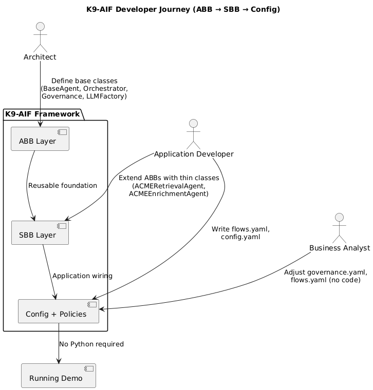
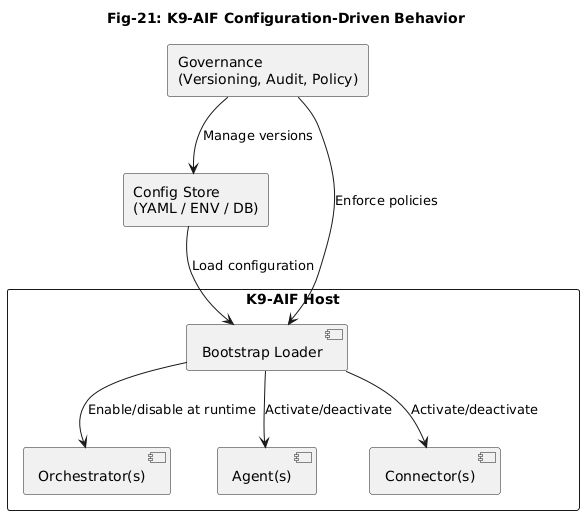
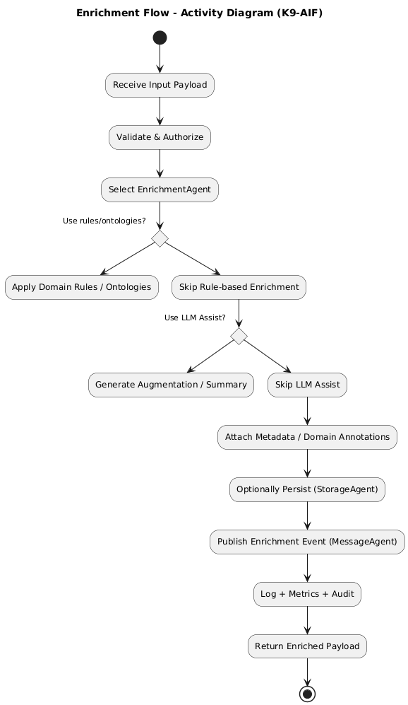

# K9-AIF Architecture Diagrams

This folder contains architecture diagrams describing the K9-AIF framework.

The diagrams illustrate different aspects of the architecture, including:

• reference architecture  
• integration layer  
• configuration-driven framework  
• enrichment workflow  
• extensibility model  
• developer workflow  

---

## Developer Journey

Illustrates how applications evolve from Architectural Building Blocks (ABB)
to Solution Building Blocks (SBB) and configuration-driven deployment.

---

## Configuration-Driven Behavior

Shows how governance policies and configuration sources control runtime
activation of orchestrators, agents, and connectors.

---

## Enrichment activity

---

## Additional Architecture Diagrams

Other diagrams in this folder document additional K9-AIF architecture layers
and workflows used throughout the framework documentation.
