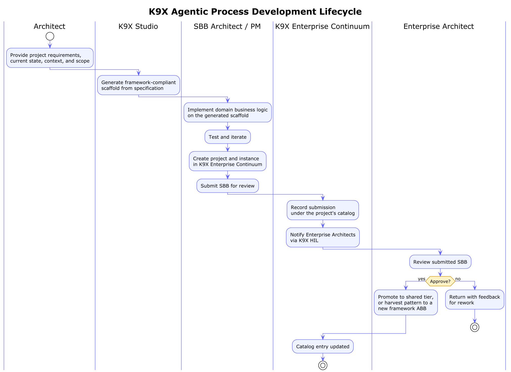
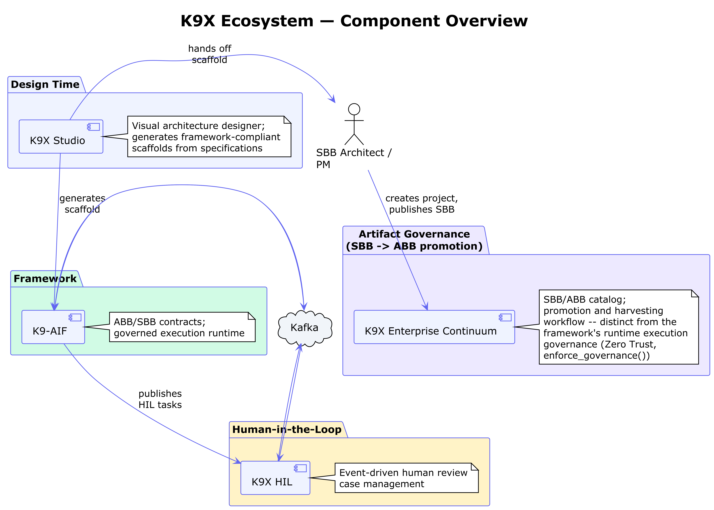
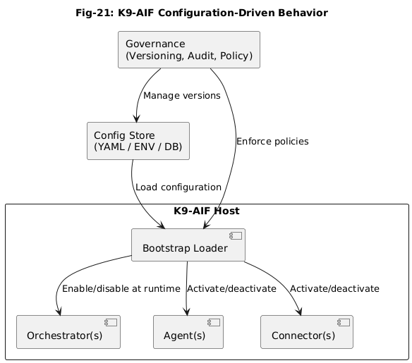
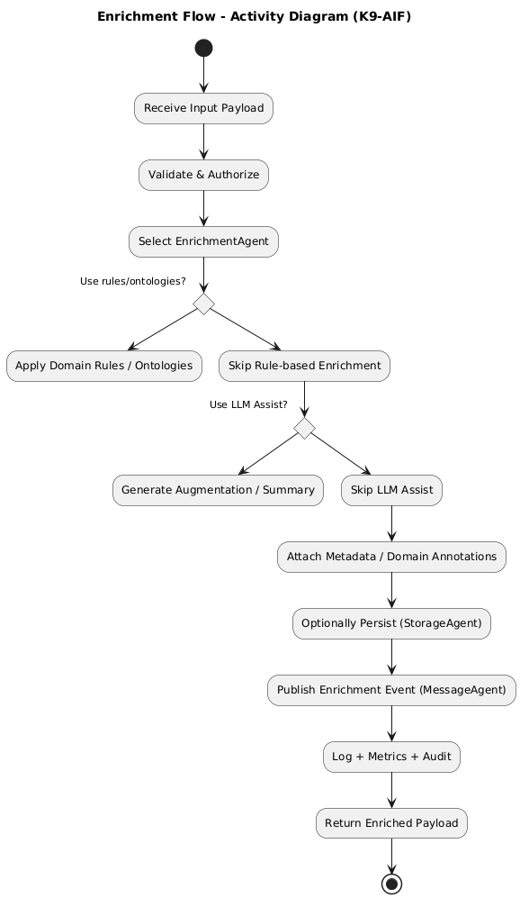

# K9-AIF Architecture Diagrams

This folder contains architecture diagrams describing the K9-AIF framework.

The diagrams illustrate different aspects of the architecture, including:

• reference architecture  
• integration layer  
• configuration-driven framework  
• enrichment workflow  
• extensibility model  
• developer workflow  

---

## Developer Journey

Illustrates the lifecycle of every K9-AIF application: requirements → K9X Studio
scaffold → SBB implementation → submission to K9X Enterprise Continuum → Enterprise
Architect review via K9X HIL → promotion to the shared tier or harvest into a new ABB.
Source: `agentic_lifecycle.puml`.

---

## K9X Ecosystem

How K9X Studio, the K9-AIF framework, K9X Enterprise Continuum, and K9X HIL fit
together at design time and runtime. Source: `k9x_ecosystem.puml`.

---

## Configuration-Driven Behavior

Shows how governance policies and configuration sources control runtime
activation of orchestrators, agents, and connectors.

---

## Enrichment activity

---

## Additional Architecture Diagrams

Other diagrams in this folder document additional K9-AIF architecture layers
and workflows used throughout the framework documentation.
