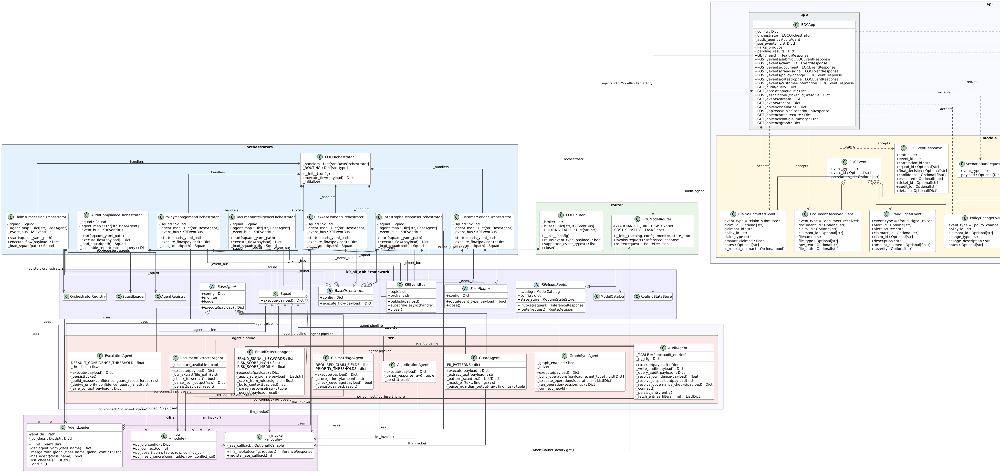

## **K9X Enterprise Insurance Operations Center (EOC)**

Architecture-first enterprise insurance operations platform built on the K9-AIF framework.

The EOC demonstrates how a complete governed multi-agent AI application can be structured using K9-AIF Architecture Building Blocks (ABBs) and Solution Building Blocks (SBBs).

Unlike isolated chatbot or summarization examples, the EOC models a realistic enterprise operational domain with orchestration, intelligent model routing, Zero Trust execution, governance enforcement, immutable auditability, and event-driven runtime processing.

---

## **What the EOC Demonstrates**

The EOC is a complete reference implementation showing:

* Kafka-driven event routing
* Router → Orchestrator → Squad → Agent execution model
* Intelligent model routing
* Zero Trust execution policies
* Governance enforcement
* PII inspection and compliance gating
* HITL escalation flows
* Immutable audit trails
* Neo4j graph synchronization
* Real-time runtime visualization
* YAML-driven architecture and runtime configuration

---

## Runtime Architecture

```code
Event
  ↓
EOCRouter
  ↓
Domain Orchestrator
  ↓
Domain Squad
  ↓
Agents
  ↓
Guard / Audit / Graph Sync
  ↓
Result Stream
```

The system is entirely configuration-driven.

Routing rules, governance policies, model assignments, thresholds, orchestration flows, and squad composition are all defined declaratively in YAML.

No governance logic is hardcoded in application code.

---

## Architecture Class Model

The EOC runtime architecture, orchestration relationships, squads, agents,
governance flow, and model-routing dependencies are documented below.



---

# **Major Runtime Components**

## **EOCRouter**

Kafka-backed enterprise event router responsible for:

* topic subscription
* event-type routing
* orchestrator dispatch
* runtime event propagation

Supported event scenarios include:

* claim_submitted
* fraud_signal_raised
* document_received
* catastrophe_alert_issued
* policy_change_requested
* customer_interaction_logged
* audit_query_received

---

# **Domain Orchestrators**

Each operational domain is implemented as an independent orchestrator.

| **Orchestrator**           | **Responsibility**           |
| -------------------------------- | ---------------------------------- |
| ClaimsProcessingOrchestrator     | claim intake, triage, adjudication |
| RiskAssessmentOrchestrator       | fraud and risk scoring             |
| DocumentIntelligenceOrchestrator | OCR and extraction                 |
| PolicyManagementOrchestrator     | policy workflows                   |
| CustomerServiceOrchestrator      | customer interaction flows         |
| CatastropheResponseOrchestrator  | disaster event coordination        |
| AuditComplianceOrchestrator      | compliance and audit workflows     |

---

## Squads

Squads provide ordered multi-agent execution pipelines.

Examples:

* ClaimsProcessingSquad
* RiskAssessmentSquad
* DocumentIntelligenceSquad
* AuditComplianceSquad

Each squad composes multiple agents into a governed execution flow.

---

# **Agents**

The EOC demonstrates multiple specialized agent types.

| **gent**         | **Purpose**              |
| ---------------------- | ------------------------------ |
| ClaimsTriageAgent      | initial claim analysis         |
| AdjudicationAgent      | adjudication reasoning         |
| FraudDetectionAgent    | fraud scoring                  |
| DocumentExtractorAgent | structured extraction          |
| GuardAgent             | PII and compliance enforcement |
| AuditAgent             | immutable audit persistence    |
| EscalationAgent        | HITL escalation                |
| GraphSyncAgent         | Neo4j synchronization          |

---

# **Intelligent Model Router**

The EOC demonstrates policy-driven intelligent model routing.

Every agent declares a `task_type`.

The `EOCModelRouter` resolves the correct model dynamically based on routing policy.

Example routing logic:

| **Condition**       | **Model**   |
| ------------------------- | ----------------- |
| compliance / PII          | granite3-guardian |
| lightweight realtime task | llama3.2:1b       |
| reasoning / adjudication  | granite3-dense:2b |
| fallback                  | llama3.2:1b       |

The model router makes:

* cost
* latency
* compliance
* reasoning depth

explicit architectural decisions rather than hidden implementation behavior.

---

# **Zero Trust Execution Layer**

The EOC applies Zero Trust execution policies to every orchestrator flow.

## **Runtime policy examples**

| **Condition**     | **Action**       |
| ----------------------- | ---------------------- |
| confidence ≥ 0.75      | approve                |
| confidence < 0.75       | HITL escalation        |
| fraud score ≥ 0.85     | automatic deny         |
| PII/compliance detected | GuardAgent enforcement |

The GuardAgent is mandatory and non-bypassable.

---

## Governance

Governance policies are defined in:

```code
config/governance.yaml
```

Policies include:

* confidence thresholds
* escalation policies
* PII enforcement
* audit requirements
* model routing constraints
* runtime obligations

All governance is declarative.

---

## YAML-Driven Architecture

The EOC is intentionally configuration-centric.

## Key configuration files

## config/

```code
├── config.yaml
├── flows.yaml
├── governance.yaml
├── orchestrators.yaml
└── squads.yaml
```

---


# **Why This Example Exists**

The EOC is not intended as a copy/paste template.

It is a reference implementation showing how:

* orchestration
* governance
* model routing
* Zero Trust
* event-driven execution
* runtime observability
* auditability
* graph synchronization

---

# **K9-AIF**

K9-AIF is an architecture-first framework for governed, modular, enterprise-grade agentic AI systems.

Core concepts include:

* Architecture Building Blocks (ABB)
* Solution Building Blocks (SBB)
* intelligent model routing
* Zero Trust execution
* governance-first orchestration
* configuration-driven runtime behavior
* event-oriented execution
* enterprise observability

can operate together inside a single architecture-first AI system.

The goal is to demonstrate what a production-oriented governed K9-AIF application actually looks like.

---

License

See repository root license information.