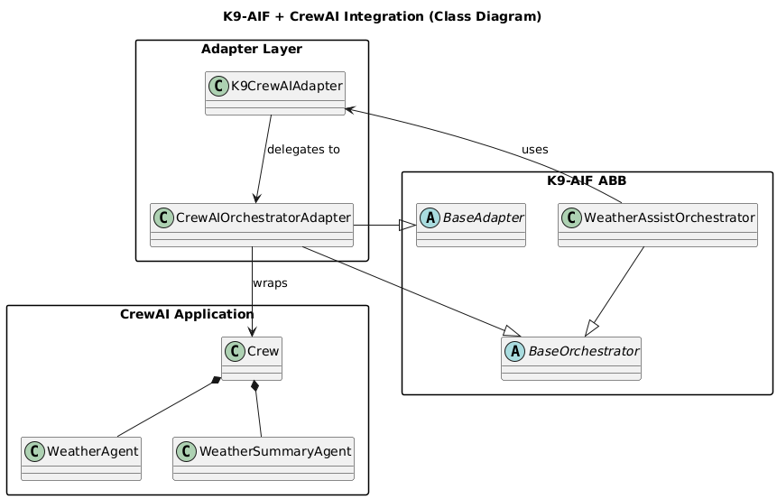

# Weather Assist — Architecture Demo (CrewAI + K9-AIF)

This example demonstrates how a **CrewAI-based agent application** can be integrated into the **K9-AIF architecture framework** using a clean adapter pattern.

---

## What This Is

This is a **side-by-side architecture demonstration**:

- A **pure CrewAI application**
- The **same application governed by K9-AIF**

---

## Project Structure

examples/weather_assist/
crewai/     # Standalone CrewAI implementation
k9/         # K9-AIF integrated version
diagrams/   # Architecture diagram

---

## Architecture Diagram



---

## Architecture (Conceptual View)

```text
User
  ↓
K9 Orchestrator (BaseOrchestrator)
  ↓
K9CrewAIAdapter
  ↓
CrewAIOrchestratorAdapter
  ↓
CrewAI Crew
  ↓
Agents (Weather Agent, Summary Agent)

---

## How to Run.

### Standalone CrewAI

``` bash
python -m examples.weather_assist.crewai.main "Atlanta"

```

### K9-AIF Integrated

``` bash
python -m examples.weather_assist.k9.main "Atlanta"
```

what you will see in the output:

``` code

K9 Base Class      : BaseOrchestrator
K9 Orchestrator    : WeatherAssistOrchestrator
CrewAI Object      : Crew
CrewAI Agents      :
  1. Weather Agent
  2. Weather Summary Agent
K9 Adapter         : K9CrewAIAdapter
CrewAI Bridge      : CrewAIOrchestratorAdapter
```

### What this demoonstrates

User → K9-AIF → CrewAI

K9-AIF owns the system boundary.
Clean Integration
True Extensibility

---
