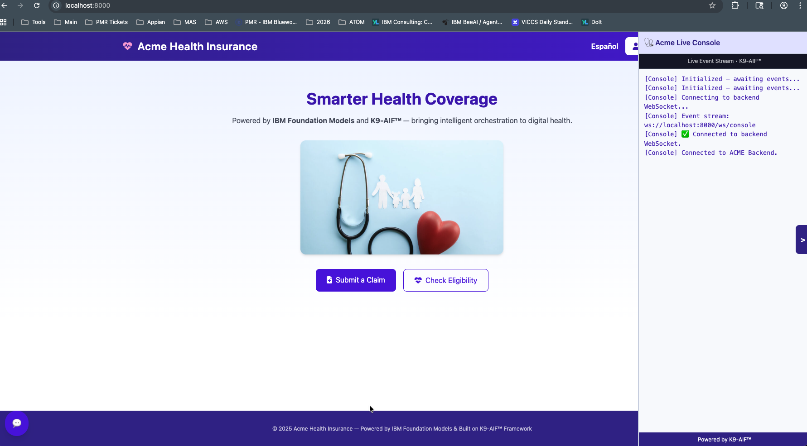

# ACME Health Insurance Demo

The ACME Health Insurance Demo is a domain-specific multi-agent application built using the **K9-AIF (K9 Agentic Integration Framework)**.

This example demonstrates how K9-AIF can orchestrate multiple agents, connectors, and configuration-driven workflows to simulate a realistic enterprise AI system in the health insurance domain.

---

## System Flow


---

## Demo Interface

The ACME demo includes a lightweight web interface that allows users to interact
with the multi-agent system. The interface exposes common workflows such as
plan lookup, provider search, eligibility checks, and claims support while
a live console streams orchestration events from the K9-AIF runtime.



---

## Overview

This demo models a health insurance platform where cooperating agents handle common business workflows such as:

- Member registration
- Authentication and login
- Eligibility checks
- Claims processing
- Provider lookup
- Policy advisory
- Notifications
- Monitoring and governance

The purpose of this example is to demonstrate how **LLM-powered agents can operate inside a structured, governed multi-agent system**, rather than only through a standalone chat interface.

---

## Key Capabilities

The demo includes:

- Multi-agent orchestration using domain-specific agents
- Configuration-driven behavior through YAML-based configuration
- Knowledge retrieval from health plan documents
- Persistence and auditing through a data layer
- Workflow orchestrators for coordinating domain processes
- Tools and loaders for ingesting health plan knowledge
- Simple UI pages for demonstrating interactive workflows

---

## Directory Structure

``` text
acme-health-insurance/
├── agents/             # Domain agents for auth, claims, retrieval, monitoring, notifications
├── config/             # YAML configuration for flows, governance, orchestrators, MCP servers
├── data/               # Schema, seed files, and health plan knowledge content
├── orchestrators/      # Workflow orchestrators for claims, plans, providers, and users
├── tools/              # Knowledge loaders and helper utilities
├── run_demo.py         # Entry point for running the demo
└── README.md
