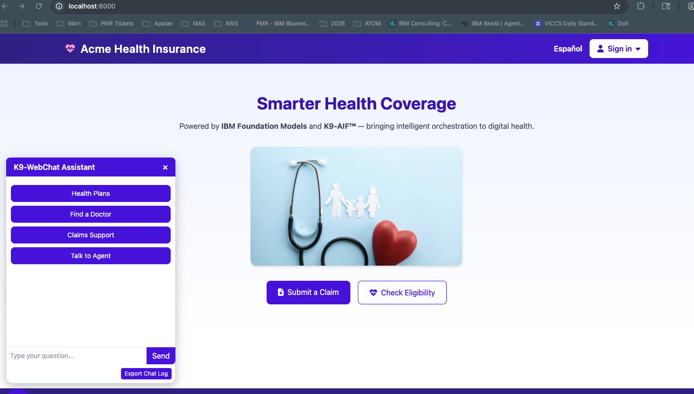

# ACME Health Insurance Demo UI

The ACME demo includes a simple web interface that allows users to interact
with the multi-agent system built using the **K9-AIF (K9 Agentic Integration Framework)**.

## Main Application Interface

The interface demonstrates common health insurance workflows including:

- health plan discovery
- provider lookup
- claims support
- eligibility checks
- interaction with the K9-WebChat assistant

---

## Live Orchestration Console

The demo also includes a **live console** that displays runtime events produced
by the K9-AIF orchestration layer. The console streams backend activity such as
agent coordination, event processing, and system heartbeat monitoring.

