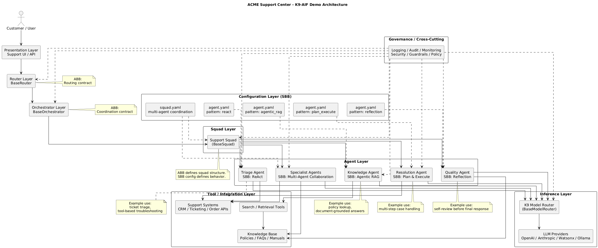

# ACME Support Center

**ACME Support Center** is a demonstration application built on the **K9-AIF (K9 Agentic Integration Framework)**.

The demo illustrates how a **single architecture (ABB layer)** can support multiple **agent behavior strategies implemented as Solution Building Blocks (SBBs)** through configuration.

The goal is to demonstrate that **agentic patterns are not part of the framework architecture itself**, but rather **behavior strategies that agents and squads can adopt depending on the task.

---

# Agentic AI Patterns Demonstrated

This demo showcases several widely used **agent reasoning and execution patterns** found in modern agentic systems.

Within K9-AIF, these patterns are implemented through **SBB-level configuration** such as:

- `agent.yaml`
- `squad.yaml`

The patterns demonstrated include:

## ReAct

**Reasoning + Acting loop**

The agent alternates between reasoning and tool usage until a task is solved.

**Typical use cases**

- Research assistants  
- Support troubleshooting agents  
- Real-time information retrieval  

---

## CodeAct

**Code as the action space**

Instead of calling fixed tools, the agent writes and executes code as part of its reasoning process.

**Typical use cases**

- Data analysis  
- DevOps automation  
- Debugging agents  
- Script-based task execution  

---

## Agentic RAG

**Autonomous Retrieval-Augmented Generation**

The agent dynamically decides when and how to retrieve knowledge from documents or data sources before generating an answer.

**Typical use cases**

- Enterprise knowledge assistants  
- Policy and documentation lookup  
- Legal and medical research bots  

---

## Plan & Execute

**Planner + Executor architecture**

A planner decomposes complex goals into steps while executor agents perform the actions.

**Typical use cases**

- Case resolution workflows  
- Order processing  
- Multi-step enterprise tasks  

---

## Multi-Agent

**Coordinated specialized agents**

Multiple agents collaborate under an orchestrator to solve complex tasks.

**Typical use cases**

- Enterprise AI assistants  
- Research automation  
- Security operations  
- Content pipelines  

---

## Reflection

**Self-critique and refinement**

Agents review their own output, critique it, and improve the result before final delivery.

**Typical use cases**

- Code debugging  
- Report generation  
- Writing and analysis tasks  

---

# Architecture Principle

K9-AIF maintains a strict separation between:

## Architecture Building Blocks (ABB)

Framework contracts such as:

- Router
- Orchestrator
- Squads
- Agents
- Tool interfaces
- Model routing

These define the **architecture and capabilities of the system**.

## Solution Building Blocks (SBB)

Concrete implementations and behavior strategies such as:

- ReAct agents
- Agentic RAG agents
- Multi-agent squads
- Reflection-based agents
- Tool integrations
- model providers

These define **how the system behaves and executes tasks**.

---

# Purpose of This Demo

**ACME Support Center** demonstrates how enterprise AI systems can:

- combine multiple agent reasoning patterns
- route tasks across specialized agents
- integrate knowledge retrieval and tools
- maintain architectural separation between framework and implementation

All while operating within the **K9-AIF architecture**.

## Architecture of the ACME Support Center

The ACME Support Center demonstrates how **K9-AIF architecture (ABB)** can host multiple **agent behavior strategies (SBB)** through configuration.

The system routes support requests through the K9-AIF layers:

- **Router** – classifies incoming support requests  
- **Orchestrator** – coordinates the appropriate squad  
- **Squads** – groups of specialized agents  
- **Agents** – execute tasks using different reasoning strategies  

Agent behaviors such as **ReAct**, **Agentic RAG**, **Plan & Execute**, **Reflection**, and **Multi-Agent collaboration** are implemented as **SBB configurations** (for example via `agent.yaml` and `squad.yaml`), while the underlying architecture remains stable.

This demonstrates the core K9-AIF principle:

**Architecture Building Blocks (ABB)** define the system structure,  
while **Solution Building Blocks (SBB)** define the implementation and behavior.
