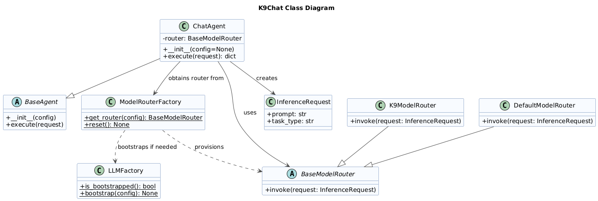

# K9Chat Example

K9Chat is a lightweight example application built on the **K9-AIF Framework**.

It demonstrates how a simple chat experience can be implemented using K9-AIF building blocks while remaining configuration-driven and model-provider agnostic.

This example showcases:

- ABB / SBB architectural separation
- Squad and Agent structure
- Model routing via **ModelRouterFactory** and the default **K9ModelRouter**
- Integration with LLM providers (for example **Ollama**)
- A reusable backend service shared by both **CLI** and **browser UI**

---

## Class Diagram

The following class diagram illustrates the core K9Chat object-oriented structure and shows how the example uses K9-AIF abstractions such as `BaseAgent`, `ModelRouterFactory`, `BaseModelRouter`, and `InferenceRequest`.



---


## Contents

- `chat.py` — Shared chat backend logic used by both CLI and web UI
- `app.py` — FastAPI-based browser UI for K9Chat
- `chat_agent.py` — Agent implementation handling chat prompts
- `chat_squad.py` — Defines the squad containing the chat agent
- `config.yaml` — Configuration for LLM provider, model routing, and runtime settings
- `squad.yaml` — Squad definition for `k9chat`
- `templates/index.html` — Browser UI template
- `static/style.css` — Styling for the web interface
- `doc/` — Supporting documentation for the example

---

## Requirements

- Python 3.13+
- Virtual environment with K9-AIF dependencies installed
- Additional UI dependencies for browser mode:
  - `fastapi`
  - `uvicorn`
  - `jinja2`

Install UI dependencies if needed:

```bash
pip install fastapi uvicorn jinja2

```
---

## Running K9Chat (Browser UI)

From the root of the k9-aif-framework repository, run:

``` bash
./run_k9chat.sh
```
The above scipt runs:

``` bash
uvicorn examples.k9chat.app:app --reload
```

