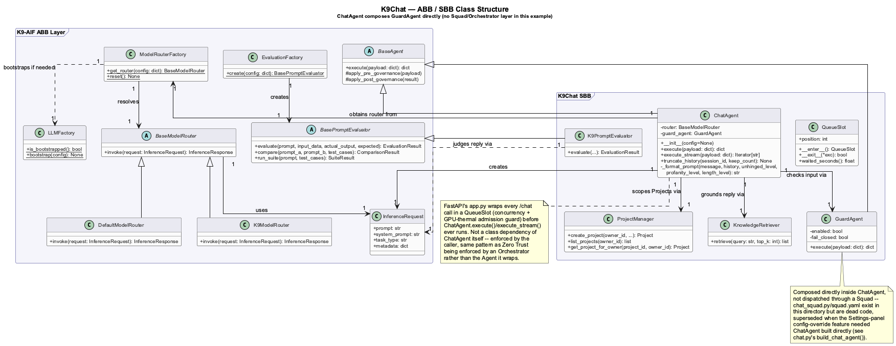

# K9Chat Example

K9Chat is a lightweight example application built on the **K9-AIF Framework**.

It demonstrates how a simple chat experience can be implemented using K9-AIF building blocks while remaining configuration-driven and model-provider agnostic.

This example showcases:

- ABB / SBB architectural separation (`ChatAgent`/`GuardAgent` extend `BaseAgent`; composed directly, not dispatched via a Squad/Orchestrator — see the class diagram note)
- Model routing via **llm_invoke** (retry-on-empty-response + trace events), which resolves **ModelRouterFactory**/**K9ModelRouter** internally — agent code itself never touches the router directly
- Integration with LLM providers (for example **Ollama**)
- Real-time knowledge grounding (ChromaDB, `knowledge_retriever.py`/`seed_knowledge_base.py`) plus per-visitor **Projects** (own document collections, `project_manager.py`/`project_retriever.py`)
- Guest identity with no password (`auth.py`) — every visitor gets a display name/codename, scoping Projects per-visitor without gating access
- A real concurrency + GPU-thermal admission guard (`queue_control.py`/`gpu_telemetry.py`) protecting the backing GPU host from being overrun
- Toggleable "fun dials" (Unhinged/Profanity/Length), an LLM-as-judge **Eval** toggle, and a **Streaming** toggle — all genuinely wired, not decorative
- Ubuntu/Podman container deployment (`scripts/ubuntu/k9chat/`)

---

## Class Diagram

The following class diagram illustrates the core K9Chat object-oriented structure and shows how the example uses K9-AIF abstractions such as `BaseAgent`, `LlmInvoke` (the only sanctioned path to `ModelRouterFactory`/`BaseModelRouter`), `InferenceRequest`, and `BasePromptEvaluator`. PlantUML source: [`../diagrams/k9-chat-class-diagram.puml`](../diagrams/k9-chat-class-diagram.puml).



---


## Contents

- `chat.py` — Shared chat backend logic (session/history, Projects wiring, Eval/Streaming toggles); builds `ChatAgent` directly (see `build_chat_agent()`'s docstring for why)
- `app.py` — FastAPI browser UI: routes, SSE streaming, `QueueSlot`-guarded `/chat` endpoints
- `chat_agent.py` — `ChatAgent`, the one real agent in this example; composes `GuardAgent` and applies the fun-dial/scope prompt instructions
- `guard_agent.py` — `GuardAgent`, pre-inference content-safety check via a guardian model
- `auth.py` — No-password guest identity (display name / generated codename), session-scoped `owner_id`
- `queue_control.py` — Concurrency semaphore (`QueueSlot`) + model-switch cooldown, backing the waitlist widget
- `gpu_telemetry.py` — Real GPU/CPU telemetry proxy + thermal admission guard (default 85°C limit)
- `project_manager.py` / `project_retriever.py` — Per-visitor Projects: metadata (sqlite) and per-project ChromaDB document collections
- `knowledge_retriever.py` / `seed_knowledge_base.py` — The always-on K9-AIF/K9X knowledge base (ChromaDB, `k9x_knowledge_base` collection)
- `provider_settings.py` — Runtime Settings-panel overrides (model, OpenAI-compatible endpoint + key)
- `health_check.py` — `/health` route backing
- `config.yaml` — Configuration for LLM provider, model routing, evaluation, and guardrails
- `squad.yaml` / `chat_squad.py` — **Dead code**, not loaded by anything today; left over from before the Settings-panel override feature required constructing `ChatAgent` directly (bypasses `SquadLoader`/`AgentRegistry`, which would silently drop config overrides)
- `templates/index.html`, `templates/login.html` — Browser UI templates
- `static/js/`, `static/style.css` — Frontend JS (`app.js`, `message_list.js`, `chat_input.js`) and styling
- `knowledge/` — Seed documents for the knowledge base (e.g. `glossary.md`)
- `doc/` — Supporting documentation for the example
- `.env.example` — Full environment template (copy to `.env`, gitignored)

Deployment scripts (`scripts/ubuntu/k9chat/Containerfile`/`build-run.sh`) live at the repo root, not in this directory — see below.

---

## Requirements

- Python 3.13+
- Virtual environment with K9-AIF dependencies installed
- Additional UI dependencies for browser mode:
  - `fastapi`
  - `uvicorn`
  - `jinja2`

Install UI dependencies if needed:

```bash
pip install fastapi uvicorn jinja2

```
---

## Running K9Chat (Browser UI)

From the root of the k9-aif-framework repository, run:

``` bash
./run_k9chat.sh
```
The above scipt runs:

``` bash
uvicorn examples.k9chat.app:app --reload
```

## Running K9Chat (Ubuntu / Podman container)

Deployment scripts live at `scripts/ubuntu/k9chat/` (repo root), not in this
directory, since the build context is the whole repo (k9_aif_abb/ +
examples/k9chat/ together).

```bash
cp examples/k9chat/.env.example examples/k9chat/.env   # fill in your own values
scripts/ubuntu/k9chat/build-run.sh all                  # build + start, port 7777
scripts/ubuntu/k9chat/build-run.sh seed                 # one-time: seed the knowledge base
scripts/ubuntu/k9chat/build-run.sh logs
scripts/ubuntu/k9chat/build-run.sh stop
```

`.chroma/` and the Projects sqlite db persist across rebuilds via a bind
mount at `examples/k9chat/data/` on the host. Override the published port
with `HOST_PORT=<port> scripts/ubuntu/k9chat/build-run.sh start`.

