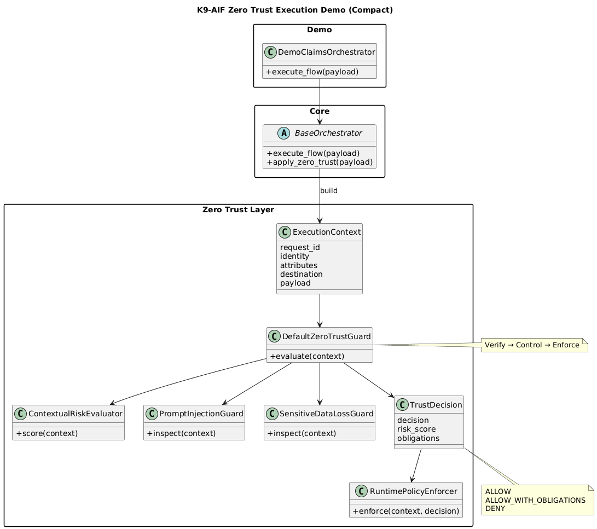

# K9-AIF  (K9_Security) Zero Trust Execution Demo

This example demonstrates the **K9 Zero Trust Execution Layer**, a vendor-neutral
runtime security pattern integrated into the K9-AIF framework.

---

## What this shows

Traditional Zero Trust focuses on **who can access what**.

K9-AIF extends this idea to:

> **Every action is verified before execution.**

This demo introduces a **runtime execution control layer** that evaluates:

- Identity (who is acting)
- Attributes (data sensitivity, environment)
- Destination (internal vs external)
- Contextual risk
- Potential compromise signals
- Data loss risk

---

## Architecture Concept

Governance (policies, rules). → Zero Trust Execution Layer → Orchestrator → Agents → Tools / APIs / Models

---

## Architecture Overview



## Scenarios Demonstrated

### 1. Low Risk Internal Call

- Internal system access
- Low sensitivity data
- Result: **Allowed**

---

### 2. Sensitive External Call

- External API access
- Confidential data
- Result: **Allowed with obligations**
  - Data masking
  - Audit logging

---

### 3. Prompt Injection Attempt

- Malicious instruction detected
- Unknown agent + external target
- Result: **Denied**

---

## How to Run

```bash
python -m examples.zero_trust_execution_demo.main

```

## Example output

``` code
[ZeroTrust][AUDIT] request_id=... principal=claims_agent_01 ...

ALLOW
ALLOW_WITH_OBLIGATIONS (masked + audited)
DENY (prompt injection detected)
```