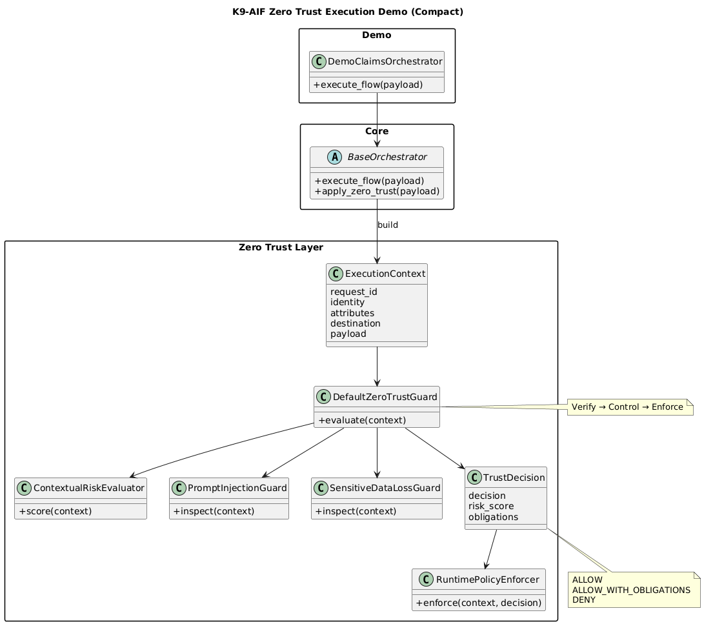

# K9-AIF  (K9_Security) Zero Trust Execution Demo

This example demonstrates the **K9 Zero Trust Execution Layer**, a vendor-neutral
runtime security pattern integrated into the K9-AIF framework.

---

## New in 1.14: can an agent grant itself a role?

```bash
K9_ENV=development python examples/zero_trust_execution_demo/identity_demo.py
```

The same request, three ways: an agent writes `roles: ["claims_approver"]` into its own payload.
1. **payload mode** (1.x default): Zero Trust believes it. Approved.
2. **signed mode**: self-declared identity is ignored; the caller is anonymous. Denied.
3. **signed mode, admitted**: `BaseRouter.admit()` authenticates the agent's API key, strips the claims and stamps an HMAC-signed identity; the orchestrator verifies it. Approved.

See `k9_aif_abb/k9_security/zero_trust/identity.py` and `security.identity.mode` in the framework `config.yaml`.

### With a real identity provider: Keycloak

`keycloak_demo.py` runs the same flow with real Keycloak users and tokens (`pip install "k9-aif[oidc]"`; Keycloak with a `k9x` realm, client `k9x-cli` and test users). Run it with `K9_ENV=development python examples/zero_trust_execution_demo/keycloak_demo.py`. Each request: Keycloak token → `EdgeRouter.admit()` (`EdgeRouter` is the demo's router, defined in `keycloak_demo.py`; `OIDCAuthenticator` verifies the token) → Zero Trust with a role policy → k9x Shield.

```
OK       k9x (claims_approver) approves a claim
DENIED   k9aif (claims_reader) tries to approve
OK       ibm (claims_reader) reads a claim
DENIED   santa (no roles) reads a claim
DENIED   satan self-declares claims_approver in the payload
BLOCKED  satan (red_team) probes with a prompt injection      <- identity passes, Shield blocks
DENIED   forged token claiming claims_approver                <- anonymous
OK       ravinata (agent_admin, claims_approver) approves
```

## What this shows

Traditional Zero Trust focuses on **who can access what**.

K9-AIF extends this idea to:

> **Every action is verified before execution.**

This demo introduces a **runtime execution control layer** that evaluates:

- Identity (who is acting)
- Attributes (data sensitivity, environment)
- Destination (internal vs external)
- Contextual risk
- Potential compromise signals
- Data loss risk

---

## Architecture Concept

Governance (policies, rules) → Zero Trust Execution Layer → Orchestrator → Agents → Tools / APIs / Models

---

## Architecture Overview



## Scenarios Demonstrated

### 1. Low Risk Internal Call

- Internal system access
- Low sensitivity data
- Result: **Allowed**

---

### 2. Sensitive External Call

- External API access
- Confidential data
- Result: **Allowed with obligations**
  - Data masking
  - Audit logging

---

### 3. Prompt Injection Attempt

- Malicious instruction detected
- Unknown agent + external target
- Result: **Denied**

---

## How to Run

```bash
python -m examples.zero_trust_execution_demo.main

```

## Example output

``` code
[ZeroTrust][AUDIT] request_id=... principal=claims_agent_01 ...

ALLOW
ALLOW_WITH_OBLIGATIONS (masked + audited)
DENY (prompt injection detected)
```