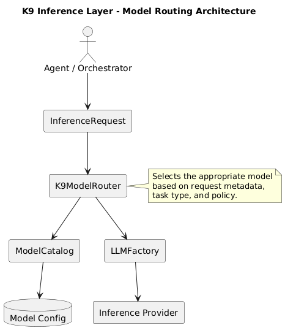

# K9 Inference Layer

The **K9 Inference Layer** provides a structured architectural framework for integrating large language models and AI inference providers into applications built with **K9-AIF (K9 Agentic Integration Framework)**.

The layer introduces architectural separation between:

• application logic  
• inference orchestration  
• model providers  

This allows AI systems to evolve independently of specific model vendors or deployment environments.

---

## Purpose

Modern AI systems often rely on multiple models and providers.  
Without an architectural abstraction layer, applications typically:

- couple directly to specific models
- embed provider-specific logic in application code
- lack governance over inference usage
- become difficult to evolve as model capabilities change

The **K9 Inference Layer** solves this by introducing a modular architecture for model interaction.

---

## Core Components

The inference layer consists of several architectural components:

``` bash

k9_inference
├── models
│   ├── inference_request.py
│   ├── inference_response.py
│   └── route_decision.py
│
├── routers
│   ├── base_model_router.py
│   └── k9_model_router.py
│
├── catalog
│   └── model_catalog.py

```

These components provide a modular system for defining inference requests, selecting models, and executing model interactions.

---

## Architectural Overview

The inference layer sits between agents/orchestrators and AI model providers.

``` code

Agent / Orchestrator
↓
InferenceRequest
↓
Model Router
↓
ModelCatalog
↓
LLMFactory
↓
Inference Provider
(Ollama / Watsonx / OpenAI / etc.)

```

This architecture ensures that application code remains independent from specific model implementations.

---

## Inference Request

`InferenceRequest` defines the structure of an inference call.

Example:

```python
InferenceRequest(
    prompt="Classify the user's request",
    task_type="chat",
    metadata={
        "agent": "claims_orchestrator",
        "stage": "intent_classification"
    }
)
```

Requests may include metadata used by the router to select the appropriate model.

---

## Model Router

``` code

BaseModelRouter (ABB)
K9ModelRouter (SBB)
  learning/            prompt embedders + per-prompt quality predictor

```

`K9ModelRouter.route()` decides in two layers:

1. **Rules.** Capability, latency-tier and cost-tier scoring with a `default_model` fallback, and session affinity on ties. This is the cold start.
2. **Evidence.** A similarity-weighted k-nearest-neighbour model over graded outcomes (the approach of Not Diamond, RouteLLM and RouterBench's k-NN router). It predicts each model's quality on the new prompt; the best prediction, after latency and cost penalties, replaces the rules' pick when it's ahead by `margin` points.

Evidence comes from `record_feedback(prompt, model_alias, quality, task_type=...)` and is stored in `routing_outcomes`. Every routed call also stores its success and latency there, which feeds the circuit breaker. Confidential requests stay on confidential-capable models whatever the evidence says.

The `RouteDecision` carries `strategy` (`rules`/`learned`), `predicted_quality`, every candidate's `predictions` and a `rationale`.

Prompt vectors come from `learning.embedder`:
- `hashing` (default): word unigrams and bigrams hashed into a sparse vector. It needs no model and gives the same vector in every process.
- `service`: `EmbeddingServiceFactory`, for example Ollama `nomic-embed-text`.

## Architecture Diagram

---

## Architecture Diagram

<p align="center">
  
</p>

```


